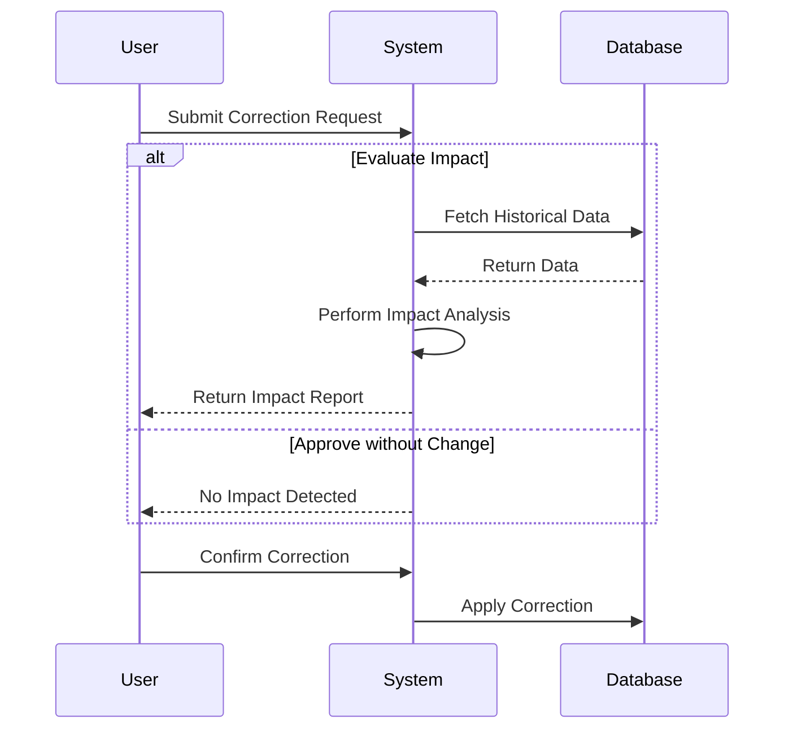

## Introduction

In the world of data management, especially when dealing with bi-temporal databases, handling corrections to historical data is a critical task. The Data Correction Impact Analysis pattern aids in evaluating the effects of such corrections to ensure accuracy, consistency, and compliance with regulatory standards. This pattern provides a structured approach to anticipate and manage the consequences of data modifications over time.

## Detailed Explanation

Bi-temporal data systems store both the time when a piece of information is valid in the real world (`valid time`) and the time when it was actually stored in the database (`transaction time`). This dual timeline allows for robust historical tracking and correction capabilities.

When corrections are necessary, such as backdating a financial transaction, it can have widespread implications. This pattern focuses on understanding these implications in a comprehensive manner before implementing changes.

### Key Considerations:
- **Historical Data Integrity**: Ensuring that corrections do not inadvertently alter the meaning or interpretation of historical records.
- **Regulatory Compliance**: Understanding how changes affect compliance with laws and regulations, which may have strict reporting requirements.
- **Consistency Across Systems**: Maintaining synchrony between different dependent systems that might consume or react to the corrected data.

## Architectural Approaches

To implement this pattern, the architecture typically involves:

1. **Logging and Audit Trails**: Keeping detailed records of all changes for traceability.
2. **Impact Simulation Tools**: Tools that can simulate the outcome of corrections, providing insights without altering actual data.
3. **Version Control**: Keeping multiple versions of data records to compare pre and post-correction states.
4. **Change Management Workflows**: Formalized processes to assess, approve, and document the correction and its impacts.

## Example Code 

Below is a simplified example in Scala that demonstrates how an impact analysis might be set up for a correction request in a financial system:

```scala
case class FinancialTransaction(id: String, amount: Double, validTime: (LocalDate, LocalDate), transactionTime: LocalDateTime)

class ImpactAnalyzer {
  def simulateCorrection(correction: FinancialTransaction, historicalData: List[FinancialTransaction]): List[ImpactReport] = {
    // Analyze the potential impact of the correction on historical data
    val impacts = for {
      record <- historicalData
      if correction.validTime._1.isBefore(record.validTime._2) && correction.validTime._2.isAfter(record.validTime._1)
    } yield ImpactReport(record, correction)

    impacts
  }
}

case class ImpactReport(original: FinancialTransaction, correction: FinancialTransaction)
```

## Diagrams

### UML Sequence Diagram



## Related Patterns

- **Audit Log Pattern**: This pattern supports maintaining a record of changes to ensure data traceability.
- **Event Sourcing Pattern**: Enables the reconstitution of state based on a series of recorded events, useful when corrections need replays.
- **Temporal Patterns**: Utilize appropriate data modeling techniques for handling time aspects in data.

## Additional Resources

- [Temporal Data and the Relational Model](https://www.amazon.com/Temporal-Data-Relational-Model-databases/dp/0123978758)
- [SQL Bitemporal Queries](https://blogs.oracle.com/plsql/post/bitemporal-data-in-relational-databases)
- [GDPR and Historical Data Analysis](https://gdpr.eu/article-22-automated_individual_decision-making/)

## Summary

The Data Correction Impact Analysis pattern is essential for organizations that require precise control over historical data corrections. By utilizing a methodical approach, including simulation, impact reports, and controlled workflows, it ensures data durability and regulatory compliance. Properly implemented, this pattern can help organizations maintain accurate historical records while accommodating necessary updates in an evolving data landscape.
