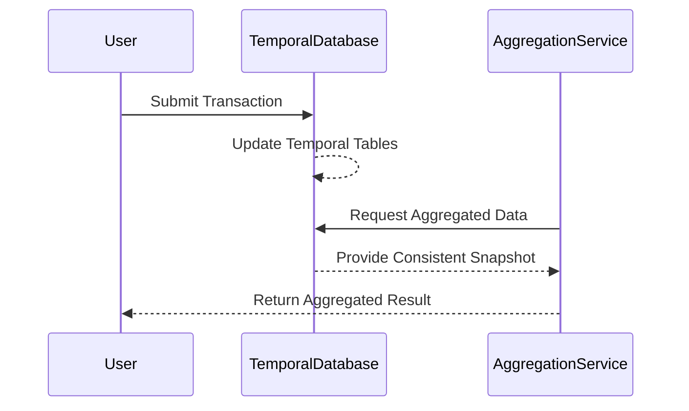

Bi-temporal data modeling is crucial when considering the consistency of aggregated data over specified time periods. This pattern focuses on providing a reliable framework to ensure that all data involved in temporal aggregations are valid, consistent, and accurate.

## Description

Temporal consistency in aggregations is about ensuring that calculations like totals, averages, and other aggregates over time-based datasets accurately reflect the underlying truth at any point in time. This pattern is critical when dealing with time-sensitive operations. It ensures that all included records are correctly represented and aligned with the respective time periods.

## Context and Problem

Time series data often evolve due to late-arriving data, corrections, or operational updates. Inaccuracies or data inconsistencies can arise if the aggregation does not account for these temporal changes, leading to flawed data-driven decisions.

For instance, when calculating the total sales for a quarter, it is essential to ensure that:

- All transactions belong to the specified quarter.
- Any returned or corrected transactions are duly considered.
- Accurate temporal boundaries are maintained.

## Solution

Implementing a temporal consistency strategy involves several critical components:

### 1. Bi-Temporal Tables

Use bi-temporal tables that incorporate both valid and transaction times to accurately capture changes in data over time. This allows separate tracking of when data is valid in the real world versus when it was recorded in the system.

### 2. Temporal Queries

Use SQL's temporal querying capabilities, such as temporal tables or time-travel queries provided by databases like Snowflake or temporal aspects in SQL Server. This can help retrieve data as it existed at any point, enabling consistent backdated aggregations.

Example query in SQL:

```sql
SELECT
    SUM(amount) as total_sales
FROM
    sales
FOR SYSTEM_TIME AS OF '2023-12-31'
WHERE
    transaction_date BETWEEN '2023-10-01' AND '2023-12-31';
```

### 3. Consistent Snapshot Isolation

Ensure consistency during read operations by leveraging databases that support snapshot isolation or multi-version concurrency control (MVCC). This allows the system to provide a consistent dataset for aggregation.

### 4. Change Data Capture (CDC)

Implement CDC mechanisms to handle and process late-arriving data and corrections efficiently. This ensures updated aggregations reflecting the most recent state of the data are available.

## Diagram

Here's a diagram illustrating the workflow of maintaining temporal consistency:



## Related Patterns

- **Event Sourcing**: Helps maintain a complete history of state changes, potentially useful in providing a complete audit trail for how aggregations evolved over time.
- **Snapshot Pattern**: Captures the state of an entire system at a point to facilitate fast-read queries especially in temporal data management.
- **CQRS (Command Query Responsibility Segregation)**: Separates the data modification from data retrieval operations, helping to optimize the consistency of read models using eventual consistency.

## Additional Resources

- [Bi-Temporal Data Management](https://your-database-resources.com/bi-temporal-data-management)
- [Event Sourcing Best Practices](https://your-database-resources.com/event-sourcing-best-practices)
- [Using Temporal Tables in SQL](https://docs.microsoft.com/en-us/sql/temporal-tables)

## Summary

Temporal consistency in aggregations is essential for accurate data analysis, particularly in time-sensitive applications. Implementing this pattern involves using advanced temporal querying techniques, ensuring consistency through snapshot isolation, and accommodating changes through CDC. By adopting this pattern, organizations can ensure that their final aggregates are both accurate and reliable, ultimately empowering stakeholders with trustworthy data-driven insights.
