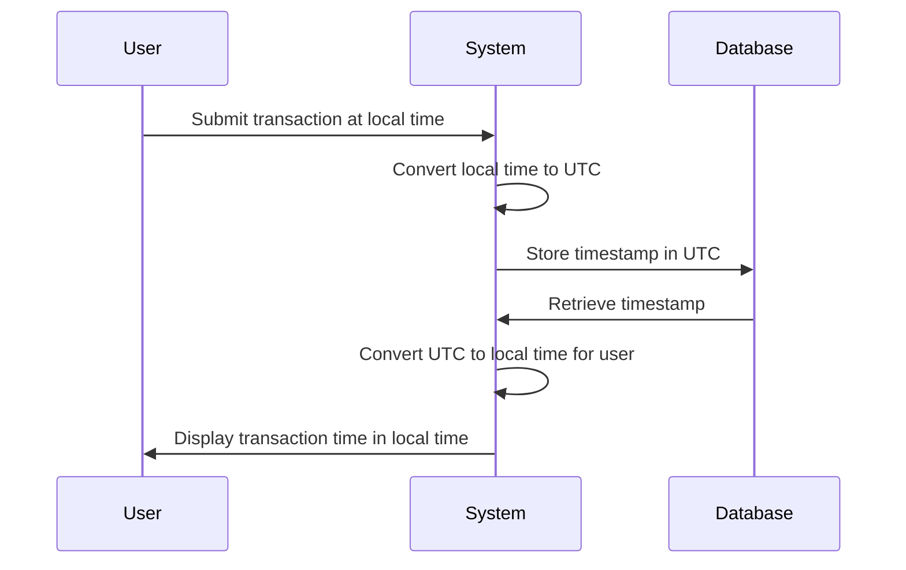

## Description

In today's globally interconnected world, systems are required to manage and process temporal data from multiple time zones. The Time Zone Consistency design pattern ensures that temporal data is consistently handled irrespective of the geographical location of the users or systems involved. By standardizing time representations, usually to Coordinated Universal Time (UTC), systems can prevent time-related errors, avoid daylight saving discrepancies, and ensure a unified approach to timestamp management across different regions.

## Architectural Approach

Implementing Time Zone Consistency involves adopting a systematic approach to time management in your distributed systems:

1. **Unified Time Standard**: Convert all timestamps to a standard time zone (preferably UTC) at the point of data creation or entry into the system. This avoids complexity arising from differing time zones and daylight saving changes.

2. **Data Storage**: Store all timestamps in a standardized format, using UTC, in databases. This ensures that temporal queries, such as those that involve time range searches or event sequencing, can be executed consistently without needing additional conversions.

3. **Application Logic**: When timestamps are retrieved from the storage or transit systems, convert them to the local time zone only if necessary for display purposes or user interfacing, ensuring that business logic processing remains in UTC to maintain consistency.

4. **User Interface**: Adjust timestamps for the end-user’s time zone at the user interface layer. This helps in rendering the personalized time experience while maintaining back-end data integrity.

## Examples

### Example Code

Below is a simple example using Java's `java.time` package to handle time zone conversions:

```java
import java.time.Instant;
import java.time.LocalDateTime;
import java.time.ZoneId;
import java.time.ZonedDateTime;

public class TimeZoneConsistencyExample {
    public static void main(String[] args) {
        // Current time in UTC
        Instant nowUtc = Instant.now();

        // Convert UTC to a specific time zone
        ZoneId zoneId = ZoneId.of("America/New_York");
        ZonedDateTime zonedDateTime = nowUtc.atZone(zoneId);

        // Convert back to UTC from specific time zone
        ZonedDateTime utcDateTime = zonedDateTime.withZoneSameInstant(ZoneId.of("UTC"));

        System.out.println("UTC Time: " + nowUtc);
        System.out.println("Specific Zone Time: " + zonedDateTime);
        System.out.println("Converted Back to UTC: " + utcDateTime.toInstant());
    }
}
```

### Diagram

Below is a simple sequence diagram using Meridian that demonstrates time zone conversion:



## Best Practices

- **Use Libraries**: Leverage existing time handling libraries (e.g., `java.time` for Java, `pendulum` for Python) that natively support time zone conversions and DST adjustments.
- **Standardized Formats**: Use ISO 8601 for time string representations to maintain consistency across services and applications.
- **Consistent Logging**: Ensure that logs are also timestamped in UTC to facilitate easier correlation and debugging in distributed environments.

## Related Patterns

- **Event Sourcing**: When capturing changes as a sequence of events, ensure all events are timestamped consistently using UTC to maintain event order.
- **Data Versioning**: Use bi-temporal data management techniques to manage historical data across time zones which can involve valid time and transaction time.

## Additional Resources

- [Java Date and Time API](https://docs.oracle.com/javase/tutorial/datetime/)
- [ISO 8601](https://www.iso.org/iso-8601-date-and-time-format.html)
- [Time Zone Database (IANA)](https://www.iana.org/time-zones)

## Summary

Time Zone Consistency is crucial for ensuring reliable interaction with temporal data in systems operating across multiple geographic locations. By standardizing time zones to UTC, systems can avoid errors related to time zone differences, leading to robust, predictable, and reliable software solutions. Proper implementation of this pattern simplifies temporal data management and heightens data integrity across distributed systems.
