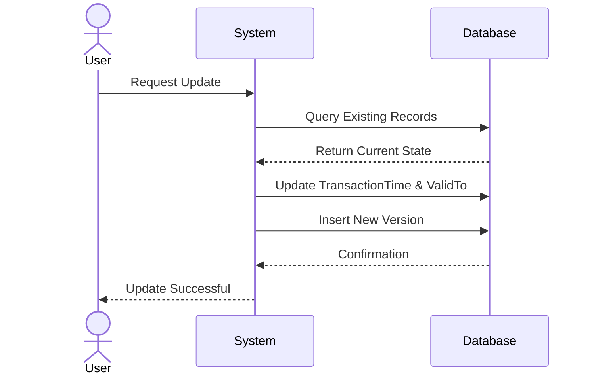

## Consistent History Maintenance

### Introduction

Consistent History Maintenance is a design pattern essential for managing and maintaining the integrity of historical data across multiple temporal dimensions—transaction time and valid time—especially when updates or changes occur in the data set. This pattern is particularly critical in environments where both current and historical accuracy is crucial, such as financial audits, legal documents, and compliance reporting.

### Detailed Explanation

In a bi-temporal database, each data entry is characterized by two dimensions:
- **Transaction Time**: The time at which a data entry is stored in the database and becomes known to the system.
- **Valid Time**: The time period during which a data entry is true in reality.

The Consistent History Maintenance pattern ensures that any modifications to data are reflected consistently across these timelines, maintaining historical accuracy while allowing for corrections or updates. 

Applying this pattern often involves:
1. **Versioning Data Changes**: Each update to a record is stored as a new version, preserving previous states.
2. **Temporal Queries**: Implementing efficient queries to access data for any point in time.
3. **Cascading Updates**: Ensuring related records are updated together to reflect changes accurately across all relevant datasets.

### Architectural Approaches

1. **Use of Temporal Tables**: Employing tables specifically designed to track historical changes with automatic versioning, such as `SYSTEM_VERSIONED` tables in SQL.
2. **Audit Logging**: Maintaining a detailed log of all changes, including metadata about who made each change and why, which are essential for tracing and verification.
3. **Effective Use of Markers**: Utilizing logical deletes and validity flags to differentiate between an active, outdated, or logically deleted record.

### Best Practices

- **Normalization of Data**: Keeping historical data normalized minimizes redundancy and preserves the ability to apply rules consistently across the dataset.
- **Implement Strong API Security**: Ensure that access to temporal data is tightly controlled to prevent unauthorized retroactive changes.
- **Active Alerts and Monitoring**: Set up notifications and logs for historical data modifications, allowing for swift identification and rectification of inconsistency.

### Example Code

Let’s consider the SQL implementation for handling bi-temporal data:

```sql
CREATE TABLE ProductPriceHistory (
    ProductID INT,
    Price DECIMAL(10, 2),
    ValidFrom DATETIME,
    ValidTo DATETIME,
    TransactionFrom DATETIME,
    TransactionTo DATETIME
);

-- Insert example data with versioning
INSERT INTO ProductPriceHistory
VALUES (1, 29.99, '2023-01-01', '9999-12-31', '2023-01-01', '9999-12-31');

-- Update example data, effectively versioning it
UPDATE ProductPriceHistory
SET ValidTo = CURRENT_TIMESTAMP, TransactionTo = CURRENT_TIMESTAMP
WHERE ProductID = 1 AND ValidTo = '9999-12-31';

INSERT INTO ProductPriceHistory
VALUES (1, 34.99, CURRENT_TIMESTAMP, '9999-12-31', CURRENT_TIMESTAMP, '9999-12-31');
```

### Diagrams

Here’s a UML sequence diagram depicting the update process in a bi-temporal system:



### Related Patterns

- **Temporal Property Pattern**: For representation of properties that have temporal attributes.
- **Event Sourcing**: Capturing all changes to an application state as a sequence of events.
- **Snapshot Pattern**: Taking periodic snapshots of the data state to facilitate history reconstruction.

### Additional Resources

- *“Managing Temporal Data in Databases”* by Richard T. Snodgrass
- *“Database Solutions for Real-World Business Challenges”* article series by leading data architects.
- Official documentation for temporal table support in various database systems such as PostgreSQL, SQL Server, and Oracle.

### Summary

Implementing the Consistent History Maintenance pattern is crucial for applications requiring a nuanced history of changes. Through careful design and the use of temporal technologies, data integrity and accuracy can be preserved across both past and present data states, ensuring compliance with business needs and regulatory requirements.
