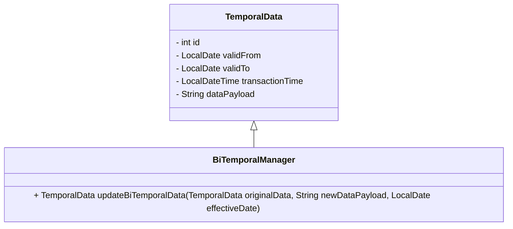

## Introduction

In the realm of data management, the concept of time plays a pivotal role in ensuring the integrity and relevance of information. Bi-temporal data involves capturing both the valid time (when data is true in the real world) and the transaction time (when data is recorded in the database). Bi-Temporal Data Dependency Management is a design pattern that addresses the complexities associated with managing dependencies among temporal data entities. By orchestrating how data changes and their dependencies are handled over time, this pattern aims to provide a comprehensive approach to maintaining data consistency and integrity.

## Design Pattern Overview

This design pattern deals with ensuring that all dependent data points reflect correct and coherent information for their valid times whenever changes occur. It is essential in use cases involving contracts, legal documents, or any scenario where historical accuracy and future projections must remain consistent.

## Architectural Approaches

The following strategies are integral to implementing a Bi-Temporal Data Dependency Management system:

1. **Versioning and History Maintenance**: Keep a record of all changes to allow backtracking. Each data update should create a new version entry with valid and transaction times.

2. **Dependency Tracking**: Establish and maintain a graph of data dependencies to ensure that when one entity is updated, all related entities are examined and, if necessary, updated or flagged.

3. **Reactive Updates**: Implement event-driven architectures where changes in one data entity trigger updates or validations in other dependent entities.

4. **Contextual Consistency Checks**: Regularly validate the data consistency across different temporal states, ensuring no outdated dependencies affect the current state of affairs.

5. **Future Validations**: Predictive checks for future dated entries based on current and past data to foresee potential consistency conflicts.

## Example Implementation

```kotlin
data class TemporalData(
    val id: Int,
    val validFrom: LocalDate,
    val validTo: LocalDate,
    val transactionTime: LocalDateTime,
    val dataPayload: String
)

fun updateBiTemporalData(
    originalData: TemporalData,
    newDataPayload: String,
    effectiveDate: LocalDate
): TemporalData {
    // Creating a new version of the data entry with updated payload
    return TemporalData(
        id = originalData.id,
        validFrom = effectiveDate,
        validTo = originalData.validTo,
        transactionTime = LocalDateTime.now(),
        dataPayload = newDataPayload
    )
}
```

## UML Class Diagram



## Related Patterns

- **Event Sourcing**: Capturing all changes as a sequence of events enhances historical tracking capabilities.
- **CQRS (Command Query Responsibility Segregation)**: Separating data modification from data retrieval can help manage complex dependency relationships effectively.

## Additional Resources

- *Temporal Data & the Relational Model* by C.J. Date, Hugh Darwen, and Nikos A. Lorentzos.
- Temporal Support in SQL: SQL/Temporal, TSQL2 - an extension of SQL facilitating temporal data management.
  
## Summary

Bi-Temporal Data Dependency Management is crucial for maintaining consistency and continuity of dependent temporal data. By ensuring that changes are properly tracked and managed, organizations can ensure historical accuracy and prepare effectively for future data states. Through diligent application of this pattern, robust data temporal systems can be developed, offering reliability and insight into past, present, and future data landscapes.
