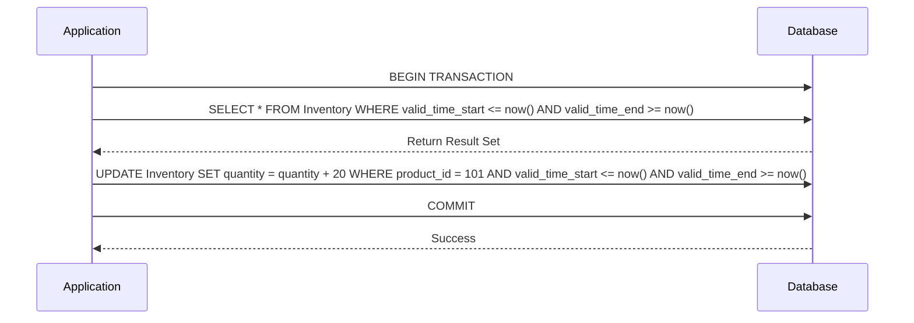

## Temporal Batch Processing Consistency

### Introduction

In systems that handle temporal data, consistency across batch processing activities is crucial to maintain data integrity. Temporal data typically involves both valid-time and transaction-time attributes. Valid-time refers to the time period during which a fact is true in the real world, while transaction-time records when the data was stored in the database. The Temporal Batch Processing Consistency pattern ensures that these temporal attributes are maintained accurately during batch operations.

### Problem

When dealing with temporal data in batch processes, several challenges can arise:
- **Overwriting Future Data**: Batch processes might overwrite modifications that have future valid times if not controlled.
- **Temporal Gaps**: Inadequate handling of temporal attributes can lead to discontinuities in data validity.
- **Data Skews**: When transaction-time information is compromised, historical consistency may suffer.

### Solution

To address these issues, the following practices can be adopted:

1. **Separate Valid and Transaction Times**: Ensure that the data model clearly distinguishes between valid-time and transaction-time attributes to avoid confusion during batch processes.

2. **Use Bitemporal Techniques**: Implement bitemporal tables that inherently maintain both valid and transaction times, ensuring a history of both real-world and recorded changes.

3. **Time-Oriented Query Constructs**: Leverage database features that support temporal queries, such as temporal SQL, to fetch and manipulate data based on its temporal attributes.

4. **Concurrency Control Mechanisms**: Implement locking mechanisms during batch processing to ensure that no concurrent transactions can interfere with temporal data adjustments.

### Best Practices

- **Versioning**: Use versioning strategies to keep records of all historical changes in temporal data.
- **Temporal Auditing**: Regularly audit temporal data changes as part of batch processing logs.
- **Batch Window Management**: Determine non-conflicting batch windows considering time-zone differences and business activity clashes.

### Example Code

```sql
-- Creating a bitemporal table example in SQL
CREATE TABLE Inventory (
    product_id INT,
    quantity INT,
    valid_time_start DATE,
    valid_time_end DATE,
    transaction_time_start TIMESTAMP,
    transaction_time_end TIMESTAMP,
    PRIMARY KEY (product_id, valid_time_start, transaction_time_start)
);

-- Example of inserting with valid and transaction times
INSERT INTO Inventory (product_id, quantity, valid_time_start, valid_time_end, transaction_time_start, transaction_time_end)
VALUES (101, 50, '2024-07-01', '2024-07-31', CURRENT_TIMESTAMP, NULL);
```

### Diagram

A simplified sequence diagram showing temporal batch processing:



### Related Patterns

- **Event Sourcing Pattern**: Captures all changes to an application's state as a sequence of events, useful in maintaining an immutable state.
- **Data Versioning Pattern**: Focuses on maintaining different versions of datasets for backup or historical analysis purposes.

### Additional Resources

- "Designing Data-Intensive Applications" by Martin Kleppmann - covers complex data management scenarios including handling temporal data.
- Temporal Data & the Relational Model by Richard T. Snodgrass - an advanced resource on temporal databases.

### Summary

Temporal Batch Processing Consistency is a fundamental design pattern in handling temporal data effectively and ensuring data consistency over time. By adopting careful separation of valid and transaction times, employing robust querying techniques, and implementing vigilant process management, systems can safeguard temporal data integrity and improve reliability across batch operations.
