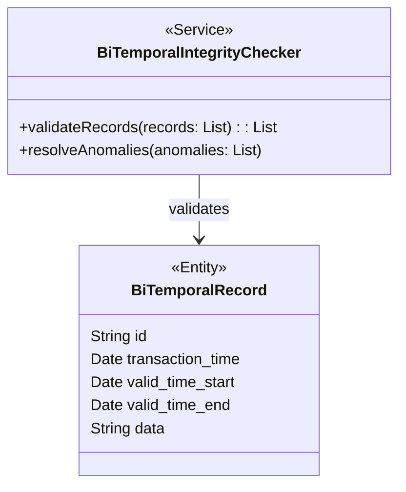

## Bi-Temporal Integrity Checking

### Introduction

Bi-temporal data management involves maintaining two distinct aspects of time: transaction time and valid time. Transaction time refers to when a fact is stored in the database, while valid time represents when the fact is considered true in the real world. This pattern is essential for applications where understanding the history and state of data over time is critical, such as in financial systems, auditing, and versioned data storage.

Bi-temporal integrity checking involves regularly validating this temporal data to ensure its consistency and correctness. It aims to detect and resolve data anomalies, ensuring trustworthiness in your temporal database systems.

### Architectural Approach

Bi-temporal integrity checking can be implemented using a combination of SQL queries or utility scripts that regularly scan the temporal records. Here's a simplified approach:

1. **Automated Scripts**: Schedule scripts that query the database, specifically checking for anomalies:
   - Instances where the `transaction_time` surpasses the current system time, which usually indicates data entry errors.
   - Cases where `valid_time` overlaps for records concerning the same entity, which might cause logical inconsistencies.

2. **User Notification or Automated Correction**: Establish processes for alerting data managers about detected anomalies. For simpler scenarios, even automate corrections based on predefined business rules.

3. **Checkpoint Creation**: Regularly take snapshots of your temporal data, creating baselines for integrity comparison. This helps in tracking down when exactly corruption might have entered the data.

4. **Logging and Monitoring**: Implement logging mechanisms within your system to capture when anomalies were detected and how they were resolved. Ensure accessible dashboards for live monitoring of data consistency state.

### Example Code

Here's an example SQL query that identifies future-dated transaction times:

```sql
SELECT 
    id, 
    transaction_time, 
    valid_time_start, 
    valid_time_end 
FROM 
    bi_temporal_records 
WHERE 
    transaction_time > CURRENT_TIMESTAMP;
```

### MerDiagramDiagram Example



### Related Patterns

- **Audit Logging**: Used to maintain a history of changes.
- **Event Sourcing**: Storing state as a sequence of events that lead to the current state.
- **Temporal Consistency**: Ensures that related inserts and updates occur in a consistent time frame.

### Additional Resources

- [Temporal Database Concepts](https://en.wikipedia.org/wiki/Temporal_database)
- [Bi-Temporal Data Management](https://example.com/bitemporal_data_management)

### Summary

Bi-temporal integrity checking is a crucial mechanism ensuring data quality and consistency over time in systems relying on temporal data. By deploying automated checking procedures, you ensure that inaccuracies are flagged or corrected promptly, thereby maintaining the trust and dependability of your data systems. This pattern supports straightforward database health management but requires diligent implementation and careful maintenance of the temporal integrity rules.
