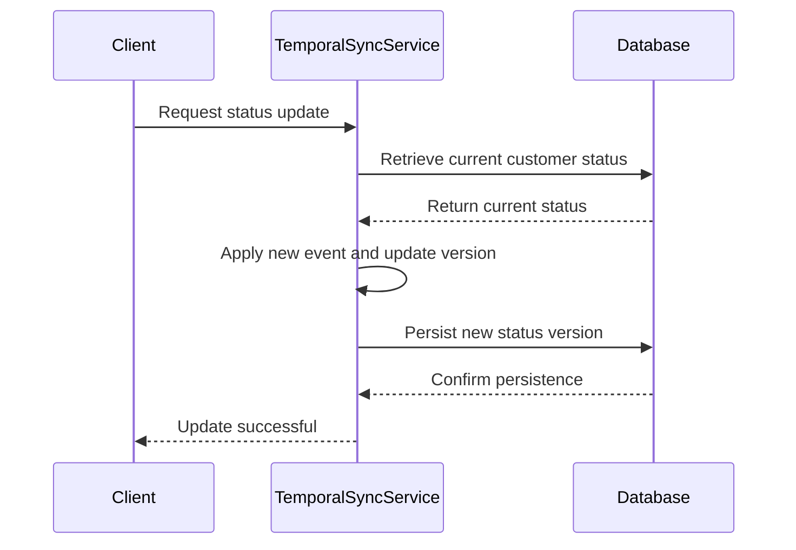

In the world of data modeling, particularly in systems that track historical changes, maintaining bi-temporal consistency can be a complex yet critical task. The **Temporal Data Version Alignment** pattern is designed to ensure that versions of related temporal records remain in sync to preserve the accuracy and integrity of the data across various entities. 

## Detailed Explanation

Temporal Data Version Alignment involves managing temporal aspects of data to ensure consistency across changes to different entities. Essentially, this pattern deals with the synchronization of data versions within a bi-temporal data model. 

### Use Cases
A common use case is in financial systems where changes to a customer's status (e.g., from "regular" to "premium") must be reflected immediately across their account transactions, loyalty points, and other associated records. If a change is made prematurely or out of order, it could result in discrepancies that misrepresent the customer's interaction history.

## Architectural Approaches

There are several architectural approaches and paradigms you might employ to implement this pattern effectively:

1. **Event Sourcing**: Capture all changes to entities as a sequence of events. Replay these events to derive consistent states across interconnected entities. 
   
2. **Command Query Responsibility Segregation (CQRS)**: Separate the read and write models so commands can update the data stores in a way that naturally aligns updates.

3. **Versioning Strategies**: Implement strategies such as optimistic or pessimistic locking to handle version control in a bi-temporal context.

## Best Practices

- **Centralized Time Stamping**: Use a consistent strategy for time stamping entities to assist in aligning versions across the system.

- **Validation Mechanisms**: Implement robust validation routines that check and verify cross-entity version compatibility before commits.

- **Audit Trails**: Maintain detailed audit logs for transactional activities to trace any misalignment or errors in synchronization between temporal records.

## Example Code

Here is a simplified Java example using an event-sourced approach:

```java
public class Event {
    private final UUID id;
    private final String entityId;
    private final String data;
    private final Instant timestamp;
    
    // Constructor, getters, and other methods
}

public class TemporalSyncService {

    public void applyEvent(Event event) {
        // Retrieve the entity using event.getEntityId()
        // Derive new state from the current state and event data
        // Save the new state assuring that all related entities are updated
    }
}
```

## Diagrams

### Temporal Data Versioning Sequence Diagram



## Related Patterns

- **Event Sourcing**: Capture all changes to the state as a sequence of immutable events.
  
- **CQRS**: Segregate the responsibility of reading and writing to facilitate easier synchronization.

- **Saga Pattern**: Manage complex business transactions that span multiple microservices, ensuring consistent state transitions even across distributed systems.

## Additional Resources

- "Designing Data-Intensive Applications" by Martin Kleppmann: A comprehensive guide on how to architect applications that deal with data at scale, including discussions on event sourcing, CQRS, and temporal models.

- Online courses on cloud data modeling and architecture, which often cover advanced patterns like Bi-Temporal Consistency.

## Summary

The Temporal Data Version Alignment pattern is fundamental for systems requiring high consistency and accuracy across temporal records. By applying this pattern, organizations can ensure that all related data entities accurately reflect their state changes in a synchronized manner, thereby maintaining data integrity across the entire system.
