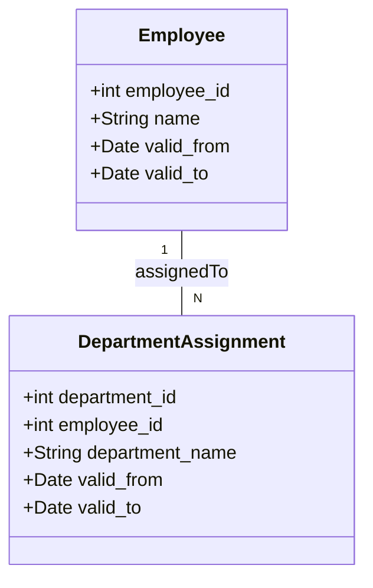

---

linkTitle: "Consistent Temporal Joins"
title: "Consistent Temporal Joins"
category: "Bi-Temporal Consistency Patterns"
series: "Data Modeling Design Patterns"
description: "Performing joins on temporal data, ensuring that records are matched based on overlapping valid times."
categories:
- Data Modeling
- Temporal Data
- Database Design
tags:
- Bi-Temporal
- SQL
- Join Operations
- Data Consistency
- Temporal Databases
date: 2024-07-07
type: docs

canonical: "https://softwarepatternslexicon.com/103/8/7"
license: "© 2024 Tokenizer Inc. CC BY-NC-SA 4.0"
---

## Consistent Temporal Joins

### Introduction

In the realm of temporal databases, managing time-based data is a common challenge. Conventional join operations need enhancements to handle temporal consistency, ensuring that the data being combined is valid for overlapping time periods. The Consistent Temporal Join pattern addresses this by providing a structure to perform efficient and logically correct joins on temporal data.

### Motivation

Modern applications often require analysis on time-variant data, such as tracking employee roles over time or inventory levels. In these scenarios, it is crucial to maintain bi-temporal consistency—consistency across both valid time (business timeline) and transaction time (database timeline).

### Applicability

This pattern is used when you need to:
- Join tables with time-period attributes, where records must be related based on overlapping time intervals.
- Ensure historical accuracy and consistency in reports and datasets.
- Handle complex histories and future planning data in a bi-temporal context.

### Architectural Approach

The Consistent Temporal Join pattern involves:
1. **Identifying the Temporal Attributes**: Determine the fields in your datasets that define the time intervals (e.g., `valid_from` and `valid_to`).
2. **Ensuring Overlapping Periods**: Use SQL join conditions that check for any overlap in these time periods between two datasets.
3. **Handling Gaps and Overlaps Carefully**: Additional logic might be necessary to deal with potential gaps and overlaps in time dimensions effectively.

### Example Code

Using SQL, the following is a simplified example of how a consistent temporal join might be executed:

```sql
SELECT e.employee_id, e.name, d.department_name, e.valid_from, e.valid_to
FROM employee e
JOIN department_assignment d ON e.employee_id = d.employee_id
WHERE e.valid_from <= d.valid_to
  AND e.valid_to >= d.valid_from;
```

In this example, the SQL query joins employee records to department assignments, ensuring that only temporal overlaps between the `valid_from` and `valid_to` date fields in both tables are considered.

### Diagrams

Here is a Mermaid diagram that visualizes the interaction between employee records and their respective department assignments:



### Related Patterns

- **Slowly Changing Dimensions**: Techniques for managing and tracking changes in data over time.
- **Temporal Validity Pattern**: Defining a model structure to handle time-stamped data.
- **Audit Logging**: Recording changes to provide historical neatness in temporal joins.

### Additional Resources

- "Temporal Data & the Relational Model" by C.J. Date, Hugh Darwen, and Nikos A. Lorentzos
- "SQL Performance Explained" for optimized query techniques
- Database system documentation for temporal data types and functions (e.g., PostgreSQL, Oracle)

### Summary

The Consistent Temporal Join pattern is essential for ensuring accurate and reliable joins between temporal datasets. This pattern supports sophisticated data analysis and reporting by guaranteeing valid data relationships over time intervals. Implementing this pattern helps meet complex business requirements and improves data integrity in temporal analytical environments.


