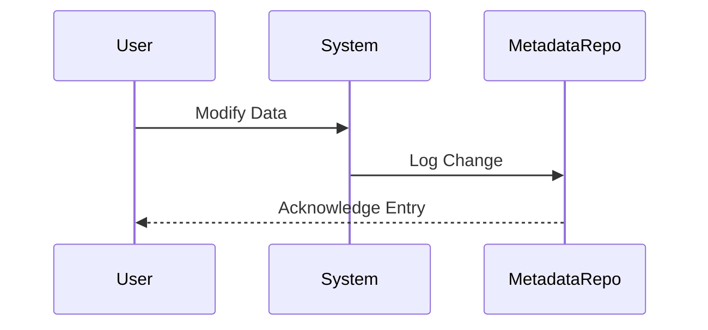

## Data Lineage Tracking

### Introduction

Data Lineage Tracking is a crucial design pattern in modern data systems that focuses on tracking the lifecycle of data as it flows through various stages of processing and transformation. This pattern is integral for ensuring data auditability, compliance with regulatory requirements, and for understanding the journey and transformation of data within systems. It captures when, how, and why data values are modified, providing a comprehensive view of data evolution.

### Architectural Approach

The Data Lineage Tracking pattern involves capturing metadata at various stages of data processing to establish a clear history of the data's journey. This can involve:

- **Source Identification**: Capturing the origin of data when it enters the system.
- **Transformation History**: Logging changes made to data as it passes through different layers and systems.
- **Audit Trail**: Keeping a detailed log of who accessed the data, when, and for what purpose.

### Paradigms and Best Practices

1. **Centralized Metadata Repository**: Maintain a central repository for storing metadata that describes the data flow and transformation steps. This allows easy querying and analysis.

2. **Data Tags and Annotations**: Use data tags to label data at different stages of processing, indicating the source, transformation applied, and timestamp.

3. **Version Control Systems for Data**: Implement version control mechanisms akin to those used in software development to manage versions of datasets, facilitating rollback and change tracking.

4. **Granular Change Logging**: Ensure that change logs capture granular details about data alterations, including user identifiers, timestamps, and reasons for changes.

5. **Compliance and Security**: Incorporate security measures such as access controls and encryption to protect lineage data, ensuring that sensitive information is safeguarded.

### Example Code

```java
// Simulating a simple logging mechanism for data lineage tracking
public class DataLineageLogger {
    public static void logChange(String dataId, String change, String userId) {
        String logEntry = String.format(
            "Data ID: %s | Change: %s | User: %s | Timestamp: %s",
            dataId, change, userId, System.currentTimeMillis()
        );
        System.out.println(logEntry); // This could be replaced with a call to save to a database
    }

    public static void main(String[] args) {
        logChange("customer_123", "Updated email address", "admin_user");
    }
}
```

### Sequence Diagram



### Related Patterns

- **Audit Trail**: Focuses specifically on the tracking of actions performed on data or systems for accountability.
- **Event Sourcing**: Uses an event log to record every change to the state; can be a subset approach to lineage tracking.
- **Bi-Temporal Data Management**: Deals with data that varies over time, capturing both the current state and historical changes.

### Additional Resources

- [Data Lineage: The comprehensive guide](https://example.com/data-lineage-guide)
- [Managing Data Lineage in the Cloud](https://example.com/cloud-lineage-management)
- [Implementing Data Governance with Lineage Tracking](https://example.com/governance-lineage)

### Summary

Data Lineage Tracking is an essential pattern for organizations that require a clear view of data history, especially in scenarios demanding stringent auditability and regulatory compliance. By implementing Data Lineage Tracking, organizations can enhance their data governance capabilities, ensure data integrity, and foster trust in their data-driven decisions. This pattern is increasingly relevant in complex and distributed data architectures, such as big data and cloud-based ecosystems, where data traverses multiple layers and services.
