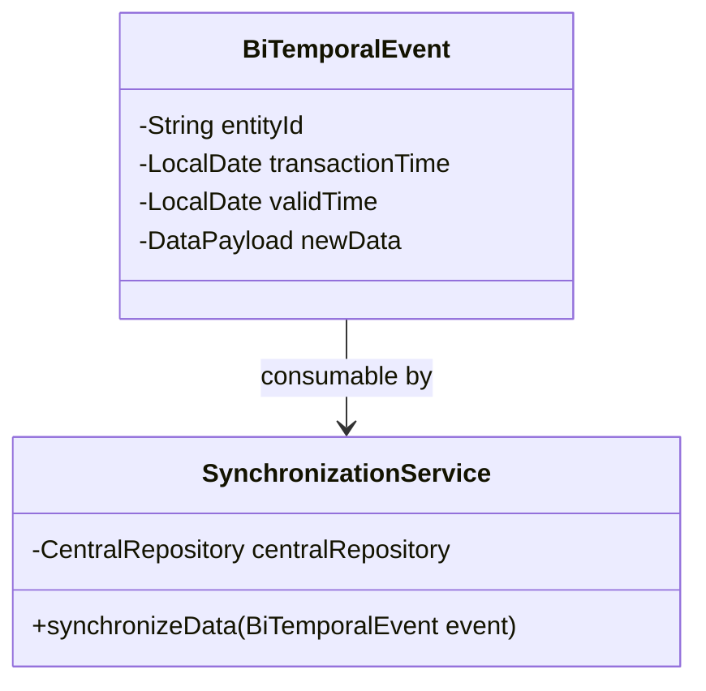
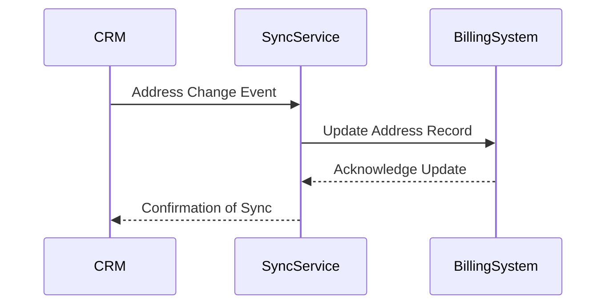

## Overview

Bi-Temporal Synchronization is a data design pattern crucial for maintaining synchronized, consistent information across systems that track changes over time with both valid and transaction times. The pattern addresses challenges associated with integrating past, current, and future data consistency across distributed systems.

## Architectural Approach

Bi-Temporal Synchronization requires an architectural setup that accommodates dual timelines for data: transaction time and valid time. Transaction time refers to when data is recorded in the system, while valid time is the period during which the data is considered effective.

- **Transaction Time**: Managed via system-generated timestamps that denote when the data activities and changes occurred.
- **Valid Time**: Includes user-defined timestamps indicating when the data is considered active and valid.

### Common Architectural Components:

- **Central Repository**: A system that tracks changes, updates, and consolidations of data along both dimensions of time.
- **Temporal Databases**: Specialized databases that inherently support bi-temporal data directly, reducing synchronization overhead.
- **Synchronization Mechanisms**: Utilize event-driven systems or batch processing for data harmonization across distributed these timestamps.

## Example Use Case

Consider a retail system that synchronizes customer data between the CRM and billing systems:

- **CRM Updates**: Reflect customers' information with any historical corrections, such as changes in addresses or contact details.
- **Billing System Adjustments**: Ensures invoices and transactions reflect consistent historical records aligning with CRM updates, like amending past billing addresses.

### Example Workflow

```plaintext
1. CRM captures a customer address change with a previous effective date.
2. Trigger an event to adjust the historical records in the billing system.
3. Employ a service to synchronize similar historical data across systems.
4. Ensure both systems reflect consistent state over shared data.

```

## Example Code Snippet

The following conceptual example in Java leverages an event-driven approach for updates:

```java
class BiTemporalEvent {
    private String entityId;
    private LocalDate transactionTime;
    private LocalDate validTime;
    private DataPayload newData;

    // Getters and Setters
}

class SynchronizationService {
    
    private final CentralRepository centralRepository;

    SynchronizationService(CentralRepository repository) {
        this.centralRepository = repository;
    }

    public void synchronizeData(BiTemporalEvent event) {
        centralRepository.updateRecords(event.entityId, event.validTime, event.newData);
        // Logic to propagate the changes to dependent systems
    }
}
```

## Diagrams

### Class Diagram



### Sequence Diagram



## Related Patterns

- **Event Sourcing**: Captures all changes to the state as a sequence of events, facilitating both consistency and temporal queries.
- **CQRS (Command Query Responsibility Segregation)**: Separates data write and read operations, enhancing scalability and consistency management.
- **Versioning**: Maintains different versions of data, crucial for managing bi-temporality.

## Additional Resources

- [Temporal Database Management by Snodgrass](https://www.amazon.com/Developing-Time-Oriented-Database-Applications-Snodgrass/dp/1558604367)
- [Event Sourcing and CQRS](https://martinfowler.com/eaaDev/EventSourcing.html)

## Summary

Bi-Temporal Synchronization is critical for maintaining accurate and consistent data histories across disparate systems in scenarios that require a dual timeline perspective. This pattern, involving temporal databases and synchronization services, ensures robust data consistency management, thus providing a foundation for complex, time-sensitive operations across enterprise systems.
