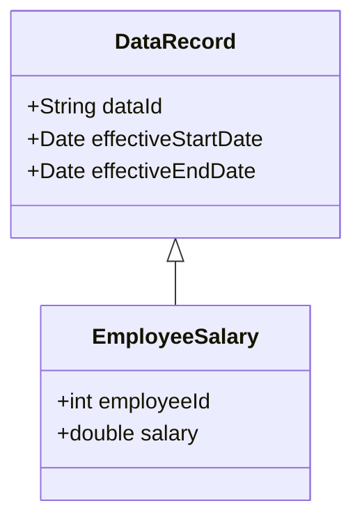

## Introduction

In various data-intensive applications, it's essential to track the period during which a specific data entry is valid. This pattern, known as Validity Intervals, provides a systematic way to signify the timeframe for which data should be considered accurate or applicable. This method can efficiently handle time-based conditions in data modeling and is fundamental for temporal databases.

## Problem Statement

Many applications require tracking records or entities where their truthfulness depends on the temporal context. For instance, salary records, product prices, and employee roles often have a specific time span during which they are valid. Without effective temporal management, inconsistencies and errors can arise in data analysis and operations.

## Architectural Approach

Validity Intervals involve enriching data models with additional attributes that denote the beginning and end times of a data record's validity. Typically, these attributes are:

- `EffectiveStartDate`: The date and time when the data starts to be applicable.
- `EffectiveEndDate`: The date and time when the data ceases to be applicable.

### Design Considerations

- **Granularity**: Determine the precision required for the intervals (e.g., date, timestamp). This depends on the business requirements.
- **Overlaps**: Ensure no overlapping intervals within the same context unless explicitly necessary.
- **Default Values**: Choose appropriate default timestamps if a record should start immediately or has an indefinite end.

## Example Code

Here’s how you can implement Validity Intervals in both SQL and NoSQL databases:

### SQL


```sql
CREATE TABLE EmployeeSalary (
    EmployeeID INT,
    Salary DECIMAL(10, 2),
    EffectiveStartDate DATE,
    EffectiveEndDate DATE,
    CONSTRAINT PK_EmployeeSalary PRIMARY KEY (EmployeeID, EffectiveStartDate)
);

-- Example entry
INSERT INTO EmployeeSalary (EmployeeID, Salary, EffectiveStartDate, EffectiveEndDate)
VALUES (1, 60000.00, '2024-01-01', '2024-12-31');
```
### NoSQL (MongoDB)

```json
{
  "employeeId": 1,
  "salary": 60000.00,
  "validityInterval": {
    "effectiveStartDate": "2024-01-01T00:00:00Z",
    "effectiveEndDate": "2024-12-31T23:59:59Z"
  }
}
```

## Diagrams

Below is a conceptual UML diagram illustrating the Validity Intervals pattern:



## Related Patterns

- **Audit Log**: Often used with Validity Intervals to maintain a history of changes, the Audit Log pattern helps track modifications over time, ensuring accountability.
- **Slowly Changing Dimension (SCD)**: This pattern is used in data warehousing to manage and track changes in data over time.
- **Temporal Tables**: Introduced in modern databases, temporal tables provide built-in support to manage validity intervals at a more granular level without manually managing start and end dates.

## Best Practices

1. **Consistency**: Ensure consistent use of time zones to avoid misinterpretations.
2. **Indexing**: Use indexing on start and end date fields for efficient querying, especially for range-based queries.
3. **Validation**: Implement rigorous validation checks to avoid invalid date ranges (e.g., an end date preceding a start date).
4. **Forward Compatibility**: Design with potential future changes in mind by allowing nulls in `EffectiveEndDate` for records that should remain valid indefinitely.

## Additional Resources

- [Temporal Data and the Relational Model](https://www.goodreads.com/book/show/8349378-temporal-data-and-the-relational-model)
- [Time-Oriented Databases](https://academic.oup.com/book/35361)

## Summary

The Validity Intervals design pattern provides critical functionality for managing temporal aspects in data modeling, enabling systems to handle information lifecycle effectively. By defining periods of validity, businesses can ensure their data-driven operations reflect accurate, relevant, and timely data analysis, decision-making, and reporting.
