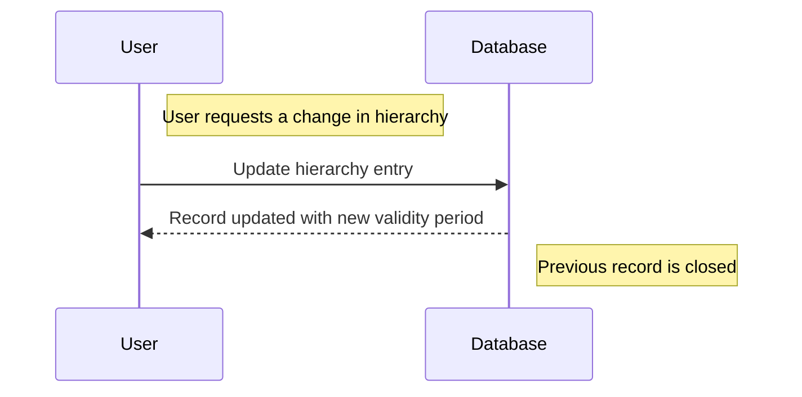

---

linkTitle: "Effective Hierarchy Management"
title: "Effective Hierarchy Management"
category: "Effective Data Patterns"
series: "Data Modeling Design Patterns"
description: "Managing hierarchical relationships that are effective during certain periods, enabling the representation of dynamic structures such as organizational charts that reflect management reporting lines as they change over time."
categories:
- Data Modeling
- Data Patterns
- Time-based Data Structures
tags:
- Hierarchical Data
- Temporal Design
- Dynamic Structures
- Organizational Charts
- Data Relationships
date: 2024-07-07
type: docs

canonical: "https://softwarepatternslexicon.com/103/9/10"
license: "© 2024 Tokenizer Inc. CC BY-NC-SA 4.0"
---


## Introduction

Managing hierarchical relationships effectively is critical for businesses that need to model data structures that evolve over time. An organization might have an employee hierarchical structure that varies due to promotions, transfers, restructuring, and other factors. This design pattern provides a systematic way to manage these changes.

## Explanation of the Design Pattern

The Effective Hierarchy Management pattern focuses on the temporal aspects of hierarchical data. It enables representation of hierarchies that change over predefined periods. This pattern is useful in various scenarios beyond organizational charts, such as product categorization and financial reporting lines.

### Key Concepts

1. **Temporal Validity**: Track the time range during which a hierarchical relationship is effective.
2. **Versioning**: Maintain multiple versions of the hierarchy to reflect changes over time without losing historical accuracy.
3. **Parent-Child Relationships**: Ensure each node's relationship as a parent or child is accurately recorded and time-bounded.

## Architectural Approach

To implement this pattern:

- **Data Model**: Use a table structure that records parent-child relationships with start and end dates representing the validity period. 

- **Indexes**: Create indexes on temporal fields to efficiently query active relationships at a given time point.

- **Version Management**: Implement logic to create new versions of nodes as changes occur, and archive inactive versions.

## Best Practices

- **Immutable Records**: Once a record's period has lapsed, it should not be altered. Instead, create new records for subsequent changes.
- **Efficient Querying**: Design queries to retrieve hierarchies relevant to a specific timestamp by leveraging date fields and indexes.
- **Audit Trails**: Maintain a history of changes to provide context and support rollback or auditing tasks.

## Example Code

Below is a basic example using SQL to represent the Effective Hierarchy Management pattern:

```sql
CREATE TABLE Hierarchy (
    ID SERIAL PRIMARY KEY,
    ParentID INT,
    ChildID INT,
    EffectiveStart DATE NOT NULL,
    EffectiveEnd DATE,
    FOREIGN KEY (ParentID) REFERENCES Entities(ID),
    FOREIGN KEY (ChildID) REFERENCES Entities(ID)
);

-- Query to find the current effective hierarchy
SELECT * FROM Hierarchy
WHERE CURRENT_DATE BETWEEN EffectiveStart AND COALESCE(EffectiveEnd, CURRENT_DATE);
```

## Diagrams

Here's a sequence diagram illustrating how changes in the hierarchy can be recorded and managed:



## Related Patterns

- **Temporal Data Management**: Focuses on managing data changes over time.
- **Versioned Data**: Maintains multiple versions of data to reflect changes and history.

## Additional Resources

- [Temporal Design Patterns](https://example.com/temporal-design-patterns)
- [Hierarchical Data in SQL](https://example.com/hierarchical-data-sql)
- [Managing Effective Dates in Databases](https://example.com/effective-dates-databases)

## Summary

The Effective Hierarchy Management pattern is a vital tool for businesses needing to represent and query hierarchical data that varies over time. By focusing on the temporal aspects, this pattern helps maintain data accuracy and usability across various applications. Proper implementation ensures that organizations can adapt to changes without loss of historical data integrity.

---
