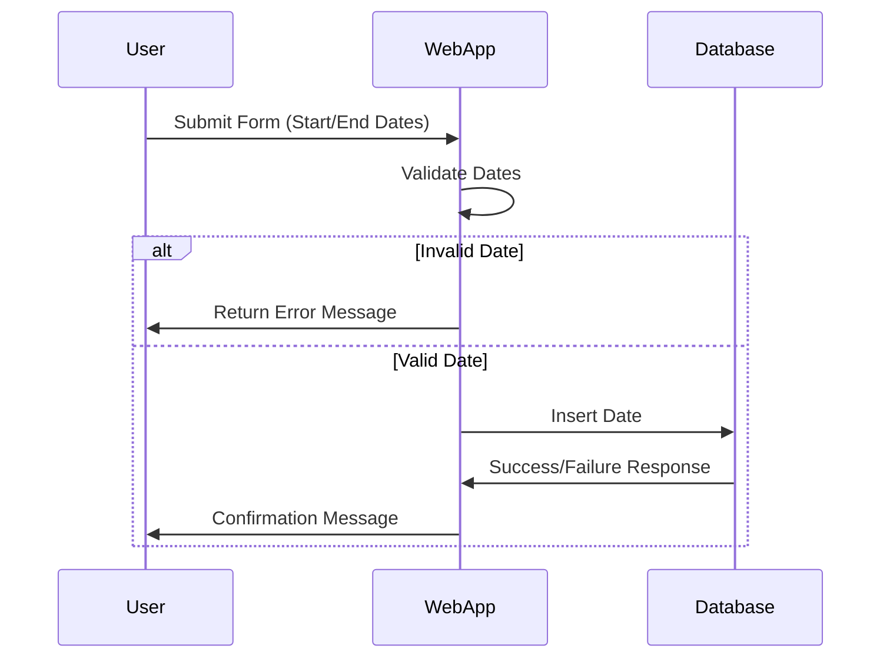

## Effective Date Constraints

### Description

The Effective Date Constraints pattern deals with enforcing rules in data models that ensure date-related attributes adhere to logical expectations, such as ensuring a start date occurs before an end date. This pattern is crucial in data integrity where temporal data is involved, ensuring that the recorded and operational timeframes make business sense. This pattern can apply not only in database schemas but across various systems using effective dates, such as event sourcing systems.

### Architectural Approach

Implementing effective date constraints involves creating validations either in the database layer or application layer. The most robust methods often employ both. Here's a breakdown:

1. **Database Constraints**: Utilize database-level constraints, such as CHECK constraints in SQL databases, to ensure that the start date (`EffectiveStartDate`) is always before or the same as the end date (`EffectiveEndDate`).

2. **Application Logic**: Implement logical checks within the application code that processes date-related data to prevent insertion or updates where date logic would be invalid.

3. **Message Validation**: In messaging or event-driven architectures, validate date logic before publishing messages or events to ensure downstream consumers likewise receive valid temporal data.

### Best Practices

- **Consistent Validation**: Apply effective date checks consistently across all data entry points, including bulk imports, direct edits, and transactional systems.
- **Test Edge Cases**: Carefully test edge cases, like leap years and daylight savings changes, to ensure your constraints handle them gracefully.
- **Data Types**: Use appropriate date-time data types in databases and coding environments to prevent loss of precision and unintended errors.
- **Time Zones**: Account for time zones, especially in distributed systems, to avoid logical fallacies in data recorded across multiple geographies.

### Example Code

Here's an example using SQL to enforce effective date constraints:

```sql
CREATE TABLE Contracts (
    ContractID INT PRIMARY KEY,
    EffectiveStartDate DATE NOT NULL,
    EffectiveEndDate DATE,
    CHECK (EffectiveStartDate <= EffectiveEndDate)
);
```

In application logic, consider a simple validation in Java:

```java
public class Contract {

    private LocalDate effectiveStartDate;
    private LocalDate effectiveEndDate;

    public void setEffectiveDates(LocalDate start, LocalDate end) {
        if (start.isAfter(end)) {
            throw new IllegalArgumentException("Start date must be before end date");
        }
        this.effectiveStartDate = start;
        this.effectiveEndDate = end;
    }
}
```

### Diagrams

Below is a UML Sequence Diagram illustrating the typical workflow for validating effective date constraints through a web application:



### Related Patterns

- **Validation Layers**: Integrate with validation frameworks or pattern libraries in modern web development environments.
- **Temporal Patterns**: Evaluate crossing patterns to handle chronological data better, such as longevity or duration monitoring.

### Additional Resources

- *SQL Constraints and Their Use Cases* [Link to resource]
- *Designing a Data Validation Strategy* [Link to resource]
- *Temporal Data Management in Distributed Systems* [Link to resource]

### Summary

Effective Date Constraints are integral to maintaining high data quality and integrity across applications and systems dealing with temporal information. Whether through database enforcement, application logic, or a combination of both, these constraints safeguard against illogical date entries, ensuring the business rules regarding date validity remain inviolate and dependable. By understanding and implementing these constraints correctly, systems remain robust against various anomalies or invalid entries.
