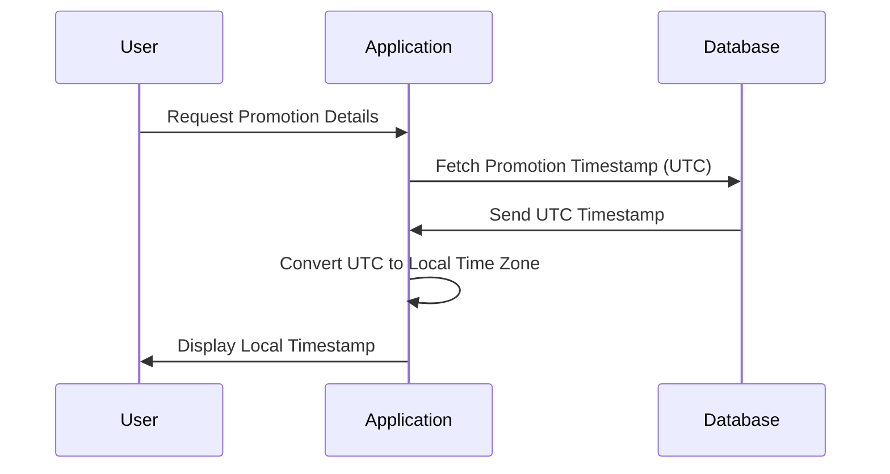

## Introduction

In today's global applications, effective time-zone handling is crucial to managing time-sensitive data consistently and accurately across different regions. Mismanagement can lead to data inconsistency, user dissatisfaction, and operational errors. This pattern emphasizes the strategies to ensure that effective dating and time-sensitive events are correctly handled irrespective of the users' geographical locations.

## Problem Statement

When managing datasets with time-dependent attributes, it is essential to account for the time zone differences. A common use case is scheduling promotions that should be effective at local times. For instance, a promotional campaign might be set to start at a specific time globally, but due to time zone variations, this time must be adjusted locally to prevent confusion.

## Context

Applications that operate across multiple regions often need to present date-time information correctly. An incorrect time zone assumption may lead to operations firing too early or late, violating business rules, or worse, degrading the user experience.

## Solution

The solution to effective time-zone handling involves:

1. **Standardizing on a Base Time Zone**: Store all timestamps in UTC (Coordinated Universal Time). This global standard helps in simplifying calculations and comparisons without the extra complexity of time zone conversions.

2. **Localized Presentation**: Convert and display times in the users' local time zones using libraries like `moment-timezone.js` or Java's `java.time.ZoneId` framework.

3. **Time Zone Awareness**: Include time zone data within your data models where applicable. Store not only the timestamp but also the time zone in which it needs to be interpreted when transactions or records are created.

4. **Supporting Daylight Saving Changes**: Ensure your system can adjust for daylight saving changes automatically to avoid unexpected behavior.

## Example Code

### Java Example with `ZoneId`

```java
import java.time.ZonedDateTime;
import java.time.ZoneId;

public class Promotion {
    public static void main(String[] args) {
        ZoneId utcZone = ZoneId.of("UTC");
        ZoneId userZone = ZoneId.of("America/New_York");
        
        ZonedDateTime utcTime = ZonedDateTime.now(utcZone);
        ZonedDateTime localTime = utcTime.withZoneSameInstant(userZone);
        
        System.out.println("UTC Time: " + utcTime);
        System.out.println("Local Time: " + localTime);
    }
}
```

### JavaScript Example with `moment-timezone`

```javascript
const moment = require('moment-timezone');

let utcTime = moment.utc();
let localTime = utcTime.clone().tz('America/New_York');

console.log("UTC Time: ", utcTime.format());
console.log("Local Time: ", localTime.format());
```

## Diagrams

### Sequence Diagram for Localized Time-Handling



## Related Patterns

- **Data Normalization** - Ensures uniform data formats, including time conversion to a standard time zone.
- **Anti-Corruption Layer** - For systems interacting with multiple sources adhering to different time standards, this layer normalizes time formats before processing.

## Additional Resources

- [IANA Time Zone Database](https://www.iana.org/time-zones) provides the essential database for managing time zones.
- Java Documentation on [Time Handling](https://docs.oracle.com/javase/8/docs/api/java/time/ZoneId.html)
- [Moment.js Time Management Library](https://momentjs.com/timezone/)

## Summary

Effective time-zone handling is a critical component in global applications. By understanding and implementing best practices in time zone management, developers can prevent common pitfalls related to time zone mishaps. Using UTC for storage, converting dates for presentation, and leveraging robust libraries for handling time zones ensures that applications serve users accurately and effectively across the globe.
