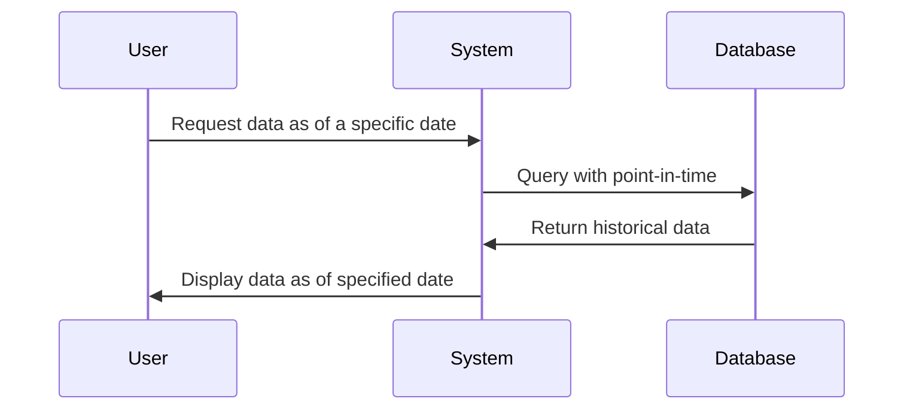

---

linkTitle: "Effective Data Versioning"
title: "Effective Data Versioning"
category: "Effective Data Patterns"
series: "Data Modeling Design Patterns"
description: "A design pattern that focuses on maintaining versions of data by effective dates, providing the ability to retrieve data as it was at any given time in history."
categories:
- Effective Data Patterns
- Data Modeling Design Patterns
- Version Control
tags:
- Data Versioning
- Effective Dates
- Time-Travel Queries
- Historical Data Management
- Data Integrity
date: 2024-07-07
type: docs

canonical: "https://softwarepatternslexicon.com/103/9/13"
license: "© 2024 Tokenizer Inc. CC BY-NC-SA 4.0"
---


## Description

Effective Data Versioning is a design pattern employed in databases and distributed systems to maintain historical versions of datasets. This pattern focuses on capturing changes in data along with timestamps or effective dates which signify the period during which the data was valid. This allows systems to present the data as it appeared at any specified time, supporting functions such as auditing, historical analysis, and reprocessing of transactions based on historical data states.

## Architectural Considerations

- **Temporal Tables**: Utilize temporal tables where each data change event creates a new version with a valid time range (e.g., `valid_from` and `valid_to`). This ensures that old data is preserved and queryable.
- **Point-in-Time Query Support**: Implement query capabilities to extract data as of a specific date.
- **Storage Strategy**: Considerations for data storage efficiency, especially for large datasets to avoid performance degradation.
- **Data Integrity and Consistency**: Maintain the consistency of data versions across distributed services.

## Example Code

### SQL Example

Below is an example of setting up a table with effective dating:

```sql
CREATE TABLE ProductHistory (
    ProductID INT,
    Description VARCHAR(255),
    ValidFrom DATE NOT NULL,
    ValidTo DATE DEFAULT '9999-12-31',
    PRIMARY KEY (ProductID, ValidFrom)
);

-- Insert initial product description
INSERT INTO ProductHistory (ProductID, Description, ValidFrom)
VALUES (1, 'Original Description', '2022-01-01');

-- Update product description
UPDATE ProductHistory
SET ValidTo = '2022-06-01'
WHERE ProductID = 1 AND ValidTo = '9999-12-31';

INSERT INTO ProductHistory (ProductID, Description, ValidFrom)
VALUES (1, 'Updated Description', '2022-06-01');
```

### Point-in-Time Query

```sql
SELECT *
FROM ProductHistory
WHERE ProductID = 1 AND '2022-05-15' BETWEEN ValidFrom AND ValidTo;
```

## Diagram



## Related Patterns

- **Event Sourcing**: Storing a sequence of state changes as a series of events which can be replayed to reconstruct past states.
- **Audit Logging**: Keeping a comprehensive log of changes for traceability and compliance, often combined with effective versioning.
- **Delta Lake Architecture**: Utilizes data versioning to manage data pipelines, allowing easy rollbacks and time travel queries.

## Additional Resources

- [Temporal Table Queries in SQL Server](https://docs.microsoft.com/en-us/sql/relational-databases/tables/temporal-tables)
- [Implementing Effective Dating in Relational Databases](https://martinfowler.com/articles/alternate-schema.html)

## Summary

Effective Data Versioning is crucial for systems where historical accuracy of data is necessary, such as in financial systems, auditing frameworks, and analytics engines. By leveraging techniques like temporal tables and point-in-time queries, organizations can ensure they meet requirements for historical data integrity and provide enhanced analytical capabilities.

The implementation requires careful consideration of storage strategies, indexing, and query optimization to safeguard against performance bottlenecks, but effectively addresses the need for viewing system state at any historical point, fulfilling both operational and compliance needs.

---
