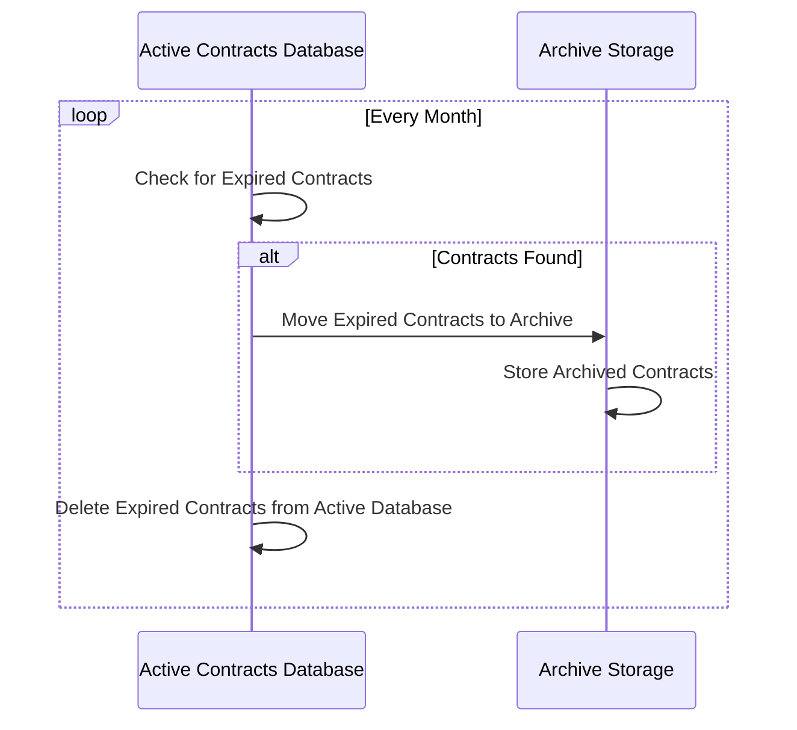

## Overview

Effective Data Archiving is a design pattern that helps organizations manage data lifecycle by systematically archiving records based on their effective dates. This pattern is particularly useful for maintaining compliance with data retention policies, improving database performance, and reducing storage costs.

### Architectural Approach

This pattern involves several key steps:
1. **Identify the Data for Archiving**: Determine which records should be archived based on business rules, such as effective or expiry dates.
2. **Define Archiving Policies**: Establish criteria for when and how data should be moved to archive storage. These policies should align with organizational and regulatory requirements.
3. **Implement Archival Processes**: Develop automated or semi-automated processes to migrate data to archive tables or dedicated storage solutions.
4. **Access Archived Data**: Ensure archived data remains accessible for audits or historical reference, typically through archive indexes or specialized access procedures.

### Best Practices

- **Automation**: Implement automated processes to regularly move data to archive storage, reducing manual intervention.
- **Data Integrity**: Maintain referential integrity by preserving relationships between archived data and active records.
- **Security and Compliance**: Ensure archived data is stored securely and in compliance with legal and organizational policies.
- **Regular Reviews**: Periodically review and refine archiving policies to adapt to changing business needs and regulations.

### Example Code

Below is an example SQL snippet for archiving contracts that expired more than five years ago to a separate archive table:

```sql
-- Move expired contracts to archive table
INSERT INTO contracts_archive (contract_id, client_id, contract_details, expiry_date)
SELECT contract_id, client_id, contract_details, expiry_date
FROM contracts
WHERE expiry_date <= NOW() - INTERVAL '5 years';

-- Delete moved contracts from active contracts 
DELETE FROM contracts
WHERE expiry_date <= NOW() - INTERVAL '5 years';
```

### Diagrams



### Related Patterns

- **Data Partitioning**: Split data into partitions based on date ranges for better management and retrieval.
- **Event Sourcing**: Keep a historical log of changes to facilitate data recovery and analysis.

### Additional Resources

- [AWS Data Archiving Guidelines](https://aws.amazon.com/archiving/)
- [Data Governance and Compliance Article](https://example.com/data-governance)
- [Database Partitioning Strategies](https://example.com/database-partitioning)

## Summary

Effective Data Archiving provides a robust solution for organizations seeking to manage their data lifecycle effectively. By following best practices and utilizing automation, businesses can ensure compliance, improve database performance, and reduce costs associated with storing obsolete or expired data. As business needs and technological capabilities evolve, thoughtful implementation and periodic review of archiving strategies will facilitate seamless data management and accessibility.
