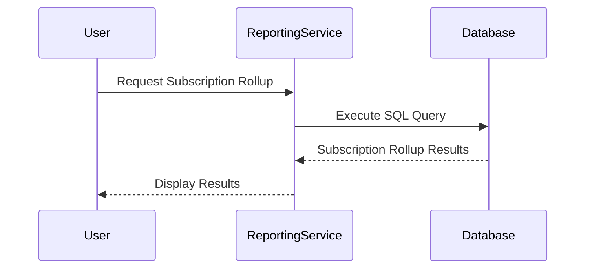

## Overview

Effective Data Rollup is a design pattern used to aggregate data within defined effective date ranges for reporting or analytical purposes. This pattern is commonly applied in scenarios where you need to summarize or compute metrics over periods, such as calculating monthly active subscriptions, financial transactions, or inventory levels based on their active or valid date ranges.

## Architectural Considerations

Effective data rollup involves several architectural considerations:

- **Storage**: The data structure must efficiently store date ranges and relevant metrics. It often leverages time-series databases or partitioned tables for efficient querying.
  
- **Query Performance**: Efficient indexing and partitioning strategies are essential for quick range-based queries.
  
- **Data Integrity**: Heed for accurately maintaining the start and end dates, ensuring no overlapping periods for the same entity.
  
- **Temporal Validity**: Incorporate mechanisms to check temporal validity with current or reporting dates.

## Example

Example task: Summing up the total active subscriptions for each month.

```sql
SELECT 
  TO_CHAR(date_trunc('month', effective_date), 'YYYY-MM') AS month, 
  SUM(subscription_count) as total_active_subscriptions
FROM 
  subscriptions
WHERE 
  effective_date BETWEEN :startDate AND :endDate
GROUP BY 
  TO_CHAR(date_trunc('month', effective_date), 'YYYY-MM')
ORDER BY 
  month;
```

## Diagram



## Best Practices

- **Use of Indexes**: Create composite indexes on date fields for faster retrieval.
  
- **Batch Processing**: For large datasets, employ batch processing or micro-batching to efficiently aggregate data.
  
- **Time Zone Handling**: Ensure date ranges are correctly handled concerning time zones, especially for global applications.

## Related Patterns

- **Snapshot Pattern**: Useful for capturing the state of a dataset at a particular point in time, allowing for detailed historical analysis.
  
- **Event Sourcing Pattern**: Uses a sequence of state-changing events to derive system state for rollup during a specific period.

## Additional Resources

- Article on temporal database modeling practices: [Temporal Data Modeling](https://example.com/temporal-data-modeling)
  
- White paper on performance optimization for date-range queries: [Optimizing Range Queries](https://example.com/optimizing-range-queries)

## Summary

The Effective Data Rollup pattern efficiently aggregates data across specified date ranges, optimizing for reporting and analysis. By maintaining data integrity and applying best practices for storage and query execution, this pattern supports robust time-based insights across various use cases. This approach can significantly streamline operational and strategic decision-making by providing reliable and time-bound data aggregations.
