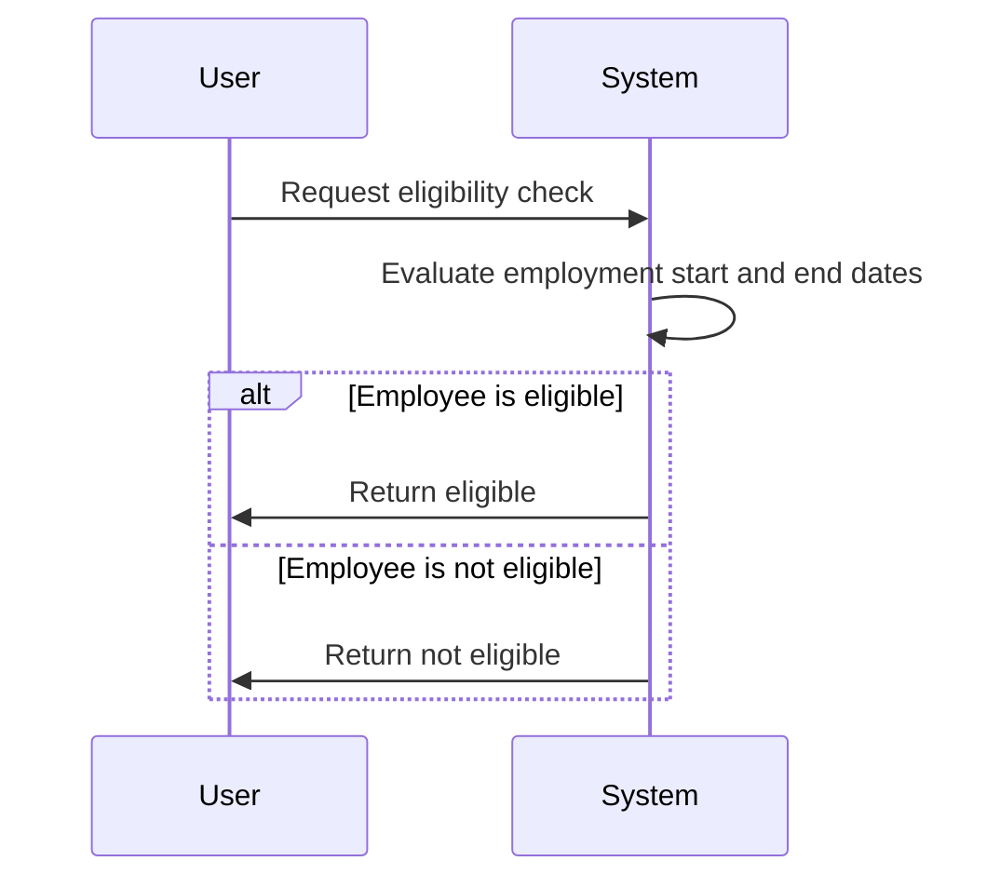

## Overview

Effective Conditional Logic is a design pattern that deals with the application of business logic based on the effective dates of the data. This pattern is essential when conditions or actions need to be triggered or evaluated depending on the state of data at a particular time. An example can be the calculation of employee benefits eligibility based on their effective employment dates.

## Architectural Approaches

1. **Temporal Data Management**: Store effective start and end dates with data records. This approach enables history tracking and future scheduling.

2. **Event Sourcing**: Utilize past events to reconstruct the state of a data entity. With event sourcing, the system can determine the state at any given time which aids in applying conditional logic effectively.

3. **Policy-Based Logic**: Define business policies as separate entities that control behavior based on temporal conditions.

## Paradigms and Best Practices

- **Encapsulation of Logic**: Encapsulate conditional logic within domain services or dedicated policy objects to simplify and standardize the handling of time-based logic across the application.

- **Use of Feature Toggles**: Employ feature toggles to conditionally activate or deactivate logic paths based on dates without redeploying the system.

- **Testing**: Implement thorough testing regimes to explore different scenarios especially around critical dates like effective start and end dates.

## Example Code

```scala
case class Employee(id: Int, name: String, employmentStartDate: LocalDate, employmentEndDate: Option[LocalDate])

def isEligibleForBenefits(today: LocalDate, employee: Employee): Boolean = {
  val isCurrentlyEmployed = employee.employmentStartDate.isBefore(today) &&
    employee.employmentEndDate.forall(_.isAfter(today))
  
  isCurrentlyEmployed
}

val employee = Employee(1, "John Doe", LocalDate.of(2022, 1, 1), Some(LocalDate.of(2025, 12, 31)))
println(isEligibleForBenefits(LocalDate.now(), employee)) // Evaluates based on today's date
```

## Diagrams



## Related Patterns

- **Event Processing Patterns**: These are crucial for managing the flow and transformation of events over time.
  
- **History Table Pattern**: Create history tables in SQL databases to manage changes over time explicitly.

## Additional Resources

- *Martin Fowler's "Patterns of Enterprise Application Architecture"*: Offers a good foundation for understanding effective conditional logic through patterns.
- *Event Sourcing and CQRS Samples and Boilerplates*: Various online repositories provide examples of how temporal data management is achieved using event-driven architectures.

## Summary

Effective Conditional Logic is a strategic approach in data modeling and business logic designs where conditions are formulated based on effective dates. This pattern ensures precise control and accurate data management crucial in industries that strongly rely on date-based calculations and policies like finance, HR, and insurance.

Understanding and employing temporal data management principles ensures that your system remains flexible, maintainable, and efficient in handling past, present, and future-based conditional logic.
