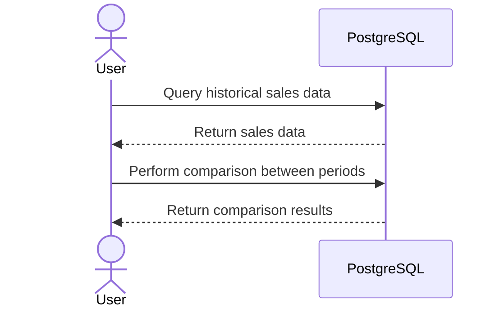

## Overview

In data-driven decision-making, the ability to accurately compare data across different time frames, known as effective periods, is essential. The **Effective Data Comparison** pattern helps businesses and analysts identify changes, trends, and anomalies by comparing data from different points in time.

## Key Concepts

- **Effective Periods**: Specific time frames over which data is collected or analyzed.
- **Temporal Data Management**: Handling of historical, current, and future data states to maintain accuracy and consistency over time.
- **Change Detection**: Identifying differences or trends between two or more effective periods.

## Architectural Approach

The Effective Data Comparison pattern involves structuring your data architecture to efficiently handle and query temporal datasets. This includes using:

- **Time-Stamped Records**: Each data entry is associated with a timestamp indicating its effective period.
  
- **Snapshots and Delta Changes**: Retain full data snapshots or record only changes to minimize storage and enhance query performance.

- **Temporal Query Engines**: Utilize databases supporting temporal queries like PostgreSQL with `TIMESTAMP` types or specialized engines like Apache Hudi or Delta Lake for big data.

## Best Practices

1. **Data Normalization**: Ensure data consistency across different time frames by normalizing schema.

2. **Indexing by Time**: Use time-based indexing to enhance retrieval performance for temporal queries.

3. **Consistent Time Zones**: Store and process timestamps in a consistent time zone to avoid discrepancies in comparisons.

4. **Use of OLAP**: Employ Online Analytical Processing systems for complex query capabilities in multidimensional datasets.

## Example Implementation

Here's a simple example in SQL illustrating how you might compare sales data between two promotional periods using PostgreSQL:

```sql
SELECT 
    p1.product_id,
    p1.sales_amount AS promo1_sales,
    p2.sales_amount AS promo2_sales,
    (p2.sales_amount - p1.sales_amount) AS sales_change
FROM 
    promotional_sales p1
JOIN 
    promotional_sales p2 
ON 
    p1.product_id = p2.product_id
WHERE 
    p1.promo_period = '2023-Promo1'
    AND p2.promo_period = '2023-Promo2';
```

## Diagrams

Here’s a simple Mermaid UML Sequence Diagram representing a temporal query scenario:



## Related Patterns

- **Temporal Static Pattern**: Manages entities with changing data over time, maintaining a history of changes.
- **Event Sourcing Pattern**: Captures state changes as a sequence of events, useful in reconstructing past states.

## Additional Resources

- "Time-Oriented Databases" by Richard Snodgrass for understanding temporal data structures.
- Apache Delta Lake and Apache Hudi documentation for managing large temporal datasets.

## Summary

The Effective Data Comparison pattern is crucial for businesses aiming to understand data dynamics over time. By adopting temporal data management techniques and using specialized databases, organizations can significantly enhance their analytical capabilities and make informed decisions based on comprehensive data comparisons.
