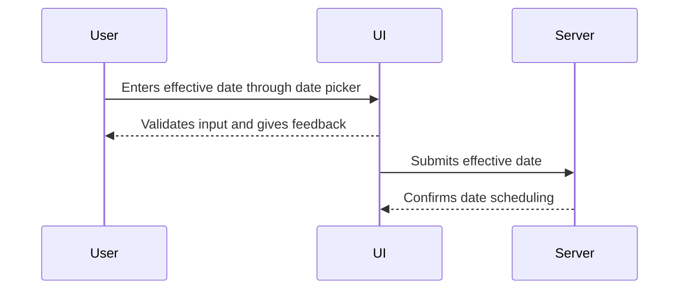

## Overview

The "Effective Dating" pattern in user interfaces (UI) provides a means for users to specify when data should become effective. This design pattern is particularly useful in applications where changes need to be scheduled for a future date, allowing for better planning and reduced error rates.

## Design Pattern Description

Effective dating is crucial for systems that require dynamic data updating and future planning, such as financial applications, content management systems, or inventory management software. The core concept is to allow users to specify 'effective dates' directly within the interface. This approach not only improves data accuracy but also user satisfaction by providing intuitive date control mechanisms.

## Key Components

1. **Date Selection Widgets**: UI components like calendars, date pickers, or dropdown menus to facilitate easy date selection.
2. **Data Validation**: Ensuring that selected dates fall within acceptable ranges and adhere to business logic.
3. **Feedback Mechanisms**: Providing users with immediate visual feedback or validation messages when incorrect dates are entered.
4. **Future Scheduling**: Allowing for operations like scheduling, notifications, or auto-execution based on the selected dates.
5. **Time Zone Awareness**: Handling time zones to ensure that the dates are consistent across different geographical locations.

## Architectural Approaches

### Client-Side

- Use JavaScript libraries such as [Flatpickr](https://flatpickr.js.org/) or [React-Datepicker](https://reactdatepicker.com/) to implement date selection widgets.
- Ensure real-time data validation using the client-side logic to minimize server requests and enhance user experience.

### Server-Side

- Maintain a centralized logic for effective date processing to ensure consistency across client sessions.
- Implement RESTful APIs to handle date-related queries and mutations separately, with endpoints dedicated to effective date operations.

## Best Practices

- **Consistency**: Use uniform date formats across all components and modules.
- **Accessibility**: Ensure date pickers and feedback mechanisms are accessible to users with disabilities.
- **Localization**: Adapt the display of dates according to user's locale and timezone.
- **Testing**: Conduct robust testing for date input scenarios, including leap years, end-of-month scenarios, and daylight saving changes.

## Example Code

Here's a basic example in JavaScript using React and the React-Datepicker library:

```javascript
import React, { useState } from 'react';
import DatePicker from 'react-datepicker';
import 'react-datepicker/dist/react-datepicker.css';

const EffectiveDateForm = () => {
  const [startDate, setStartDate] = useState(new Date());

  return (
    <div>
      <h3>Set Effective Date</h3>
      <DatePicker
        selected={startDate}
        onChange={(date) => setStartDate(date)}
        minDate={new Date()}
        showTimeSelect
        dateFormat="Pp"
      />
    </div>
  );
};

export default EffectiveDateForm;
```

## Diagram



## Related Patterns

- **Delayed Activation Pattern**: Similar in purpose but focuses on actions instead of data that is effective in the future.
- **Temporal Validity Pattern**: Used for validating date ranges where data must abide by specific time-based rules.
  
## Additional Resources

- [Designing Effective Date Handling in FinTech Apps](https://example.com/fintech-dates)
- [The Role of Effective Dates in Inventory Management](https://example.com/inventory-dates)

## Summary

The "Effective Dating in User Interfaces" design pattern enhances the functionality and reliability of applications where future scheduling of data is imperative. By providing intuitive UI elements for date selection and embedded validation logic, this pattern ensures data accuracy and improves user interaction within applications. Implementing effective dating requires careful attention to detail, especially concerning time zone handling, feedback mechanisms, and consistent formatting, which altogether refine user experience across platforms.


