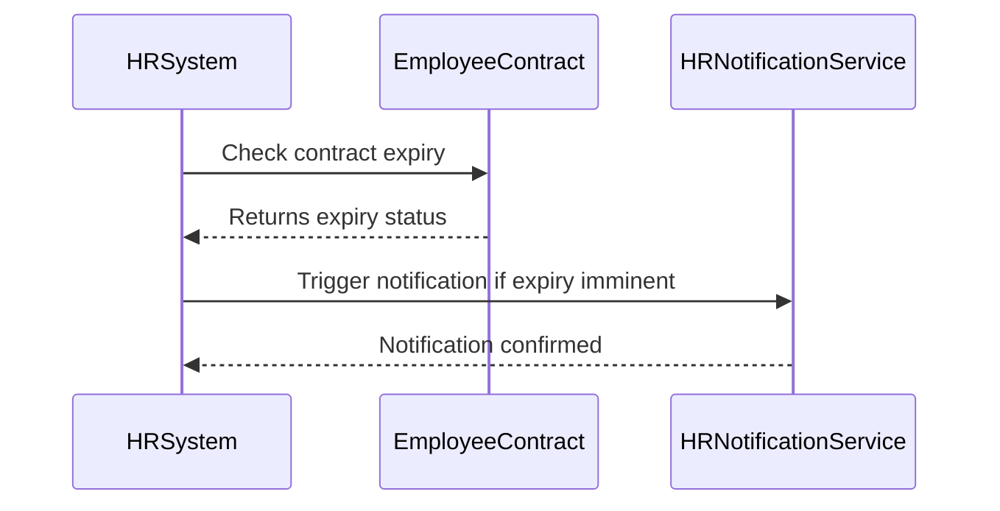

## Introduction

Incorporating effective dates into workflows is a pivotal design pattern aimed at automating actions based on pre-defined time criteria. This pattern is particularly crucial for efficiently managing business processes that rely heavily on temporal conditions. An effective date is a specific date during which a particular state is valid, helping trigger relevant events in workflows.

### Use Cases

- **Human Resources**: Automatically notify HR when an employee's contract is about to expire, providing a buffer for renewal discussions.
- **Subscription Services**: Alert users before their service renewal date, possibly offering a renewal promotion.
- **Compliance Checks**: Ensure regulatory compliance documents are up to date and trigger alerts when they approach expiration.

## Design Pattern Explanation

**Concept**: The Effective Data in Workflows pattern helps maintain the consistency and timing of events within a process by storing and checking conditions against effective dates. This assists in preempting actions and orchestrating complex workflows that depend on temporal data.

### Architectural Approach

- **Data Modeling**: Extend entities with effective date attributes (e.g., valid_from, valid_until) which are registered within database schemas.
  
- **Workflow Automation Tools**: Leverage workflow automation tools or Continuous Integration/Continuous Deployment (CI/CD) pipelines to implement this pattern and monitor effective dates.

### Example Code

Let's consider an example using Java and a simple workflow framework to implement effective dates for an employee contract workflow:

```java
import java.time.LocalDate;
import java.time.temporal.ChronoUnit;

public class EmployeeContract {
    private LocalDate contractStartDate;
    private LocalDate contractEndDate;

    public EmployeeContract(LocalDate startDate, LocalDate endDate) {
        this.contractStartDate = startDate;
        this.contractEndDate = endDate;
    }

    public boolean isExpiryImminent() {
        return LocalDate.now().isAfter(contractEndDate.minusDays(30));
    }
}

// Workflow Implementation
public class HRWorkflow {
    public void checkContracts(EmployeeContract contract) {
        if (contract.isExpiryImminent()) {
            notifyHRDepartment();
        }
    }

    private void notifyHRDepartment() {
        // Trigger notification logic
        System.out.println("Notification sent to HR about contract expiration.");
    }
}
```

### Visual Representation

Here is a UML Sequence Diagram showcasing a simplified workflow of how an HR department might be notified of contract expirations.



## Related Patterns

- **Temporal Validity Design Pattern**: Ensure data is valid for processes using predefined timeframes.
- **Event-Driven Architecture**: Use events to adapt workflow logic based on real-time triggers related to effective dates.
- **State Transition**: Manage finite states across entities when their effective dates lead to changes in business rules.

## Best Practices

- **Regular Audits**: Periodically audit effective dates to ensure data accuracy and integrity.
- **Grace Periods**: Implement logic for grace periods for operations that require additional time after an effective date has passed.
- **Version Control of Records**: For effective dates, manage multiple versions of data records to account for changes over time.

## Additional Resources

- [Temporal Data and its Management in Modern DBMS](https://www.example.com)
- [Best Practices in Automated Workflow Design](https://www.examplewfe.com)
- [A Guide to Event-Driven Architecture](https://www.exampleevents.com)

## Summary

Integrating effective dates within workflow processes ensures timely responses to changes in business conditions, enhancing efficiency, and automating repetitive tasks. By carefully modeling these temporal attributes and implementing them in workflow systems, organizations can maintain compliance, promote efficiency, and reduce manual overhead.
