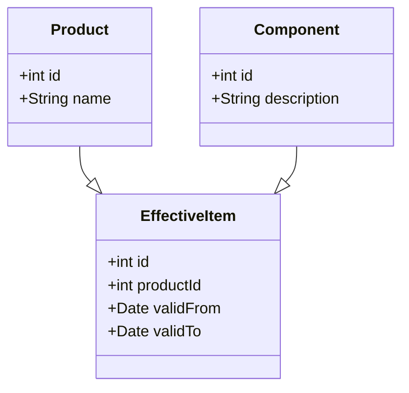

---

linkTitle: "Effective Date Hierarchies"
title: "Effective Date Hierarchies"
category: "Effective Data Patterns"
series: "Data Modeling Design Patterns"
description: "Organizing hierarchical data based on effective dates, such as versioned bills of materials, allowing for effective management of data that evolves over time."
categories:
- data-modeling
- temporal-data
- patterns
tags:
- effective-date
- hierarchy
- data-versioning
- temporal-pattern
- data-management
date: 2024-07-07
type: docs

canonical: "https://softwarepatternslexicon.com/103/9/23"
license: "© 2024 Tokenizer Inc. CC BY-NC-SA 4.0"
---


## Overview

The Effective Date Hierarchies pattern is instrumental in organizing and managing data that changes over time, which is crucial in domains like manufacturing, billing, product management, or any domain reliant on temporal data integrity. This pattern utilizes an effective date attribute to hierarchically organize the data, allowing for versioning and management through changes.

## Context

In many business scenarios, data entities undergo changes that are not immediately applicable but are scheduled to take effect at specific future dates. Product structures, pricing models, and service plans often need structuring that respects these temporal constraints.

## Problem

A straightforward method of managing these additions to the data might lead to components becoming outdated as they cannot accommodate future changes until those changes are current. This can lead to inefficiencies and errors, particularly when these changes are part of a hierarchical structure like a Bill of Materials (BOM). Hence, maintaining historical versions and managing upcoming changes effectively is vital.

## Solution

Introduce effective date elements as a necessary attribute within your data hierarchies to track when data changes occur and manage both current and future data editions simultaneously. Each node in a data hierarchy has a valid timeframe defined by start and end effective dates.

### Key Concepts

- **Effective Date**: Represents when the data record becomes valid. If undefined, the data is immediate.
- **Versioning**: Each data record can have different versions, tracked using effective dates.
- **Temporal Validity**: Ensures that at any point, the correct version is accessible based on temporal context.

### Structure

The structure typically begins with hierarchical storing, where each element from children nodes to parent nodes follows sequential valid-from-date to valid-to-date order for future projections.

### Implementation

Here's a simplified example in SQL representing a versioned Bill of Materials:

```sql
CREATE TABLE BillOfMaterials (
    bom_id SERIAL PRIMARY KEY,
    product_id INT NOT NULL,
    component_id INT NOT NULL,
    valid_from DATE NOT NULL,
    valid_to DATE,
    CONSTRAINT valid_date_range CHECK (valid_to IS NULL OR valid_from <= valid_to)
);

INSERT INTO BillOfMaterials (product_id, component_id, valid_from, valid_to)
VALUES (101, 501, '2024-07-01', NULL), 
       (101, 502, '2024-01-01', '2024-06-30');
```

### Visualization

Below is a UML diagram that represents the Effective Date Hierarchy:



## Benefits

1. **Accurate Historical Representation**: By keeping track of changes over time, effective dates allow for the reflection of past, current, and future states.
2. **Ease of Management**: It offers a systematic approach to managing changes in hierarchically organized data entities.
3. **Improved Forecasting**: Enables forecasting and planning that incorporate upcoming changes.

## Related Patterns

- **Temporal Table Pattern**: This utilizes time-interval tables for managing data versioning.
- **Event Sourcing**: Captures all changes to an application state as a sequence of events.
- **CQRS**: Integrates naturally with systems where knowing the state at any given time is crucial.

## Additional Resources

- *“Organizing Temporal Data in Hierarchical Structures”* by Elaine D. Knox (Journal of Systems and Software)
- SQL & Relational Theory by C. J. Date
- Temporal Data & the Relational Model by Richard Snodgrass

## Summary

Effective Date Hierarchies form a critical part of temporal data management strategies, creating an organized and reliable framework for tracking changes over time. This pattern is valuable in businesses where future-proofing and maintaining detailed records over time support accurate data utilization and reporting.


