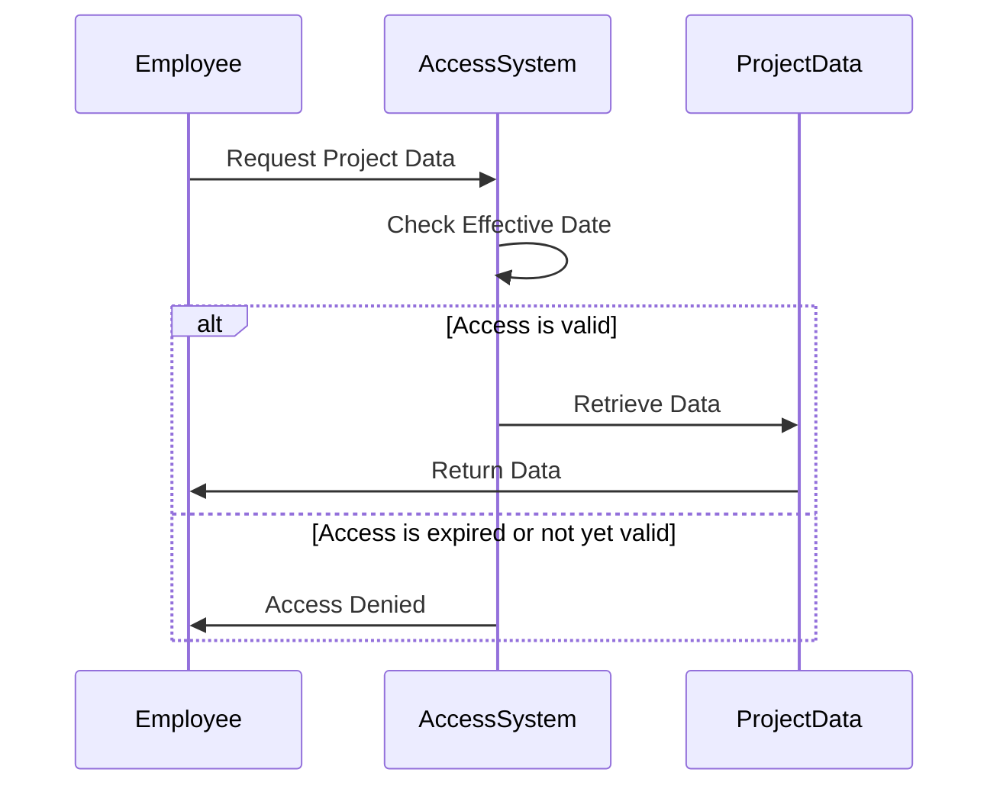

## Introduction

Effective Data Security is a design pattern focused on implementing security rules based on effective date ranges. This approach controls data access by specifying the time frames during which certain security settings, such as permissions or roles, are valid. This not only enhances security but also ensures compliance with various regulatory requirements and improves operational efficiency.

## Problem Statement

Organizations often face challenges in managing data access based on changing contexts or time-based conditions. For example, employee roles might evolve over time, and their data access rights should adjust automatically without manual intervention. Moreover, ensuring that data permissions dynamically align with business rules such as project lifetimes or contract durations can be complex.

## Solution Overview

To address these challenges, the Effective Data Security pattern leverages effective dates to dictate data access control. By associating access permissions with time conditions — start and end dates — organizations can ensure that access rights reflect the current context.

### Core Elements

- **Effective Start Date**: The date from which the security rule is valid.
- **Effective End Date**: The date until which the security rule is applicable.
- **Access Permissions**: The level and scope of access granted during the effective period.

## Example Implementation

Let's consider an example in which employees are granted access to project data only while they are actively assigned to the project. The following pseudo-code illustrates a basic implementation:

```java
class EmployeeAccess {
    String employeeId;
    String projectId;
    LocalDate effectiveStartDate;
    LocalDate effectiveEndDate;

    boolean hasAccess(LocalDate date) {
        return (date.isEqual(effectiveStartDate) || date.isAfter(effectiveStartDate)) &&
               (date.isEqual(effectiveEndDate) || date.isBefore(effectiveEndDate));
    }
}

// Usage
EmployeeAccess access = new EmployeeAccess("e123", "p789", LocalDate.of(2024, 1, 1), LocalDate.of(2024, 12, 31));
if (access.hasAccess(LocalDate.now())) {
    System.out.println("Access granted");
} else {
    System.out.println("Access denied");
}
```

## Architectural Diagram



## Best Practices

- **Automate Date Management**: Use automated systems to manage effective dates based on predefined business rules or triggers.
- **Audit Trails**: Maintain logs of access requests and the corresponding effective period checks to ensure traceability.
- **Flexible Configurations**: Design solutions to allow dynamic updates to effective periods without downtime.
- **Comprehensive Testing**: Implement rigorous testing to ensure the logic correctly respects effective date ranges under all conditions.

## Related Patterns

- **Role-Based Access Control (RBAC)**: Integrates well with time-based access by complementing roles with effective dates.
- **Attribute-Based Access Control (ABAC)**: Can be enhanced with date attributes to refine contextual access.
- **Data Masking**: Ensures sensitive information is hidden once access rights expire.

## Additional Resources

- [OWASP - Access Control Design](https://owasp.org/www-project-top-ten/)
- [ISO/IEC 27001: Information Security Management](https://www.iso.org/isoiec-27001-information-security.html)

## Summary

The Effective Data Security pattern is pivotal for organizations aiming to manage data access with advanced precision and context awareness. By embedding temporal constraints within access logic, businesses can streamline security management, enhance compliance, and reduce administrative overhead. Embracing this pattern as part of a broader data management strategy ensures robust protection against unauthorized data access and fosters a culture of proactive security governance.
