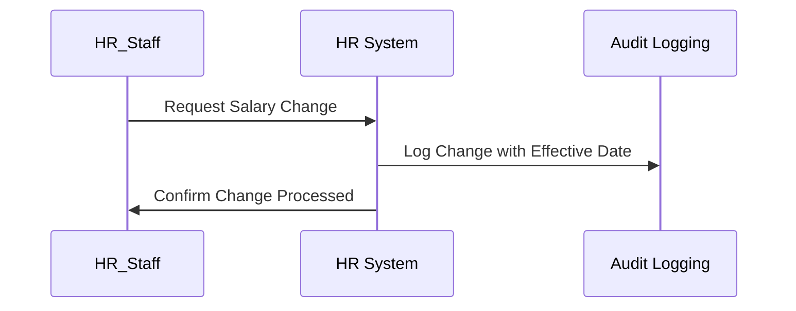

## Overview

The Effective Data Auditing pattern provides a mechanism for tracking changes to data with a particular emphasis on effective dates. This is advantageous for understanding when data changes are implemented and the reasoning behind their scheduling. This pattern is widely applied in domains where future-dated entries affect operations, like HR and financial systems.

## Detailed Explanation

### Purpose

The main aim of the Effective Data Auditing pattern is to maintain a reliable audit trail for data modifications, particularly capturing the **effective date** of the changes. Effective data auditing is crucial for guaranteeing data integrity and compliance with organizational policies and regulations.

### Key Concepts

- **Effective Date**: The date when the data change is intended to take effect.
- **Audit Trail**: A historical record of changes, including who made the change and when.
- **Temporal Tables**: Database tables designed to handle historical data by pairing data modifications with effective dates.

### Benefits

- **Transparency**: Provides visibility into data changes and their intended application.
- **Regulatory Compliance**: Enables adherence to legal requirements by maintaining detailed records.
- **Error Correction**: Simplifies tracing and correcting errors in data based on their audit history.

### Implementation

Here's a generalized approach to implementing effective data auditing:

1. **Database Schema Design**: Include an additional column `effective_date` in your tables to capture when the changes should apply.
   
2. **Audit Table**: Use separate tables to log changes. For example:
   ```sql
   CREATE TABLE salary_audit (
       employee_id INT,
       old_salary DECIMAL(10, 2),
       new_salary DECIMAL(10, 2),
       change_date DATETIME,
       effective_date DATETIME,
       modified_by VARCHAR(100),
       PRIMARY KEY(employee_id, change_date)
   );
   ```
   
3. **Triggers and Middleware**: Implement triggers or use middleware logic to automatically log entries in the audit tables whenever changes occur.

4. **Access Control**: Deploy permissions-based access control to ensure only authorized users can modify data, thus maintaining the integrity of both current and historical data.

### Example

Consider an HR system where salary increases are planned months in advance. Employees can review their forthcoming salary changes through an auditing interface:

```sql
INSERT INTO salary_audit (employee_id, old_salary, new_salary, change_date, effective_date, modified_by)
VALUES (123, 55000, 60000, NOW(), '2024-09-01', 'HR_Admin');
```

This record states that employee 123 will receive a salary update effective September 1, 2024, entered by HR_Admin.

### Diagram

Here’s a UML Sequence Diagram using Mermaid to illustrate the data flow for a change request and audit logging:



### Related Patterns

- **Event Sourcing**: Geared towards capturing all state changes as an immutable log.
- **Temporal Tables**: Facilitates managing effectivity for temporal data within the SQL standard.

### Additional Resources

- [Temporal Table Design Documentation](https://example.com/temporal-tables)
- [Data Auditing Best Practices](https://example.com/data-auditing-best-practices)
- [Understanding Effective Dates in Database Design](https://example.com/effective-dates-db)

## Summary

The Effective Data Auditing pattern enriches data change logs with effective date details, enhancing transparency and compliance efforts. Whether dealing with financial transactions or human resource management, this pattern fosters accountability by tying changes to specific time frames, simplifying both audit trails and future projections. Implementing this approach ensures that your system can maintain a high level of data integrity and accessibility.
