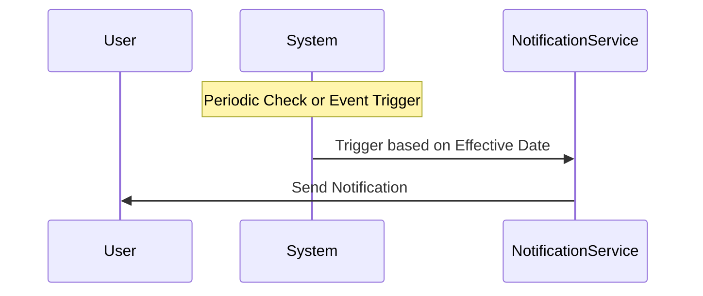

## Effective Data Notifications

### Description
The Effective Data Notifications pattern is centered around the concept of sending notifications or alerts when certain data reaches predefined effective dates. This pattern is commonly used in systems where timely alerts and actions are crucial, such as subscription renewals, policy reviews, or any scenario where data transitions state at specified dates.

### Key Concepts
- **Effective Date**: The date upon which a particular data piece triggers a specific event or state change.
- **Notification Services**: Services responsible for delivering notifications via various channels (e.g., email, SMS).
- **Event Evaluation**: Periodic or real-time evaluation of data for triggering notifications.

### Use Cases
- **Subscription Management**: Alerting customers when their subscription is about to expire or renews.
- **Policy Changes**: Notifying policyholders when changes to terms or expiry dates occur.
- **Inventory Management**: Alerts for stock replenishment based on inventory effective dates.

### Architectural Approaches

1. **Event-Driven Architecture**
   - Utilize an event-driven approach where changes in the data trigger events. These events are then processed to determine if a notification is necessary.

2. **Scheduling Frameworks**
   - Implement scheduling frameworks like Quartz Scheduler in Java, which periodically checks for data conditions to send notifications.

3. **Serverless Implementation**
   - Using cloud functions or lambdas (AWS Lambda, Azure Functions, Google Cloud Functions) that trigger based on specific data conditions or schedules.

4. **Reactive Streams**
   - Implement reactive stream libraries (e.g., Reactor, Akka Streams) to automatically handle data flow and trigger notifications by reacting to data reaching effective dates.

### Example Code

Here's an example of a Scala-based implementation using Akka Streams to handle notifications:

```scala
import akka.actor.ActorSystem
import akka.stream._
import akka.stream.scaladsl._
import java.time.LocalDate

case class Subscription(userId: String, expirationDate: LocalDate)

implicit val system = ActorSystem("EffectiveDataNotifications")
implicit val materializer = ActorMaterializer()

val subscriptions = List(
  Subscription("user1", LocalDate.now.plusDays(5)),
  Subscription("user2", LocalDate.now.plusDays(1))
)

val source = Source(subscriptions)

val notificationFlow = Flow[Subscription].filter { subscription =>
  subscription.expirationDate.isEqual(LocalDate.now.plusDays(3))
}

val sink = Sink.foreach[Subscription](sub => println(s"Notify ${sub.userId}: Subscription expiring soon!"))

source.via(notificationFlow).to(sink).run()
```

### Diagram



### Related Patterns

- **Event Sourcing**: Maintain a history of events to understand state transitions leading to effective dates.
- **Notifications Aggregator**: Collect notifications from various sources to present a unified alert sequence.

### Additional Resources

- [Pattern: Event-Driven Architecture](https://www.enterpriseintegrationpatterns.com/patterns/messaging/EventMessage.html)
- [Akka Streams Documentation](https://doc.akka.io/docs/akka/current/stream/index.html)
- [Reactive Streams](https://www.reactivestreams.org/)

### Summary

Effective Data Notifications is a powerful pattern for managing timely alerts based on data state changes. By utilizing architectural strategies like event-driven architectures, cloud functions, and reactive streams, systems can efficiently handle and trigger notifications, ensuring stakeholders are kept informed of critical changes such as expiration dates for subscriptions or policies. This pattern emphasizes the importance of timely responses in data-intensive environments.
