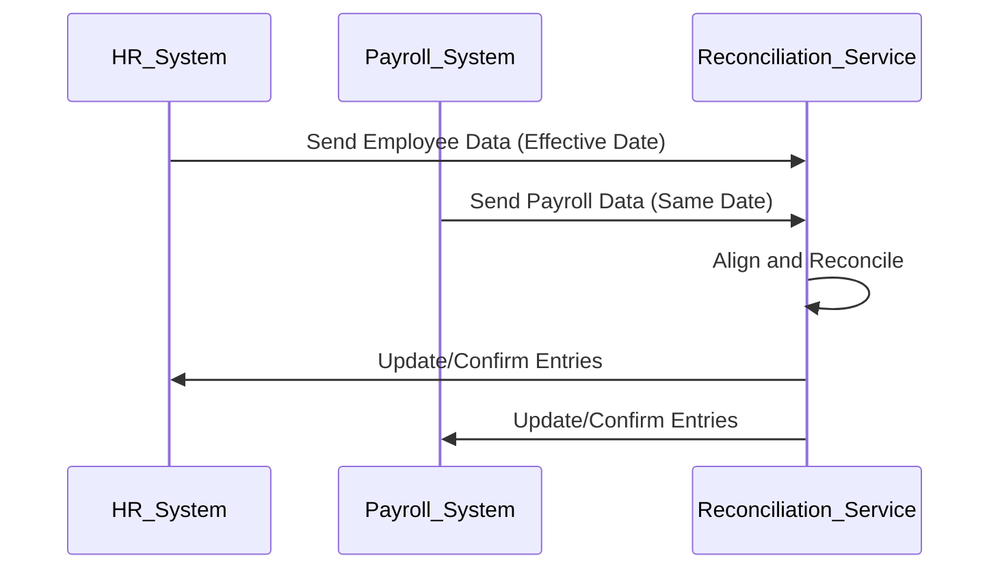

## Effective Data Reconciliation

Effective Data Reconciliation is a critical pattern used to ensure that data aligned across disparate systems is consistent, especially when processed over different periods or effective dates. This pattern is commonly used in scenarios where data from multiple sources needs to be brought together and made relatable for accurate reporting or analysis.

### Description

The Effective Data Reconciliation pattern involves aligning datasets that have overlapping responsibilities in an organization. This often includes aspects such as employee data, customer information, financial stats, or any other domain requiring synchronized data inputs from varied systems. The reconciliation is primarily timed on ‘effective dates’—the specific dates on which data snapshots must align for accuracy and integrity over time.

### Benefits

- **Consistency:** Ensures that the data from various systems depict the same scenarios during overlapping time periods.
- **Accuracy:** Facilitates precise reporting and data analysis.
- **Integrity:** Maintains data quality across multiple disparate systems.

### Use Cases

- **Human Resources and Payroll:** Align employee records for the same periods to ensure payroll computations uniquely reflect HR’s data.
- **Financial Systems:** Synchronize ledgers and transactions across two or more financial systems.
- **Customer Relationship Management (CRM):** Matching similar records from multiple customer engagement platforms to accumulate holistic customer profiles.

### Architectural Approaches

- **Data Merging and Transformation:** Use ETL (Extract, Transform, Load) processes to settle data into a unified form based on effective dates.
- **Time Windows:** Implement logical time windows to process records only for the stipulated effective periods.
- **Version Control:** Leverage version control mechanisms to trace changes over effective dates, aiding reconciliation.

### Patterns and Paradigms

- **Event Sourcing:** This captures all changes to the data as a series of events guaranteeing traceability and helping reconcilers roll back changes.
- **Transactional Outbox:** Ensures that changes made within a transaction (writes) are published or broadcast only after the transaction is completed.
- **Snapshot Isolation:** Ensures consistent reads by exposing transactional progresses limited to certain effective timelines.

### Best Practices

- Ensure that all relevant systems respect the effective date logic when generating records.
- Establish clear data governance policies around data updates and validation rules.
- Implement robust logging to track the effective period’s processing pathways.

### Example Implementation

```sql
-- SQL based reconciliation
WITH HR_DATA AS (
    SELECT employee_id, name, position, effective_date FROM hr_records
),
PAYROLL_DATA AS (
    SELECT employee_id, salary, bonus, effective_date FROM payroll_records
)
SELECT hr.employee_id, hr.name, hr.position, pr.salary, pr.bonus
FROM HR_DATA hr
JOIN PAYROLL_DATA pr 
ON hr.employee_id = pr.employee_id 
AND hr.effective_date = pr.effective_date;
```

### Diagrams

Here is an example of how the process of aligning employee records from HR and Payroll systems can be depicted:



### Related Patterns

- **Data Consolidation Patterns:** Techniques to analyze and merge data into coherent datasets.
- **Transactional Data Management:** Ensures that all systems are in agreement on successful transactional operations.

### Additional Resources

- [Data Reconciliation in Data Warehousing Systems](https://example.com/datwarehouse-reconciliation)
- [Ensuring Data Consistency with Effective Dates](https://example.com/dataconsistency)

### Summary

The Effective Data Reconciliation pattern is significant when you need to synchronize data between overlapping systems over specific timeframes. It resolves discrepancies by enforcing consistent effective dates, ensuring alignment between records and preventing data integrity issues in organizational processes. Implementing this pattern involves a blend of data governance, ETL processes, and transaction management.
