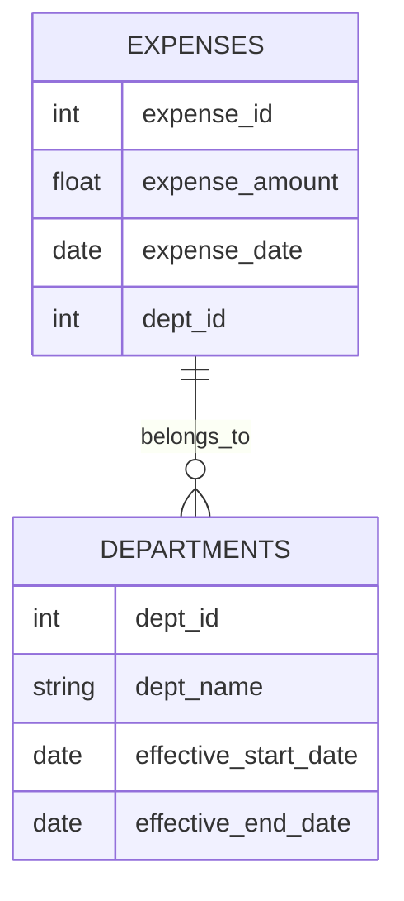

## Introduction

In data modeling, handling hierarchical structures that change over time presents unique challenges, especially when performing data summarization and analysis. The **Effective Data Hierarchical Summarization** pattern addresses these challenges by focusing on aggregating data across hierarchical levels, considering effective dates of structural changes. This approach ensures accuracy and relevance in reporting and decision-making processes.

## Problem

Organizations often operate with hierarchical structures that can change over time due to mergers, departmental re-organizations, or shifts in reporting lines. When these changes occur, standard aggregation methods can yield inaccurate results because these methods typically do not account for the historical context of the data. This pattern solves the problem of effectively summarizing data across such dynamic structures.

## Solution

The **Effective Data Hierarchical Summarization** pattern involves structuring your data and queries to account for effective dating. This means any data point is associated with a time frame during which it is valid. The pattern includes:

1. **Effective-Dated Entities**: Maintain historical records using effective dates. Each hierarchical level (e.g., departments, divisions) is associated with effective start and end dates to track when these structures were valid.

2. **Temporal Joins and Aggregation**: Implement queries that utilize temporal logic, allowing you to accurately join and aggregate data across different time periods.

3. **Maintaining Hierarchical Integrity**: Ensure that your data store supports hierarchical queries that respect effective dates, which may include using recursive queries or specialized graph-based queries.

## Architectural Approaches

- Use databases that support temporal tables (e.g., PostgreSQL with `tsrange` or Oracle's flashback features).
- Implement queries that leverage window functions and partitioning to manage and utilize effective dates efficiently.
- Employ ETL processes to calculate roll-ups and summaries that consider the historical context.

## Best Practices

- **Data Versioning**: Regularly version your hierarchical structures to ensure that historical data remains accurate over time.
- **Audit Trails**: Implement logging mechanisms to track changes in hierarchies to review past states if necessary.
- **Consistent Time Zones**: Ensure all timestamps are in a consistent time zone to avoid discrepancies in effective dating.

## Example Code

Here is a sample SQL query using temporal logic for effective summarization:

```sql
WITH Hierarchy AS (
  SELECT
    dept_id,
    dept_name,
    effective_start_date,
    effective_end_date
  FROM departments
),
Summary AS (
  SELECT
    h.dept_id,
    SUM(e.expense_amount) as total_expense
  FROM expenses e
  JOIN Hierarchy h ON e.dept_id = h.dept_id
  AND e.expense_date BETWEEN h.effective_start_date AND h.effective_end_date
  GROUP BY h.dept_id
)
SELECT * FROM Summary;
```

## Diagram



## Related Patterns

- **Slowly Changing Dimensions (SCD)**: Complement this pattern by using SCD techniques for tracking changes to data over time.
- **Temporal Table Pattern**: Use temporal tables to store historical data, allowing you to query valid datasets for any given point in time.

## Additional Resources

- [Temporal Database Design Principles](https://www.temporal.example.com)
- [Advanced SQL for Effective Data Management](https://www.sqladvanced.example.com)

## Summary

The **Effective Data Hierarchical Summarization** pattern provides a framework for summarizing data across changing hierarchical levels. By incorporating effective dating into your data model and employing the appropriate SQL strategies, you can ensure accurate and meaningful data aggregation and reporting. This pattern is particularly valuable in dynamic organizational environments where structural changes are frequent.
