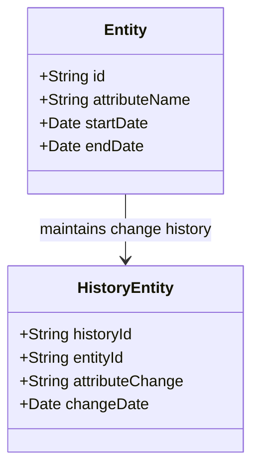

---

linkTitle: "Effective Dated Constraints in Modeling"
title: "Effective Dated Constraints in Modeling"
category: "Effective Data Patterns"
series: "Data Modeling Design Patterns"
description: "A design pattern for incorporating effective date constraints in data models to precisely capture and represent temporal relationships and changes over time. Particularly useful for handling historical data and many-to-many relationships with temporal dynamics."
categories:
- Data Modeling
- Temporal Data
- Design Patterns
tags:
- Data Modeling
- Effective Dates
- Temporal Relationships
- Many-to-Many Relationships
- Historical Data
date: 2024-01-12
type: docs

canonical: "https://softwarepatternslexicon.com/103/9/29"
license: "© 2024 Tokenizer Inc. CC BY-NC-SA 4.0"
---

## Introduction

In the domain of data modeling, capturing the element of time accurately is essential for systems that rely on temporal relationships. **Effective Dated Constraints in Modeling** is a design pattern that addresses this requirement by embedding effective dates within the data structures. This approach is crucial for applications needing historical insight, precise auditing, or chronological correctness, especially in systems where many-to-many relationships evolve over time.

## Design Pattern Overview

**Effective Dated Constraints** allow models to handle and represent state changes, temporal validity, and historical data integrity efficiently. By adding effective start and end dates to entities, developers can account for changes in state or attributes over prescribed periods.

### Key Concepts

- **Effective Date**: The timestamp when a particular entity state or relationship begins to be valid.
- **Expiration Date**: The timestamp when a particular entity state or relationship ceases to be valid.
- **Temporal Validity**: Ensures that data within the model correctly reflects the reality over time.

### Application

Frequently used in contexts like:

- Contract management systems (e.g., insurance policy obligations over time)
- Human resource management (e.g., employment status with multiple assignments)
- Inventory systems (e.g., item availability and pricing changes)

## Architectural Approach

### Modeling Strategies

For effectively capturing temporal data, an entity's model can include:

1. **Validity Periods**
   - Each entity includes fields for `start_date` and `end_date`.
2. **History Tables**
   - Separate tables capturing historical changes with timestamp details.

### UML Class Diagram (Mermaid)



## Example Implementation

Assume we have a system managing project assignments, where an employee can be assigned to multiple projects, and these assignments have effective dates.

### SQL Example

```sql
CREATE TABLE ProjectAssignment (
    employee_id INT,
    project_id INT,
    role VARCHAR(50),
    start_date DATE,
    end_date DATE,
    PRIMARY KEY (employee_id, project_id, start_date)
);

-- Inserting an assignment
INSERT INTO ProjectAssignment(employee_id, project_id, role, start_date, end_date)
VALUES (1, 101, 'Developer', '2023-01-01', '2023-06-30');
```

## Related Patterns

- **Slowly Changing Dimensions (SCD)**: Managing temporal changes in data warehouses.
- **Event Sourcing**: Recording every change to application state as a sequence of events.
- **Temporal Database Techniques**: Utilizing database features specifically designed to handle time-oriented data.

## Additional Resources

- [Temporal Data & the Relational Model](http://example.com/temporal-data-relational-model)
- [Designing Effective Time-based Data Models](http://example.com/time-based-data-models)
- [Date and Time functions in SQL](http://example.com/sql-date-time-functions)

## Summary

The **Effective Dated Constraints in Modeling** pattern provides a robust method to tackle temporal changes and historical integrity in data systems. By including effective and expiration dates in model designs, systems can ensure accurate representation of temporal relationships, preserving integrity across business processes and data audits.

Understanding and implementing effective dates within your data model can lead to improved accuracy and reliability in systems that need to reflect real-world time-dependent relationships. As businesses grow increasingly reliant on data consistency and historical accuracy, this pattern offers significant benefits in broad application areas.
