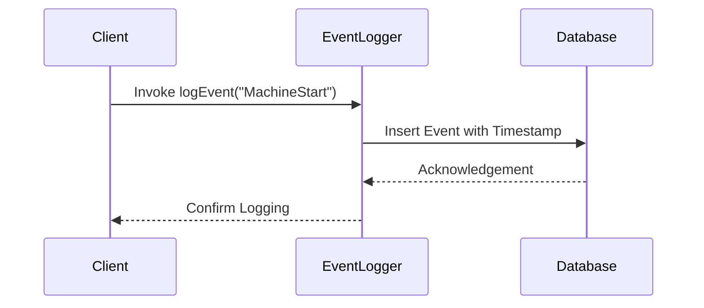

## Description

Point-Based Validity is a data modeling pattern that focuses on recording the exact timestamp of discrete events or changes. Unlike interval-based validity, which captures the start and end times of an event, point-based validity prioritizes precision by noting the exact moment changes occur. This approach is particularly useful for event-driven systems where understanding the sequence and timing of events is critical.

## Architectural Approaches

When using point-based validity, architectural approaches often involve:

- **Event Sourcing**: Capturing state changes as a series of events with precise timestamps.
- **Event Logging**: Maintaining a log of events as they occur in a system, each associated with an exact time.
- **Temporal Databases**: Utilizing databases designed to handle time-sensitive data, allowing retrieval of data states at specific points in time.
- **Time-Series Databases**: Employing specialized databases for efficiently storing and querying time-stamped data.

## Best Practices

- **Ensure Accurate Timekeeping**: Use reliable time sources, such as NTP servers, to ensure timestamp accuracy.
- **Granular Time Measurements**: Aim for millisecond or microsecond precision when logging time-sensitive events.
- **Scalability Considerations**: Design storage solutions that can handle the volume of high-frequency, time-stamped data.
- **Event Ordering**: Ensure the sequence of events can be reconstructed, even if logged by different systems.

## Example Code

Here's a simple example using Java and a time-series database:

```java
import java.sql.Connection;
import java.sql.DriverManager;
import java.sql.PreparedStatement;
import java.time.Instant;

public class EventLogger {

    private static final String INSERT_EVENT_SQL = "INSERT INTO events (event_type, timestamp) VALUES (?, ?)";

    public void logEvent(String eventType) {
        try (Connection connection = DriverManager.getConnection("jdbc:your_database_url")) {
            try (PreparedStatement statement = connection.prepareStatement(INSERT_EVENT_SQL)) {
                statement.setString(1, eventType);
                statement.setTimestamp(2, java.sql.Timestamp.from(Instant.now()));
                statement.executeUpdate();
            }
        } catch (Exception e) {
            e.printStackTrace();
        }
    }
}
```

## Diagrams



## Related Patterns

- **Event Sourcing**: Often used in conjunction with point-based validity to build audit logs of all changes.
- **Temporal Patterns**: Includes a variety of techniques for managing time-sensitive information in databases.

## Additional Resources

- [Time-Based Data Management](https://yourresource.com/time-based-data)
- [Handling Time Series Data](https://yourresource.com/time-series-databases)
- [Event Sourcing and CQRS Pattern](https://yourresource.com/event-sourcing-cqrs)

## Summary

Point-Based Validity offers precision in time-sensitive applications by focusing on capturing exact timestamps for events or changes. This pattern is integral to systems where tracking the order and time of occurrence of events is essential, providing an accurate and reliable method of state representation in event-driven and time-series applications. By leveraging architectural practices like event sourcing and using suitable data platforms, systems can achieve high fidelity in their data representation and event management.
