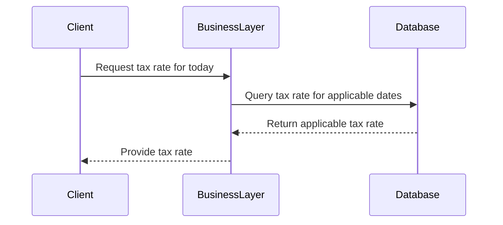

## Introduction

In complex business environments, decisions often need to be made based on rules that vary over time. The *Effective Dating in Business Rules* pattern addresses the need for business rule evaluations to incorporate temporal elements, such that rules are applied according to their applicable time periods. This consideration can help businesses to correctly enforce policies related to varying tax rates, pricing changes, or discounts over time.

## Detailed Explanation

### Core Concepts

The fundamental idea behind effective dating is to attach time-related metadata (typically an effective start and end date) to business rules. This ensures that they are only applied during periods in which they are valid. This can be critical in ensuring the accuracy of historical data assessments and can simplify the maintenance of contemporary and prospective rule applications.

### Architectural Approaches

#### Designing Effective Date Data Structures

When incorporating effective dating, data structures should include fields to track:

- `effective_start_date`: Indicates when a rule or policy becomes valid.
- `effective_end_date`: Indicates when a rule or policy ceases to be valid.

Example SQL Table Design:
```sql
CREATE TABLE tax_rate (
    id INT PRIMARY KEY,
    rate DECIMAL(5, 2),
    effective_start_date DATE,
    effective_end_date DATE
);
```

#### Rule Evaluation Logic

During the evaluation process, queries or operations should be timestamped, thus allowing current or past rules to be correctly applied. The evaluation of any given transactional activity should consider these timestamps in its logic.

Example SQL Query:
```sql
SELECT rate FROM tax_rate
WHERE effective_start_date <= current_date
    AND (effective_end_date IS NULL OR effective_end_date >= current_date);
```

This query fetches the appropriate tax rate in effect at the current date.

### Best Practices

1. **Consistency in Time Zones**: Ensure that all date and time-related data capture, storage, and processing occur consistently across time zones to avoid discrepancies. Use the `TIMESTAMP WITH TIME ZONE` data type where possible.

2. **Null Handling**: A null `effective_end_date` can indicate an open-ended rule, hence logic should be prepared to handle nulls effectively during evaluations.

3. **Data Validity Checks**: Regular checks and validations on the data can ascertain that the effective dating logic adheres to business requirements and policies.

## Diagrams

### Mermaid UML Sequence Diagram



This sequence diagram illustrates the process of requesting and receiving the appropriate business rule (tax rate) based on the current date.

## Related Patterns

- **Temporal Validity**: Similar to effective dating, this pattern broadly describes tracking object states over time.
- **Snapshot Pattern**: Keeps records of system states at particular points in time to compensate for evolving rules and relationships.

## Additional Resources

- *Temporal Data and the Relational Model* by Chris Date, Nikos Lorentzos, and Hugh Darwen, for an in-depth discussion of time-based data modeling.
- Online tutorials and documentation for systems like Oracle's Temporal Validity, which support native temporal features.

## Conclusion

The Effective Dating in Business Rules pattern is a crucial design strategy for handling time-sensitive rule application effectively within your data models. Through careful implementation of effective dates, corporate decision-making processes can ensure precise adherence to evolving policies, fostering both accuracy and compliance across operations.

By implementing well-structured effective dating strategies, businesses can expect to manage their rules more efficiently, reducing errors related to outdated rule applications, and significant effort during audits or historical financial assessments.
