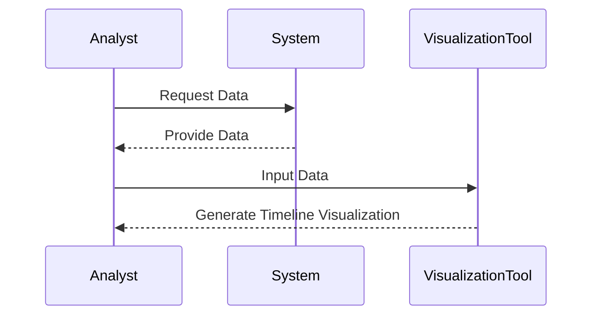

## Overview

Effective Data Visualization is a design pattern aimed at accurately representing data changes over time in a visually comprehensible manner. It is pivotal in data analytics and decision-making, providing stakeholders with intuitive insights into data trends and effectiveness over specific periods.

## Design Pattern Intent

The main objective of this pattern is to provide a clear and insightful way to depict when and how data changes occur in specific contexts. This could include financial metrics, user engagement trends, product lifecycle stages, or other time-sensitive data insights. The pattern typically employs a variety of visualization techniques such as timeline charts, line graphs, and area charts to communicate these changes effectively.

## Example Implementation

Let's explore an example scenario where this pattern could be applied using JavaScript, especially with a library like D3.js for creating a timeline chart:

```javascript
// Sample implementation of a timeline chart using D3.js
const data = [
  { date: '2023-01-01', priceTier: 'Standard', active: true },
  { date: '2023-06-01', priceTier: 'Premium', active: true },
  { date: '2023-09-01', priceTier: 'Standard', active: false },
];

const width = 800;
const height = 400;
const margin = { top: 20, right: 30, bottom: 30, left: 40 };

const svg = d3.select("body").append("svg")
  .attr("width", width)
  .attr("height", height);

// Function to create the timeline visualization
function drawTimeline(data) {
  const x = d3.scaleTime()
    .domain(d3.extent(data, d => new Date(d.date)))
    .range([margin.left, width - margin.right]);

  const y = d3.scalePoint()
    .domain(data.map(d => d.priceTier))
    .range([height - margin.bottom, margin.top]);

  svg.append("g")
    .attr("transform", `translate(0,${height - margin.bottom})`)
    .call(d3.axisBottom(x).ticks(width / 80).tickSizeOuter(0));

  svg.append("g")
    .attr("transform", `translate(${margin.left},0)`)
    .call(d3.axisLeft(y));

  svg.selectAll("circle")
    .data(data)
    .enter().append("circle")
      .attr("cx", d => x(new Date(d.date)))
      .attr("cy", d => y(d.priceTier))
      .attr("r", 5)
      .attr("fill", d => d.active ? "green" : "red");
}

drawTimeline(data);
```

This example highlights the changes over time of product pricing tiers, using circles to signify their period of activity.

## Diagrams

Below is a simple Mermaid sequence diagram illustrating data flow in an effective data visualization context:



## Architectural Considerations

- **Data Preparation**: The quality and format of raw data greatly influence the effectiveness of visualization. Data should be cleaned and prepared prior to visualization to ensure accuracy and relevance.
- **Tool Selection**: The choice of visualization tools should align with the specific needs of the visualization. Factors such as complexity, customization, and interactivity should be considered.
- **User Experience**: Visualizations should be designed with the end-user in mind, emphasizing clarity, coherence, and accessibility.

## Best Practices

- Utilize colors thoughtfully to signify different data states (e.g., active vs. inactive).
- Keep the design simple, avoiding unnecessary complexity to enhance clarity and understanding.
- Incorporate interactive elements where appropriate to allow users to explore data in more detail.
- Validate the visualization with domain experts to ensure it correctly interprets the underlying data.

## Related Patterns

- **Time-series Data Display**: Closely related to timeline visualization, focusing on presenting data points over time.
- **Heat Maps**: Useful for identifying dense areas of effectiveness within datasets.
- **Layered View**: Combining multiple datasets into a single coherent view without overwhelming the user.

## Additional Resources

- [D3.js Documentation](https://d3js.org)
- [Effective Visualization Techniques by Data Wrapper](https://datawrapper.de)
- [Visual Display of Quantitative Information by Edward Tufte](https://www.edwardtufte.com/tufte/books_vdq)

## Summary

Effective Data Visualization is a crucial design pattern in today's data-driven landscape. By implementing this pattern, businesses can gain deeper insights into their data, leading to better decision-making, strategy development, and overall performance tracking. Employing the best practices and architectural considerations outlined here will ensure that visualizations are impactful and meaningful.
