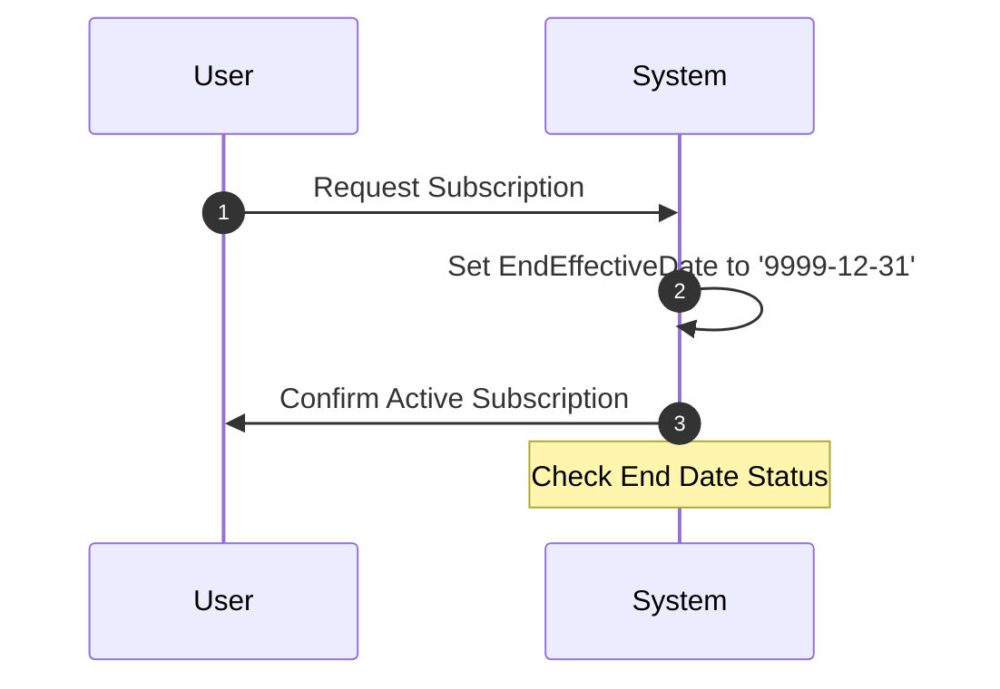

## Introduction

The Open-Ended Validity pattern is a common approach in data modeling where a predetermined, special date symbolizes that a certain entity's validity is currently ongoing without a precisely defined endpoint. This tactic is particularly useful in situations where the real end date is unknown or open-ended, such as subscriptions, memberships, or agreements, allowing for a straightforward mechanism to manage "active" records.

## Problem Context

In various business scenarios, data entities often have time-based attributes, specifying when they become effective and when they cease to be valid. However, it's not uncommon for the end date to be undefined at the point of initial data entry. Managing these open-ended time frames in a database requires a consistent approach for both functionality and readability.

## Solution Description

To indicate an ongoing validity period—the absence of a definite end—a fictitious date far in the future is used. A typical choice is '9999-12-31'. This signals that unless changed, the data is indefinitely valid:

- **Schema Design**: Include `StartEffectiveDate` and `EndEffectiveDate` fields in your database schemas.
- **Business Logic**: Use logical constraints in your queries and operations to handle the special end date as an open-ended marker.

### Example Code

Here's how this might look in SQL and Java:

```sql
-- SQL Table Definition
CREATE TABLE CustomerSubscriptions (
    SubscriptionID INT PRIMARY KEY,
    CustomerID INT NOT NULL,
    SubscriptionStartDate DATE NOT NULL,
    SubscriptionEndDate DATE DEFAULT '9999-12-31'
);

-- Example Query to Find Active Subscriptions
SELECT * FROM CustomerSubscriptions WHERE SubscriptionEndDate = '9999-12-31';
```

```java
// Java Class Example
import java.time.LocalDate;

public class Subscription {
    private int subscriptionId;
    private int customerId;
    private LocalDate startEffectiveDate;
    private LocalDate endEffectiveDate = LocalDate.of(9999, 12, 31);

    public boolean isActive() {
        return endEffectiveDate.isEqual(LocalDate.of(9999, 12, 31));
    }
}
```

## Diagram

Below is a Mermaid UML sequence diagram illustrating the process of managing open-ended validity for subscriptions:



## Related Patterns

- **Temporal Data Pattern**: Deals with capturing time-related changes effectively in a database.
- **Effective Date Pattern**: Focuses on when a data entity becomes valid.

## Best Practices

1. **Consistency**: Use the same special end date across all databases and applications to avoid confusion.
2. **Documentation**: Clearly document the usage of the special end date within your developer and user documentation to maintain transparency.
3. **Logical Constraints**: Implement application logic that properly interprets the special end date, removing any bias of interpreting it as a normal date.

## Additional Resources

- Fowler, Martin. "Temporal Patterns for Effective Software Development." [martinfowler.com](https://martinfowler.com/)
- ISO 8601 Date and Time Format: A standard format for representing dates and times.

## Summary

The Open-Ended Validity pattern offers an efficient way to manage periods of validity within datasets where the end might not be known initially. Optimizing your schema and logic with a standard end date for infinity provides clarity and minimizes ambiguity, which is crucial for any application dealing with temporal data. By adopting this pattern, systems can ensure continuity and accuracy in representing ongoing data states.
