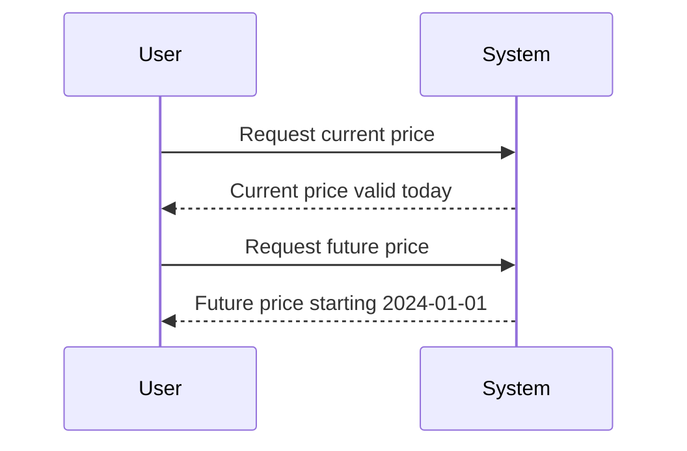

## Future-Dated Records

### Description

The Future-Dated Records pattern involves creating records in a database whose validity periods commence at some point in the future. This is essential for systems that need to be prepared for upcoming changes without immediately implementing them. It provides businesses the ability to plan, test, and communicate changes to their systems and stakeholders proactively.

### Architectural Approach

Implementing Future-Dated Records requires careful consideration of how data is accessed and maintained. Here are key architectural aspects to consider:

- **Validity Periods**: Each record should include fields that define its valid start and optionally, an end date. This helps in querying only relevant records at any point in time.
- **Temporal Tables**: Use of temporal tables or maintaining an effective/expiry date columns to accommodate historical, present, and future data effectively.
- **Versioning**: Maintaining different versions of records as changes are scheduled and past versions are retained for historical analysis.
- **Scheduling and Automation**: Systems should be in place to automatically activate future changes at the designated time without manual intervention.

### Best Practices

- **Consistent Time Zones**: Ensure that all timestamps are stored in a consistent time zone to prevent discrepancies in the calculation of valid periods.
- **Seamless Transition**: Test the transition from current data to future-dated data in a staging environment to ensure seamless updates.
- **Audit Trail**: Maintain an audit trail of changes for transparency and rollback capability if needed.
- **User Notifications**: If applicable, notify users of upcoming changes in advance to minimize disruption.

### Example Code

Below is a simple example in SQL demonstrating future-dated records for price changes in a product table:

```sql
CREATE TABLE product_pricing (
    product_id INT,
    price DECIMAL(10, 2),
    valid_from DATE,
    valid_to DATE,
    PRIMARY KEY (product_id, valid_from)
);

-- Insert current price
INSERT INTO product_pricing (product_id, price, valid_from, valid_to)
VALUES (1, 99.99, '2023-01-01', '2023-12-31');

-- Insert future price change
INSERT INTO product_pricing (product_id, price, valid_from, valid_to)
VALUES (1, 109.99, '2024-01-01', NULL);
```

### Example Diagram

A Mermaid sequence diagram demonstrates the transition between data states:



### Related Patterns

- **Temporal Patterns**: Managing and querying temporal data effectively.
- **Versioned Data Patterns**: Keeping track of changes over time for review or rollback.
- **Scheduled Task Pattern**: Automating activations or transitions at designated times.

### Additional Resources

- [Temporal Tables in SQL: A Guide](https://www.sqlshack.com/introduction-temporal-tables-sql-server/)
- [Designing Effective Data Models](https://www.oreilly.com/library/view/effective-data-modeling/1119113712/)
- [Best Practices for Future-Dated Transactions](https://www.ibm.com/docs/en/some-guide/202310.3x)

### Summary

The Future-Dated Records pattern is a powerful strategy for proactively managing changes that could impact business operations. By incorporating time-dimension data effectively, systems ensure a seamless transition and better align with strategic goals. This pattern requires careful planning, robust design for temporal data handling, and ensures systems act on changes as intended without manual intervention.
