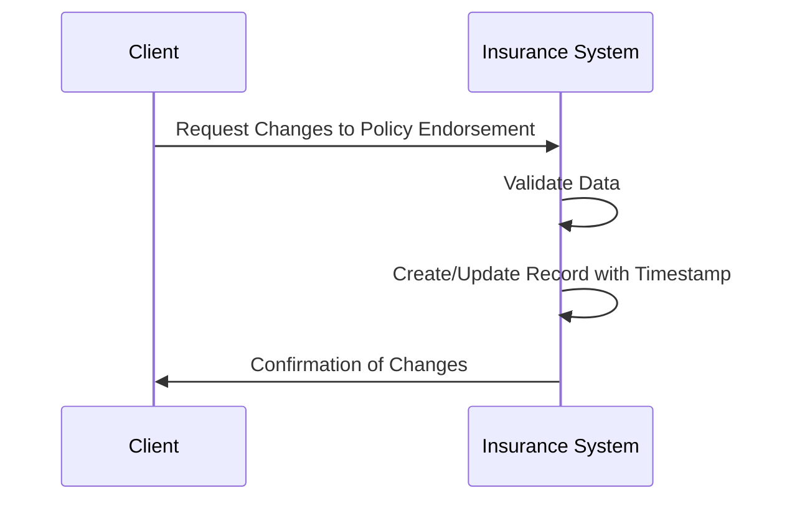

---

linkTitle: "Effective Sequencing"
title: "Effective Sequencing"
category: "Effective Data Patterns"
series: "Data Modeling Design Patterns"
description: "Numbering records in sequence based on their effective dates to track the order of changes, ensuring a coherent, chronological data framework."
categories:
- Data Management
- Data Modeling
- Cloud Computing
tags:
- Sequence
- Effective Dates
- Data Patterns
- Change Tracking
- Data Sequence
date: 2024-07-07
type: docs
canonical: "https://softwarepatternslexicon.com/103/9/7"
license: "© 2024 Tokenizer Inc. CC BY-NC-SA 4.0"
---

## Effective Sequencing

### Description

Effective Sequencing is a data pattern essential for managing records which evolve over time or to capture detailed history-based data operations. This approach hinges on numbering records sequentially according to their effective dates, allowing systems to keep track of various versions and changes. It's commonly used in contexts like financial transactions, insurance systems, contract management, and more, where order and chronology are paramount.

By employing effective sequencing, organizations can maintain a clear audit trail, simplify historical data analyses, and ensure data integrity across complex temporal datasets. The pattern supports both decision support systems and operational databases, enabling them to effectively handle time-sensitive data.

### Architectural Approaches

1. **Timestamp-Based Sequencing**: This method uses timestamps to determine the sequence of a record's validity. When employed, each change is reflected as a new record timestamp, guaranteeing a chronological order.

2. **Version Numbering**: Each record version is explicitly numbered. This can be particularly useful in tracking the incremental process or when edits are sporadically applied.

3. **Effective Date Ranges**: Records come with a validity range (`start_date` and `end_date`). This pattern helps in back-dating or pre-defining future data modifications without immediate record activation.

4. **Composite Key Design**: Integrating a composite key consisting of primary ID and timestamp/version number can naturally impose effective sequencing and prevent data overwrites.

### Best Practices

- **Combine Temporal Attributes for Robust Sequencing**: Use combinations of attributes (like timestamps and versions) for more resilient and comprehensive record tracking.
  
- **Ensure Unique Constraints**: Implement database constraints that ensure each sequence is unique to prevent duplications, which increases reliability and data accuracy.

- **Validate Input Data**: Implement safeguards that confirm input sequences and effective dates before data processing, which helps to maintain data quality.
  
- **Leverage Indexing**: Use appropriate indexing on sequence numbers and effective dates to optimize query performance, especially in large datasets.

### Example Code

Here is an example in SQL to demonstrate a simple effective sequencing pattern:

```sql
CREATE TABLE PolicyEndorsements (
    PolicyID INT,
    EndorsementID INT,
    EffectiveDate DATE,
    SequenceNumber INT GENERATED ALWAYS AS IDENTITY,
    PRIMARY KEY (PolicyID, SequenceNumber)
);

INSERT INTO PolicyEndorsements (PolicyID, EndorsementID, EffectiveDate) VALUES 
(1, 101, '2024-06-01'),
(1, 102, '2024-07-01'),
(1, 103, '2024-08-01');
```

As shown, each endorsement receives an automatic sequential number that allows easy lineage tracking of changes.

### Diagrams

To capture the effective sequencing, here is a representational UML sequence diagram using Mermaid:



### Related Patterns

- **Snapshot Pattern**: Often combined with effective sequencing to capture a full-state of records at a given effective time, preserving complete historical data.
  
- **Audit Logging**: Ensures that every change is logged with clone sequence numbers, akin to version history in source control systems.

### Additional Resources

- [Temporal Data Management in Relational Systems](https://example.com/temporal-data)
- [Best Practices for Time Series Data](https://example.com/time-series-best-practices)

### Summary

Effective Sequencing is a quintessential pattern for systems that manage time-dependent changes or modifications, ensuring accurate historical data tracking and supporting complex temporal queries. Appropriately managed, it enhances data reliability and allows organizations to pinpoint the precise impact and sequence of changes over time.

---
