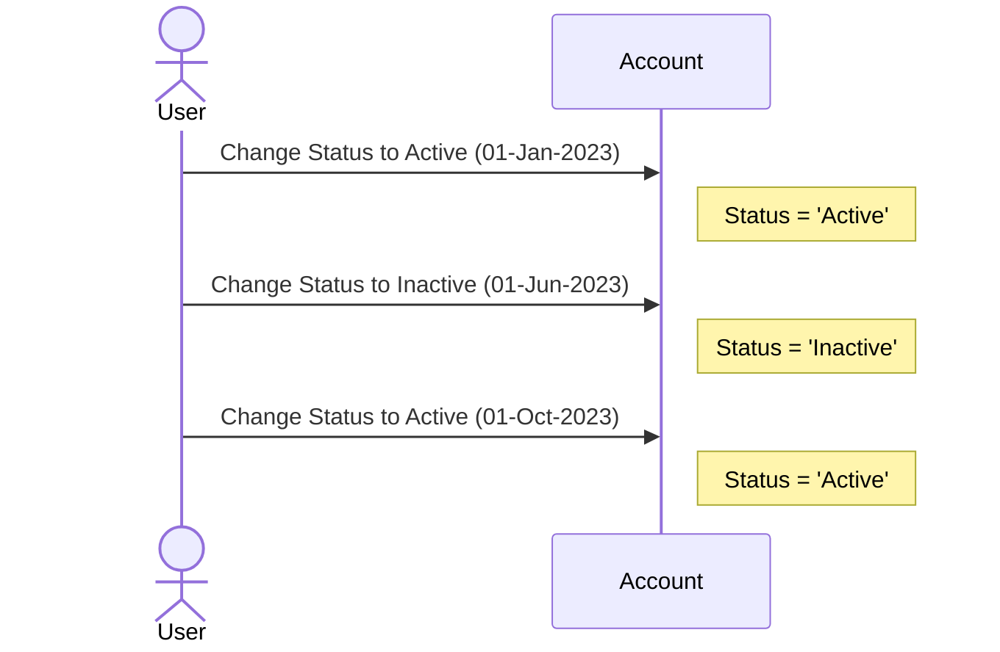

## Effective Status Tracking

### Introduction

In many scenarios, entities within an enterprise system have different states at various points in time. The concept of **Effective Status Tracking** is a design pattern used to manage these states accurately using the concept of effective dates. This pattern helps maintain the integrity and historical accuracy of status changes over time, enabling precise system behavior and reporting.

### Problem Statement

Entities in a system often go through changes that affect their status, like account activation, deactivation, suspension, etc. A simple boolean status indicator fails to capture the evolution of an entity’s state over time. We need a way to track when these states are active, allowing queries or operations based on an entity's status at any given point.

### Solution

The Effective Status Tracking pattern addresses this by using effective dates. These are typically represented by start and end dates (or timestamps), which define a period during which a particular status is valid.

### Example

Consider a customer's account with the following status transitions:

1. **Active** from 01-Jan-2023 to 31-May-2023
2. **Inactive** from 01-Jun-2023 to 30-Sep-2023
3. **Active** from 01-Oct-2023 onwards

To model this:

```sql
CREATE TABLE AccountStatusHistory (
    id SERIAL PRIMARY KEY,
    accountId INT NOT NULL,
    status VARCHAR(50) NOT NULL,
    effectiveStart DATE NOT NULL,
    effectiveEnd DATE,
    CHECK(effectiveEnd IS NULL OR effectiveEnd >= effectiveStart)
);

-- Sample Data
INSERT INTO AccountStatusHistory (accountId, status, effectiveStart, effectiveEnd) VALUES
(1, 'Active', '2023-01-01', '2023-05-31'),
(1, 'Inactive', '2023-06-01', '2023-09-30'),
(1, 'Active', '2023-10-01', NULL);
```

### Architectural Approaches

- **Temporal Tables**: Use database temporal tables to automatically manage effective date ranges, supporting powerful queries like historical analysis.
- **Snapshot Tables**: Periodically capture the state in a separate table to quickly reconstruct status at any particular time without complex joins.
  
### Best Practices

1. **Date Validation**: Ensure end dates are either null (indicating current status) or strictly greater than or equal to start dates.
2. **Indexing**: Index the `effectiveStart` and `effectiveEnd` columns for efficient querying.
3. **Default Constraints**: Set default end date to a far-future date like `'9999-12-31'` for simplicity in querying current status.
4. **Column Naming Conventions**: Consistently use terms like `effectiveStart` and `effectiveEnd` for readability.

### Related Patterns

- **Temporal Consistency Patterns**: These relate to maintaining consistent temporal data, providing strategies for when and how to store time-based changes.
- **Event Sourcing**: Involves storing a series of actions (events) to capture state evolution instead of just direct status.

### Additional Resources

- Articles on [Temporal Database Design](https://www.databasejournal.com)
- Books like "Temporal Data & the Relational Model" by C.J. Date
- Apache Kafka as a toolkit for event-driven status tracking

### Diagram

Below is a simple sequence diagram illustrating how status changes over time:



### Summary

The Effective Status Tracking pattern provides a robust approach to managing entity statuses over time. By leveraging effective date ranges, it ensures accuracy and temporal integrity, which are critical for monitoring status transitions in systems across different domains. The pattern is versatile, offering scalability in different database management systems and a foundation for strong historical data analysis.
