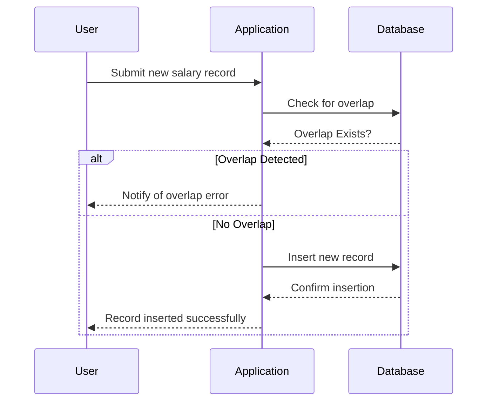

## Temporal Validity Overlap Prevention

Temporal Validity Overlap Prevention is a data modeling design pattern aimed at ensuring records associated with the same entity do not have overlapping valid time periods, except in scenarios where overlapping is explicitly intended and justified. This design pattern is vital in maintaining data integrity in time-based data where temporal conditions govern business rules.

### Key Concepts

- **Temporal Validity**: Represents the effective period during which a particular data record is considered valid or active.
- **Overlap Prevention**: Ensures temporal data sequences do not unintentionally overlap, which can lead to data inconsistencies and errors in business logic.

### Use Cases

- **Employee Salary Records**: Ensuring salary records for an employee don’t overlap unless a specific business reason exists.
- **Contract Management**: Maintaining contracts without overlapping effective periods for the same client and service type.
- **Insurance Policies**: Avoiding overlaps in insurance coverages for the same policyholder and policy type.

### Architectural Approaches

1. **Effective Date Range Validation**: Implement constraints at the database level using check constraints or triggers to validate that during insert/update operations, new records do not overlap with existing ones for the same entity.

2. **Application-Level Logic**: Introduce application logic to check for overlaps before records are created or updated. This can be done within APIs or services that interact with the data store.

3. **Temporal Data Store Features**: Leverage database features specifically designed for temporal data handling, such as transaction time in SQL databases that support temporal tables.

4. **Use of Index Structures**: Indexing on temporal attributes can enhance the performance of overlap checks.

### Example Code

Here is an example using SQL and implementing a trigger that checks for overlapping:

```sql
CREATE TABLE EmployeeSalary (
    EmployeeID INT,
    SalaryAmount DECIMAL(10, 2),
    StartDate DATE,
    EndDate DATE,
    PRIMARY KEY (EmployeeID, StartDate)
);

CREATE TRIGGER PreventSalaryOverlap
BEFORE INSERT ON EmployeeSalary
FOR EACH ROW
BEGIN
    DECLARE existing_overlap INT;
    SELECT COUNT(*)
    INTO existing_overlap
    FROM EmployeeSalary
    WHERE EmployeeID = NEW.EmployeeID
    AND (NEW.StartDate BETWEEN StartDate AND EndDate
         OR NEW.EndDate BETWEEN StartDate AND EndDate
         OR StartDate BETWEEN NEW.StartDate AND NEW.EndDate
         OR EndDate BETWEEN NEW.StartDate AND NEW.EndDate);
    IF existing_overlap > 0 THEN
       SIGNAL SQLSTATE '45000'
       SET MESSAGE_TEXT = 'Salary periods overlap for this employee.';
    END IF;
END;
```

### Diagrams

Here is a sample Mermaid UML Sequence Diagram illustrating how a system verifies temporal validity before persisting data:



### Related Patterns

- **Date Range Partitioning**: Breaking down datasets into temporal partitions for enhanced query performance and manageability.
- **Snapshot Pattern**: Maintaining historical data snapshots alongside current views for audit and rollback purposes.

### Additional Resources

- [Temporal Databases - Conceptual Overview](https://www.dataintegrationhub.com/temporal-databases)
- [Handling Temporal Data in SQL](https://www.sqltemporalfeatures.com/temporal-data-in-sql)
- [Design and Implement Temporal Data Management](https://medium.com/@datadesignpatterns/temporal-data-management-patterns)

### Summary

Temporal Validity Overlap Prevention is a crucial data pattern to ensure that time-based data sets maintain data integrity and conform to business rules requiring non-overlapping valid periods. By combining database-level constraints, application-level checks, and the use of specialized temporal database features, organizations can efficiently prevent unintentional overlaps and maintain robust data lifecycle management.
