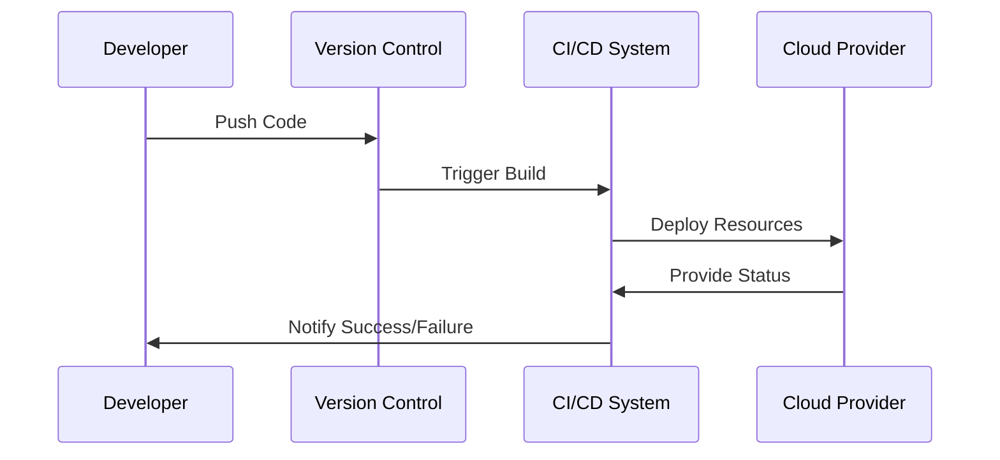

Infrastructure as Code (IaC) is a key DevOps practice that involves managing and provisioning computing infrastructure through machine-readable definition files, rather than physical hardware or interactive configuration tools. This pattern introduces the ability to automate the deployment of infrastructure, ensuring consistency across environments and enabling version control.

## Detailed Explanation

### Key Concepts of IaC:
- **Declarative vs. Imperative Configurations**: Declarative configurations define the desired end state, and the system attempts to achieve it, often using tools like Terraform or CloudFormation. Imperative configurations, on the other hand, explicitly detail the steps necessary to achieve the desired final state.

- **Version Control and Auditing**: Leveraging version control systems (VCS) such as Git allows teams to track changes, manage releases, and maintain history for audit purposes.

- **Idempotency**: The capability to apply a configuration consistently, ensuring that even if run multiple times, the infrastructure remains in a stable state without unintended side-effects.

- **Environment Consistency**: Ensures that development, staging, and production environments can be reproduced efficiently, reducing "it works on my machine" problems.

### Architectural Approaches and Paradigms

1. **Tooling**: The major tools for implementing IaC include:
   - **Terraform**: An open-source tool for building, changing, and versioning infrastructure safely and efficiently.
   - **AWS CloudFormation**: A service that gives developers and businesses an easy way to create and manage a collection of related AWS resources.

2. **Modules and Reusability**: Modular design patterns in IaC encourage code reuse and sharing logical pieces of infrastructure as modules.

3. **Automated Testing and Continuous Integration (CI)**: Integrating infrastructure testing into CI pipelines ensures that changes do not break the infrastructure.

4. **State Management**: For tools like Terraform, maintaining a state file that records current infrastructure is crucial for planning and applying updates accurately.

## Best Practices

- **Keep Infrastructure Code DRY (Don't Repeat Yourself)**: Abstract common configurations into reusable modules.
- **Review and Test Infrastructure Code Changes**: Implement peer reviews and automated tests to ensure code quality.
- **Use Managed or Serverless Infrastructure Where Possible**: Leverage cloud-managed services to reduce complexity and maintenance overhead.
- **Security Best Practices**: Store secrets securely using systems like AWS Secrets Manager or HashiCorp Vault, and enforce least privilege through detailed IAM policies.
- **Consistent Naming Conventions**: Establish naming conventions for resources and adhere to them for clarity and maintainability.

## Example Code

Using Terraform to define a simple AWS S3 bucket:

```hcl
provider "aws" {
  region = "us-west-2"
}

resource "aws_s3_bucket" "my_bucket" {
  bucket = "my-unique-bucket-name"
  acl    = "private"

  tags = {
    Name        = "MyBucket"
    Environment = "Dev"
  }
}
```

## Diagrams



## Related Patterns

- **Immutable Infrastructure**: Applies the concept of 'infrastructure immutability' to ensure that components are not altered once they are deployed; they are replaced with new instances.

- **Configuration Management**: Tools like Ansible and Puppet can be used alongside IaC to handle software and OS propping and configuration.

- **Containerization and Orchestration**: Combining IaC with containers offers greater flexibility and efficiency in resource management.

## Additional Resources

- [Terraform by HashiCorp](https://www.terraform.io/)
- [AWS CloudFormation Documentation](https://aws.amazon.com/cloudformation/)
- [Infrastructure as Code by Kief Morris](https://www.oreilly.com/library/view/infrastructure-as-code/9781491924358/)

## Summary

Infrastructure as Code (IaC) transforms infrastructure provisioning from a manual, error-prone task to an automated, reliable process. By maintaining infrastructure definitions as code, organizations can achieve consistent environments, facilitate better collaboration through version control, and streamline deployment processes. IaC encourages treating infrastructure with the same rigor as application code, resulting in faster, more secure, and reliable systems.
