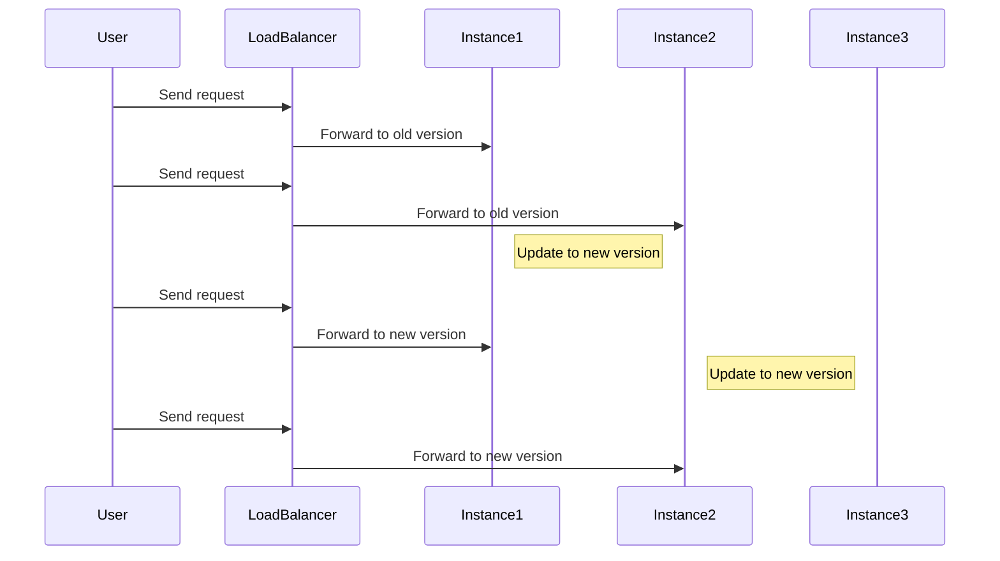

## Rolling Infrastructure Updates

Rolling Infrastructure Updates is a cloud computing design pattern that involves incrementally updating infrastructure components to ensure system availability and minimize downtime. This technique is essential when dealing with large-scale cloud environments where high availability is paramount.

### Explanation and Purpose

Rolling Infrastructure Updates allow organizations to update parts of their cloud infrastructure piece by piece rather than taking the entire system offline. This pattern is widely used in distributed systems where achieving zero downtime is a crucial business requirement. 

The primary purpose of Rolling Infrastructure Updates is to:

- Maintain overall system availability during updates.
- Limit exposure to potential faults introduced by new changes.
- Allow for quick rollback in case updates introduce critical issues.
- Facilitate continuous delivery and deployment practices.

### Architectural Approach

1. **Component Segmentation:** Divide the infrastructure into smaller, manageable components. This can be based on functionality, geography, or any other logical segmentation.

2. **Staggered Updates:** Begin the update on a subset of components rather than all at once. Monitor and verify the success of these updates before proceeding to the next set.

3. **Health Monitoring:** Continuously monitor the health of those components that have been updated. Utilize metrics and health checks to ensure the components are functioning correctly.

4. **Failure Handling:** Implement robust strategies to handle failure scenarios, such as automatic rollbacks or predefined failover procedures.

5. **Automation and Orchestration:** Use tools and platforms that support automated deployment and orchestration to streamline the update process and reduce manual intervention errors.

### Example Code

Here’s a simplified code example demonstrating a rolling update strategy using Kubernetes:

```yaml
apiVersion: apps/v1
kind: Deployment
metadata:
  name: my-application
spec:
  replicas: 3
  strategy:
    type: RollingUpdate
    rollingUpdate:
      maxUnavailiable: 1
      maxSurge: 1
  template:
    metadata:
      labels:
        app: my-application
    spec:
      containers:
      - name: my-application
        image: my-application:latest
```

This deployment configuration specifies a rolling update strategy where Kubernetes gradually updates the pods. It ensures that at least one instance remains available during the update process.

### Diagrams

Below is a conceptual diagram showing a rolling update process:



### Related Patterns

- **Blue-Green Deployment:** A strategy that involves deploying changes to a staging environment (blue) and switching traffic to it from the current live environment (green) after validation.

- **Canary Releases:** Deploy updates to a small subset of users before rolling out to the entire infrastructure, useful for risk reduction and validation.

### Additional Resources

- [Rolling Updates with Kubernetes Documentation](https://kubernetes.io/docs/tutorials/kubernetes-basics/update/update-intro/)
- [Continuous Delivery with Azure DevOps](https://docs.microsoft.com/en-us/azure/devops/pipelines/?view=azure-devops)
- [AWS Elastic Beanstalk: Managed Updates](https://docs.aws.amazon.com/elasticbeanstalk/latest/dg/environment-configuration-managed-updates.html)

### Summary

Rolling Infrastructure Updates is a critical pattern for cloud environments that require high availability and minimal downtime. By updating components incrementally, organizations can ensure their applications remain available to users, even amidst changes. This, coupled with proper monitoring and automation, allows for efficient and reliable deployment processes in today's dynamic cloud landscapes.
