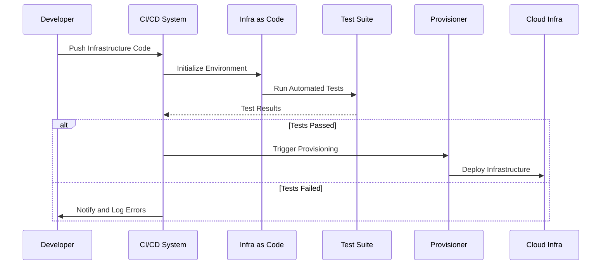

## Introduction

The **Automated Testing of Infrastructure** pattern involves embedding testing practices in the infrastructure-as-code process to ensure that infrastructure components perform as expected before they are deployed to production environments. This pattern is integral to maintaining a reliable, stable, and efficient cloud infrastructure.

## Why Automated Testing for Infrastructure?

1. **Early Detection of Errors**: Automated tests can catch bugs and misconfigurations before they affect production environments.
2. **Improved Stability**: Assurance that infrastructure components behave as expected reduces downtime and service disruptions.
3. **Enhanced Security**: Security checks can be incorporated into the testing process to identify vulnerabilities early.
4. **Consistent Deployments**: Tests help ensure that deployments are repeatable and consistent across various environments.
5. **Faster Feedback Cycles**: Continuous Integration/Continuous Deployment (CI/CD) pipelines benefit from faster feedback, allowing for quicker iterations.

## Architectural Approaches

### Infrastructure as Code (IaC)
IaC tools like Terraform, AWS CloudFormation, and Ansible provide the foundation for defining and automating infrastructure configurations through code, making them amenable to automated testing strategies.

### Testing Strategies

1. **Unit Tests**: Validate individual components or modules. For example, using tools like Terratest or Chef InSpec.
2. **Integration Tests**: Ensure multiple components interact as expected.
3. **Compliance Tests**: Ensure adherence to security and compliance standards.
4. **Performance Tests**: Validate the infrastructure’s ability to meet performance requirements.

## Example Code

Here's an example of a basic test using Terratest, a Go library used to write automated tests for infrastructure code:

```go
package test

import (
    "testing"

    "github.com/gruntwork-io/terratest/modules/terraform"
    "github.com/stretchr/testify/assert"
)

func TestTerraformModule(t *testing.T) {
    opts := &terraform.Options{
        // The path to where our Terraform code is located
        TerraformDir: "../terraform",
    }

    // Apply the Terraform code
    terraform.InitAndApply(t, opts)

    // Run `terraform output` to get the value of an output variable
    instanceID := terraform.Output(t, opts, "instance_id")

    // Verify that the EC2 instance ID is not empty
    assert.NotEmpty(t, instanceID)
}
```

## Diagrams



## Related Patterns

- **Infrastructure as Code (IaC)**: Automation of infrastructure provisioning using code.
- **Immutable Infrastructure**: Ensures infrastructure is replaced rather than modified, enhancing reliability.
- **Blue-Green Deployment**: Controlled and phased deployment strategy to mitigate risks.

## Additional Resources

- [Terratest Documentation](https://terratest.gruntwork.io/)
- [Terraform Best Practices Guide](https://www.hashicorp.com/products/terraform/faqs)
- [AWS CloudFormation Documentation](https://docs.aws.amazon.com/cloudformation)

## Summary

Automated Testing of Infrastructure is a crucial pattern in modern cloud environments. By seamlessly integrating testing into the infrastructure-as-code process, organizations can achieve higher reliability, speed, and security. This proactive approach minimizes production risks and ensures infrastructure scalability and compliance across all stages of the deployment lifecycle.
