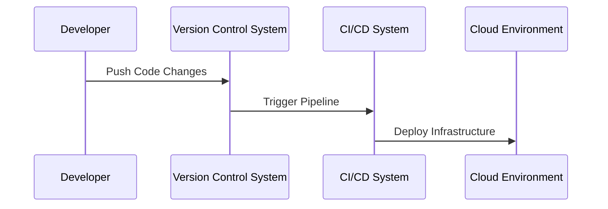

## Introduction

In modern cloud environments, infrastructure is increasingly defined and managed through code, commonly referred to as Infrastructure as Code (IaC). Version Control Integration is a foundational pattern that involves storing infrastructure code within a version control system (VCS), like Git, to manage changes effectively, improve collaboration among team members, and automate deployment processes.

## Detailed Explanation

### Purpose and Benefits

Version Control Integration for infrastructure code provides several benefits:

- **Change Tracking**: Every modification in the codebase is recorded, allowing teams to understand the history of changes, identify who made specific changes, and why.
- **Collaboration**: Multiple team members can work concurrently on infrastructure code, allowing for parallel development and streamlined code reviews through pull requests.
- **Auditability and Compliance**: An auditable history of changes assists in compliance with regulatory and organizational standards.
- **Rollback Capabilities**: In the event of an error or unforeseen issue with a new deployment, teams can revert to a previous stable version.

### Key Components

- **Repositories**: Central locations where the infrastructure code is stored, such as GitHub, GitLab, or Bitbucket. These platforms provide additional tools for CI/CD, issue tracking, and collaboration.
- **Branching Strategies**: Techniques such as Git Flow or feature branching to manage parallel development efforts and integrate disparate changes effectively.
- **Automation Pipelines**: Continuous Integration/Continuous Deployment (CI/CD) pipelines that fetch infrastructure code directly from the repository to deploy environments automatically.

### Implementation Considerations

- **Repository Structure**: Organize repositories to separate environments (development, staging, production) to simplify management and deployment.
- **Access Control**: Implement role-based access controls (RBAC) to manage who can view, edit, and deploy infrastructure configurations.
- **Tooling**: Select tools that integrate well with your VCS platform for seamless operation, such as Terraform, Ansible, or Pulumi for IaC.

## Example Code

Below is an illustration of a simplified Git workflow using Terraform for AWS infrastructure:

```hcl
provider "aws" {
  region = "us-east-1"
}

resource "aws_instance" "example" {
  ami           = "ami-12345678"
  instance_type = "t2.micro"
}
```

```bash
git init
git add main.tf
git commit -m "Initial commit of infrastructure code"
git push origin main
```

## Diagrams

### Version Control Integration Process



## Related Patterns

- **Continuous Integration/Continuous Deployment (CI/CD)**: Automates the integration of code changes and deployment processes, complementing version control.
- **Immutable Infrastructure**: Ensures cloud resources are replaced rather than updated, relying on versioned code to define consistently reproducible environments.
- **Infrastructure as Code**: The broader practice of managing cloud resources through code, of which version control integration is a crucial component.

## Additional Resources

- [Terraform Documentation](https://www.terraform.io/docs)
- [Git Best Practices](https://git-scm.com/doc)
- [Continuous Delivery: Reliable Software Releases through Build, Test, and Deployment Automation](https://www.amazon.com/dp/0321601912)

## Summary

Version Control Integration is an essential pattern that empowers teams to manage cloud infrastructure effectively through code. It enhances collaboration, accountability, and automation, serving as a key practice in cloud-native environments and enabling more reliable and efficient infrastructure management.
