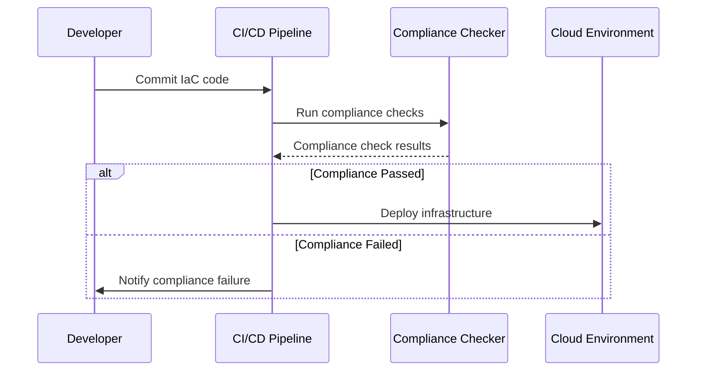

## Introduction

As organizations increasingly adopt cloud-based infrastructure, compliance with organizational, regulatory, and industry standards becomes a critical component of IT governance. Automated Compliance Checks (ACC) offer a robust pattern for integrating compliance validation directly into the infrastructure provisioning pipeline, ensuring consistent and auditable adherence to required standards. 

This design pattern emphasizes preemptive identification and resolution of compliance violations by embedding automated checking mechanisms into Continuous Integration/Continuous Deployment (CI/CD) pipelines, streamlining governance processes, and reducing the risk of non-compliance.

## Architectural Approach

The architecture of Automated Compliance Checks involves the following key components:

1. **Infrastructure as Code (IaC)**: Use IaC tools like Terraform, AWS CloudFormation, or Azure Resource Manager Templates to define cloud infrastructure, which provides a version-controlled, auditable description of infrastructure configurations.

2. **Compliance as Code**: Define compliance rules and standards using tools such as Open Policy Agent (OPA), AWS Config, or Azure Policy. These rules are expressed in code, enabling automated checks.

3. **CI/CD Integration**: Integrate compliance checks within CI/CD processes using tools like Jenkins, GitLab CI/CD, or GitHub Actions to ensure compliance checks occur automatically before deployment.

4. **Feedback Mechanisms**: Implement immediate feedback regarding compliance status, allowing for rapid adjustments and iterative improvement.

5. **Monitoring and Reporting**: Use centralized logging and monitoring solutions like Splunk, AWS CloudWatch, or Azure Monitor to track compliance status and produce actionable reports.

## Best Practices

- **Shift Left Compliance**: Integrate compliance checks early in the development pipeline to catch non-compliance issues before they move to later stages of the lifecycle.
- **Continuous Improvement**: Regularly update compliance rules to align with evolving standards and business requirements.
- **Automate Remediation**: Where possible, automate the remediation of compliance issues to prevent manual errors and reduce turnaround time.
- **Contextual Alerts**: Design alerts to be context-aware, providing actionable insights into compliance violations.
- **Detailed Auditing**: Ensure that all compliance check results are auditable, with detailed logs for traceability and regulatory reporting.

## Example Code

Below is a simplistic example of an automated compliance check using Open Policy Agent (OPA) integrated in a Terraform workflow:

```hcl
// policy.rego - An OPA policy example checking encryption usage

package terraform.aws

deny[msg] {
  resource := input.resource
  resource.type == "aws_s3_bucket"
  not resource.encryption
  msg := sprintf("S3 Bucket '%s' must have encryption enabled", [resource.name])
}

// CI/CD pipeline integration script (example in Bash)

#!/bin/bash

terraform validate

opa eval --input terraform.json --data policy.rego "data.terraform.aws.deny"
if [ $? -ne 0 ]; then
  echo "Compliance check failed"
  exit 1
fi

echo "Compliance checks passed"
```

## Diagram

A high-level sequence diagram showing Automated Compliance Checks in a CI/CD pipeline:



## Related Patterns

- **Policy Enforcement Point (PEP)**: Defines points in a system that intercept requests to enforce compliance rules.
- **Infrastructure as Code (IaC)**: Promotes defining and provisioning infrastructure through machine-readable code.
- **Continuous Compliance**: Ensures compliance standards are maintained throughout the lifecycle of cloud infrastructure.

## Additional Resources

- [Open Policy Agent](https://www.openpolicyagent.org/)
- [Terraform IaC](https://www.terraform.io/)
- [AWS Config](https://aws.amazon.com/config/)
- [Azure Policy](https://docs.microsoft.com/en-us/azure/governance/policy/)

## Summary

Automated Compliance Checks integrate compliance validation seamlessly into the provisioning pipeline, ensuring adherence to organizational and regulatory standards at every step. By using automation, organizations can minimize human errors, respond swiftly to compliance evolutions, and continuously improve their compliance posture. This design pattern enables a proactive approach to governance, laying a robust foundation for secure, compliant cloud infrastructures.
