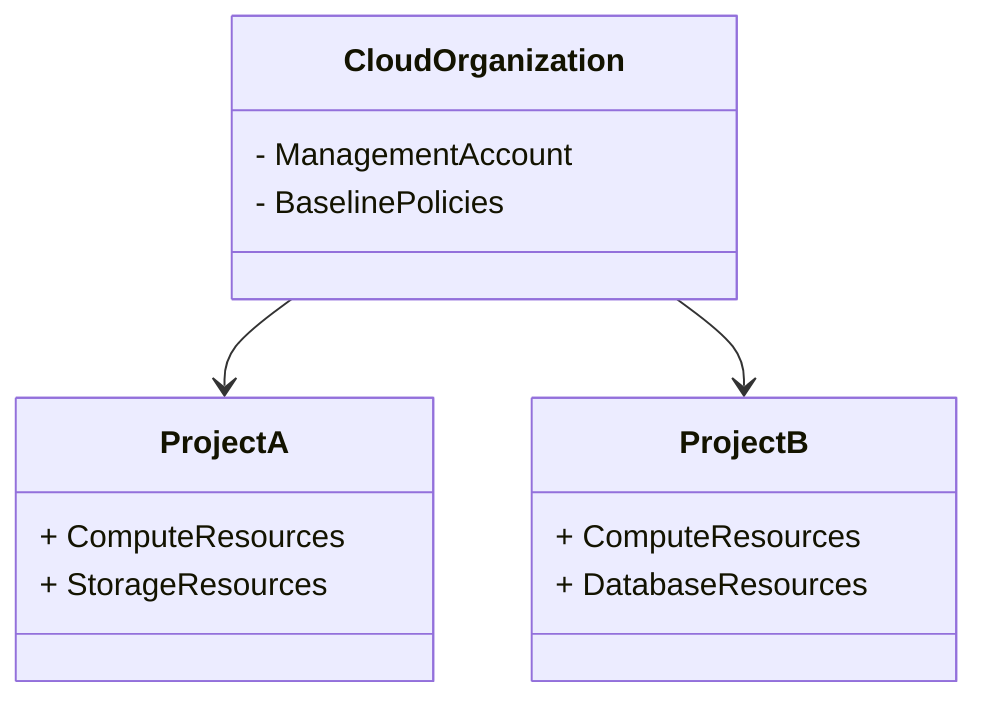

## Overview

The **Multi-Account or Multi-Project Management** pattern is a critical architectural approach in cloud computing that involves setting up, organizing, and managing resources across multiple cloud accounts or projects. This pattern addresses operational needs such as isolation, compliance, billing management, and security while facilitating effective and efficient cloud resource utilization.

## Detailed Explanation

As organizations grow and cloud environments become increasingly complex, a single cloud account or project can become a bottleneck for managing resources effectively. Here are several reasons why businesses may choose to distribute resources across multiple accounts or projects:

- **Isolation of Resources**: Different departments or teams might require isolation for resources due to operational needs or to reduce the blast radius in case of an incident.
- **Enhanced Security**: With resources segregated, permissions can be more finely controlled, minimizing the risk of unauthorized access.
- **Compliance**: Certain projects might have specific compliance requirements necessitating separate handling.
- **Billing and Cost Management**: Having multiple accounts allows finer granularity for tracking costs, enabling better budget allocation and cost containment.

### Key Components and Approaches

1. **Account or Project Hierarchies**: Establish hierarchies to manage and delegate administrative responsibilities efficiently. Cloud providers like AWS and GCP offer organizations and folders to create structured layouts.

2. **Centralized Management Tools**: Use centralized tools and dashboards provided by cloud providers to maintain oversight without losing the benefit of account isolation. AWS Organizations, Google Cloud Resource Manager, and Azure Management groups are examples.

3. **Policy Management and Enforcement**:
   - Use a unified policy enforcement layer across multiple accounts or projects to maintain security and compliance. For example, AWS Service Control Policies (SCPs) and Google Cloud Organizational Policies.

4. **Automated Provisioning and Deployment**:
   - Implement Infrastructure as Code (IaC) to manage deployments across accounts. This aids in achieving repeatability and consistency. Tools like Terraform and AWS CloudFormation can be used.

5. **Cross-Account/Project Connectivity**:
   - Establish networking configurations that provide secure and efficient communication pathways between accounts, such as VPC peering or using private endpoints.

### Example Code

Here is a simplified example of a Terraform script to set up multiple projects and leverage a shared network:

```hcl
provider "google" {
  alias = "org"
}

resource "google_project" "project_a" {
  name       = "Project A"
  project_id = "project-a-id"
  org_id     = "org-id"
}

resource "google_project" "project_b" {
  name       = "Project B"
  project_id = "project-b-id"
  org_id     = "org-id"
}

resource "google_compute_network" "shared_network" {
  provider = google.org
  name     = "shared-network"
  auto_create_subnetworks = false
}
```

### Diagrams



## Related Patterns

- **Centralized Cloud Management**: This pattern focuses on using a single pane of glass to manage diverse cloud environments.
- **Resource Tagging**: Ensures consistent resource management and cost allocation across accounts or projects.
- **Policy Compliance Monitoring**: Automates continuous compliance checks across cloud resources.

## Additional Resources

- AWS Organizations: [AWS Organizations Documentation](https://docs.aws.amazon.com/organizations/latest/userguide/orgs_introduction.html)
- Google Cloud Resource Manager: [Google Cloud Resource Manager Overview](https://cloud.google.com/resource-manager/docs)
- Azure Management Groups: [Azure Management Groups Documentation](https://docs.microsoft.com/en-us/azure/governance/management-groups/overview)

## Summary

The **Multi-Account or Multi-Project Management** pattern is an essential approach for organizations operating at scale in cloud environments. By implementing this pattern, enterprises can achieve granular resource management, enhance security, and improve financial oversight, thereby ensuring their cloud infrastructure aligns seamlessly with their operational and strategic goals.
