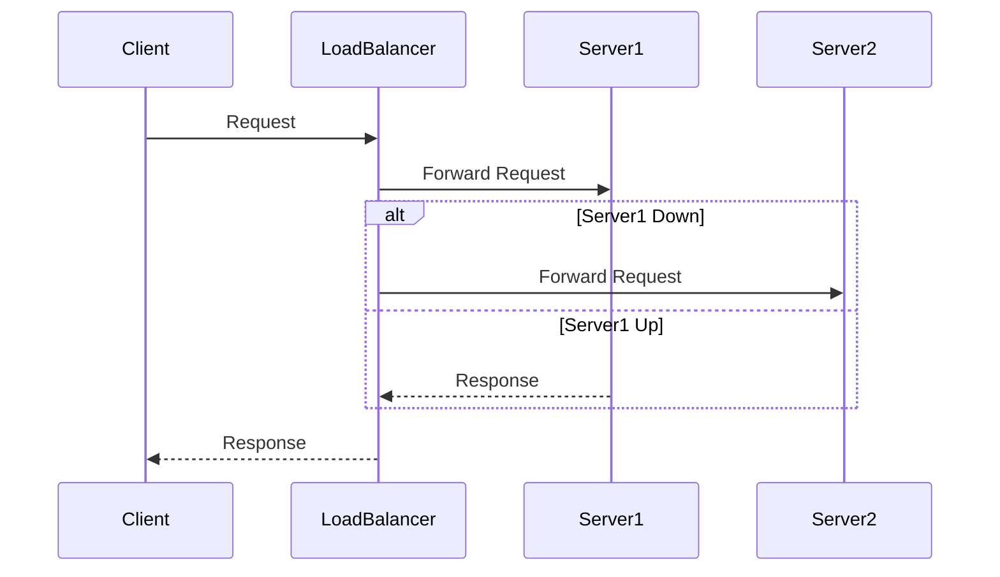

## Introduction

In the realm of cloud computing, ensuring that applications remain available and performant despite underlying infrastructure failures is paramount. The **Failover and High Availability Setup** pattern provides guidance on configuring systems to automatically handle failures, minimizing downtime and ensuring continuity of service. This pattern is indispensable for businesses relying heavily on constant service uptime, and it harnesses architectural strategies that support fault tolerance and resilience.

## Detailed Explanation

### High Availability and Failover Concepts

- **High Availability (HA):** Refers to systems that are architected to ensure a high level of operational performance and uptime. HA systems are designed to be robust and capable of recovering from failure, ensuring minimal downtime.

- **Failover:** Represents the mechanism by which a system automatically redirects operations from a failed component to a standby equivalent, ensuring continuity of service.

### Key Architectural Components

1. **Redundancy:** Deploying multiple instances of critical infrastructure components helps eliminate single points of failure. This involves having spare capacity that can take over in the event of the primary system's failure.

2. **Load Balancers:** These distribute incoming traffic across multiple servers, ensuring no single server becomes overloaded and providing a fallback should any individual server fail.

3. **Geographic Distribution:** Placing resources in multiple data centers across different locations to avoid a single point of failure due to localized issues (e.g., natural disasters).

4. **Replication:** Data is continuously updated and duplicated across multiple storage systems, ensuring data availability and consistency.

5. **Heartbeat Mechanism:** Monitoring tools that continually check the health of systems and automatically initiate failover sequences when issues are detected.

### Best Practices

- **Regular Testing:** Simulate failure scenarios to validate the efficacy of the failover mechanisms.
- **Automated Monitoring and Alerts:** Employ robust monitoring solutions to detect failures swiftly and automatically trigger alerts.
- **Data Consistency Checks:** Implement strong data consistency protocols and backups to prevent data loss.
- **Cost Considerations:** Balance the level of redundancy and geographical distribution against cost to maintain an economically feasible solution.

## Example Code

Let's see an example setup using AWS components where we configure an Auto Scaling Group for automatic failover and high availability.

```yaml
Resources:
  WebServerGroup:
    Type: AWS::AutoScaling::AutoScalingGroup
    Properties:
      MaxSize: "5"
      MinSize: "1"
      DesiredCapacity: "3"
      LaunchConfigurationName: !Ref LaunchConfig
      AvailabilityZones:
        - us-east-1a
        - us-east-1b
    UpdatePolicy:
      AutoScalingRollingUpdate:
        MinInstancesInService: "1"
        MaxBatchSize: "1"
        
  LaunchConfig:
    Type: AWS::AutoScaling::LaunchConfiguration
    Properties:
      ImageId: ami-abcdefgh
      InstanceType: t2.micro
```

## Diagrams

Here's a simple UML Sequence diagram illustrating a failover scenario:



## Related Patterns

- **Circuit Breaker Pattern:** Prevents application failures from cascading by halting requests to a failed service.
- **Load Balancing Pattern:** Distributes network or application traffic across multiple servers to ensure no single server is overloaded.
- **Backup and Restore Pattern:** Ensures data resiliency by storing backup copies and providing a mechanism for data restoration.

## Additional Resources

- AWS High Availability & Fault Tolerance Whitepaper
- Google Cloud Platform - Designing High Availability Architectures
- Microsoft Azure - Resiliency Pattern Guidance

## Summary

The **Failover and High Availability Setup** pattern is crucial for any cloud architecture that demands high uptime and reliability. By understanding and implementing the right mix of redundancy, load balancing, and geographic distribution, organizations can ensure that their applications withstand infrastructure failures. This setup not only enhances resilience but also significantly mitigates the risks associated with server downtimes, contributing to robust cloud architecture.
