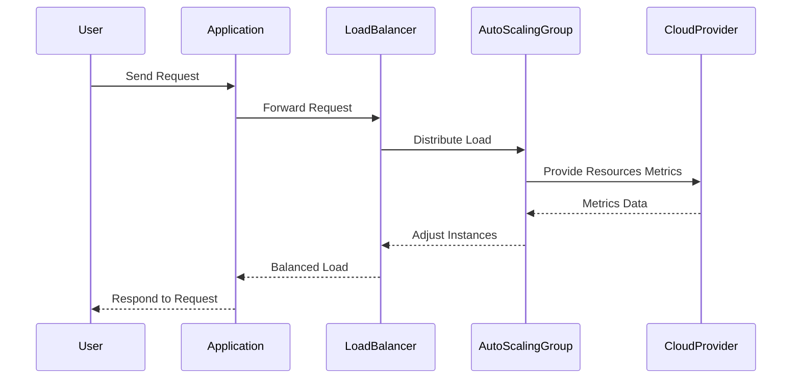

---

linkTitle: "Dynamic Resource Scaling"
title: "Dynamic Resource Scaling: Enabling Automatic Resource Adjustment"
category: "Cloud Infrastructure and Provisioning"
series: "Cloud Computing: Essential Patterns & Practices"
description: "Dynamic Resource Scaling enables cloud infrastructure resources to adjust automatically in response to varying load levels. This ensures optimal performance while minimizing costs by scaling resources up or down as needed."
categories:
- Cloud Infrastructure
- Provisioning
- Scalability
tags:
- Cloud Computing
- Dynamic Scaling
- Auto Scaling
- Resource Management
- Cost Efficiency
date: 2024-07-07
type: docs

canonical: "https://softwarepatternslexicon.com/18/1/21"
license: "© 2024 Tokenizer Inc. CC BY-NC-SA 4.0"
---

## Overview

Dynamic Resource Scaling is a crucial cloud computing pattern that allows cloud resources, such as compute instances, storage, and network bandwidth, to automatically scale in response to current demand. This pattern ensures that applications maintain performance and availability while optimizing resource utilization and costs.

## Architectural Approach

Dynamic Resource Scaling involves defining rules and triggers for scaling operations. These rules consider metrics like CPU usage, memory consumption, network I/O, or application-specific indicators. The scaling actions can be horizontal (adjusting the number of instances) or vertical (modifying the resource capacity of current instances).

### Key Components

1. **Auto Scaling Group (ASG)**: Manages the deployment of instances according to the defined scaling policies and maintains the desired state.
2. **Load Balancer**: Distributes incoming application traffic across multiple instances to ensure balanced load.
3. **Monitoring Service**: Collects metrics and provides data insights necessary for triggering scaling actions.
4. **Scaling Policies**: Predefined conditions under which scaling operations will be executed, including target thresholds and cooldown periods.

## Best Practices

1. **Establish Clear Metrics**: Identify relevant metrics that genuinely reflect resource usage and application load.
2. **Set Sensible Thresholds**: Configuring realistic thresholds helps avoid unnecessary scaling actions and ensures resources are utilized efficiently.
3. **Use Predictive Scaling**: Implement machine learning models to anticipate demand and accommodate fluctuations proactively.
4. **Regularly Review Policies**: Continuously assess auto-scaling rules to align with application and traffic changes.
5. **Consider Failover Scenarios**: Ensure the architecture can handle scaling-related failures, such as exhausted resource limits.

## Example Code

Here's a simple example using AWS SDK in Java to define an Auto Scaling Group (ASG):

```java
import com.amazonaws.services.autoscaling.AmazonAutoScaling;
import com.amazonaws.services.autoscaling.AmazonAutoScalingClientBuilder;
import com.amazonaws.services.autoscaling.model.*;

public class AutoScalingExample {

    public static void main(String[] args) {
        AmazonAutoScaling autoScaling = AmazonAutoScalingClientBuilder.defaultClient();

        CreateAutoScalingGroupRequest groupRequest = new CreateAutoScalingGroupRequest()
                .withAutoScalingGroupName("myAutoScalingGroup")
                .withLaunchConfigurationName("myLaunchConfig")
                .withMinSize(2)
                .withMaxSize(10)
                .withDesiredCapacity(5)
                .withAvailabilityZones("us-west-2a", "us-west-2b");

        autoScaling.createAutoScalingGroup(groupRequest);
        System.out.println("Auto Scaling Group Created Successfully!");
    }
}
```

## Diagrams

### UML Sequence Diagram



## Related Patterns

1. **Load Balancer Pattern**: Distributes incoming network or application traffic across multiple servers.
2. **Circuit Breaker Pattern**: Temporarily redirects failures from one service to ensure continued operations.
3. **Service Discovery Pattern**: Enables services to dynamically discover each other.

## Additional Resources

- AWS Auto Scaling: [AWS Documentation](https://docs.aws.amazon.com/autoscaling/index.html)
- Azure AutoScale: [Azure Documentation](https://learn.microsoft.com/en-us/azure/azure-monitor/autoscale/autoscale-overview)
- GCP Auto Scaling: [Google Cloud Platform Documentation](https://cloud.google.com/compute/docs/autoscaler)

## Summary

Dynamic Resource Scaling ensures that cloud environments are elastic and efficiently manage varying loads by automatically adjusting resources according to application demands. By combining well-defined metrics and intelligent scaling strategies, organizations can achieve optimal balance in performance and cost-efficiency. This pattern is vital for businesses that need to maintain service availability and reliability without manually allocating cloud resources.
