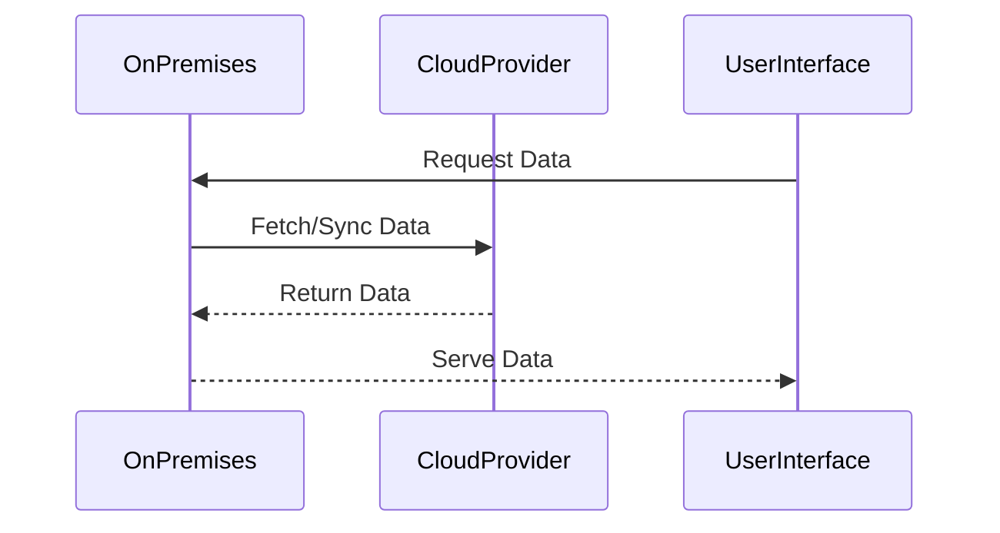

## Overview

Hybrid Cloud Integration is a design pattern that facilitates the coexistence of on-premises infrastructure with cloud resources. This approach provides organizations with the flexibility to extend their data storage, computing power, and application deployments to the cloud while maintaining control over sensitive data and critical operations that need to remain in-house. By embracing a hybrid cloud strategy, companies can leverage the scalability and cost-efficiency of cloud resources while gradually transitioning workloads and applications to the cloud in a controlled manner.

## Architectural Approach

### Key Components

1. **On-Premises Infrastructure**: Traditional data centers, servers, and networking equipment that allow companies to run applications and store data locally.

2. **Cloud Providers**: Platforms such as AWS, Azure, and GCP act as extensions of on-premises resources, offering on-demand, scalable, and flexible infrastructure.

3. **Integration Tools**: Middleware and integration platforms (e.g., MuleSoft, IBM Cloud Pak for Integration) facilitate seamless data and application integration between on-premises systems and cloud services.

4. **Security and Compliance**: Solutions that ensure data security, compliance, and governance across hybrid environments, maintaining protective measures for sensitive information.

### Interaction Model

The Hybrid Cloud Integration pattern involves bidirectional data flow and process coordination between on-premises systems and cloud resources. Key interactions include:

- **Data Synchronization**: Ensures data consistency and availability across environments, leveraging APIs, data replication, and batch processes.
  
- **Application Mobility**: Enables applications to span both environments, using containers and orchestration platforms like Kubernetes for portability.

- **Network Connectivity**: Establishes secure, high-speed connections, typically using VPNs, Direct Connect, or ExpressRoute for reliable data transfer paths.

## Best Practices

- **Assess Workloads**: Identify which workloads benefit from cloud migration and which should remain on-premises due to security, compliance, or performance requirements.

- **Design for Hybrid**: Architect applications and infrastructure with hybrid capabilities in mind, aiming for cloud-native designs and modularity.

- **Implement Robust Security**: Develop a unified security strategy encompassing identity management, access controls, and data encryption across both environments.

- **Monitor and Optimize**: Use comprehensive monitoring tools to track performance, identify bottlenecks, and optimize resource utilization in real-time.

## Example Code

In a hybrid environment, an application can be architected with microservices spread across both local and cloud servers:

```java
// Example of using a cloud storage service from an on-premises application

import com.amazonaws.services.s3.AmazonS3;
import com.amazonaws.services.s3.AmazonS3ClientBuilder;

public class HybridCloudExample {
    private AmazonS3 s3Client;

    public HybridCloudExample() {
        this.s3Client = AmazonS3ClientBuilder.standard()
                              .withRegion("us-east-1")
                              .build();
    }

    public void uploadFile(String filePath) {
        File file = new File(filePath);
        String bucketName = "company-data-bucket";
        String keyName = file.getName();
        
        s3Client.putObject(bucketName, keyName, file);
        System.out.println("File uploaded to cloud storage successfully.");
    }

    // Additional integration logic here
}
```

## Diagrams



## Related Patterns

- **Cloud Bursting**: Temporarily use cloud resources to manage peak loads beyond on-premises capacities.
- **Multi-Cloud Strategy**: Distribute workloads across multiple cloud providers to reduce vendor lock-in and improve resilience.

## Additional Resources

- [AWS Hybrid Cloud Solutions](https://aws.amazon.com/hybrid/)
- [Microsoft Azure Hybrid Benefit](https://azure.microsoft.com/en-us/pricing/hybrid-benefit/)
- [Google Cloud Hybrid and Multi-cloud Solutions](https://cloud.google.com/hybrid-cloud)

## Summary

The Hybrid Cloud Integration pattern is a strategic approach that enables organizations to harness the benefits of both on-premises and cloud environments. This approach allows for flexibility, scalability, and a phased migration that aligns with business goals and compliance requirements. By leveraging appropriate tools and architectures, companies can achieve a seamless integration that supports current operations while paving the way for future cloud-adoption initiatives.
