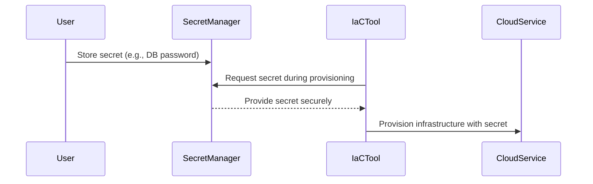

Cloud environments necessitate handling sensitive information such as API keys, database passwords, and encryption keys. Improper management of these secrets can lead to severe security breaches. The **Secret Management Integration** pattern addresses this concern by employing dedicated secret management tools to securely handle sensitive information throughout the provisioning process.

Cloud platforms like AWS, Azure, and GCP provide proprietary secret management solutions. However, third-party tools such as HashiCorp Vault, CyberArk, and AWS Secrets Manager also offer robust alternatives. This pattern ensures secrets are securely stored, transmitted, and accessed, reducing the risk of leaks and unauthorized access.


## Components

1. **Secret Management Tool**: Responsible for the storage, retrieval, and auditing of secrets. It uses encryption to protect secrets at rest and in transit.
   
2. **Provisioning Tools**: These include infrastructure as code (IaC) tools like Terraform, Ansible, or AWS CloudFormation. They integrate with secret management systems to securely retrieve secrets during deployment.
   
3. **Access Control Systems**: Implement role-based access control (RBAC) or attribute-based access control (ABAC) to determine which entities can access specific secrets.

## Workflow

1. **Secret Creation and Storage**: Secrets are created and securely stored in a secret management system. Access permissions are defined to control who can access them.
   
2. **Infrastructure Provisioning**: During provisioning, IaC tools interact with the secret management system to fetch the required secrets without exposing them in scripts or logs.
   
3. **Access Logs and Audit Trails**: All accesses to the secrets are logged, enabling audit trails for compliance and incident response.

## Best Practices

- **Encrypt Secrets**: Always encrypt secrets, both at rest and in transit, using strong encryption algorithms.
- **Least Privilege Principle**: Grant access to secrets strictly on a need-to-know basis, limiting access to only necessary permissions.
- **Regularly Rotate Secrets**: Implement automatic rotation policies for secrets to minimize the impact of potential leaks.
- **Monitor Access**: Continuously monitor and log all access to the secret management tool for anomaly detection.


The following example demonstrates using HashiCorp Vault to store and retrieve a database password during provisioning with Terraform.

```hcl
provider "vault" {
  address = "http://127.0.0.1:8200"
}

data "vault_generic_secret" "database" {
  path = "secret/data/myapp/database"
}

resource "aws_db_instance" "example" {
  allocated_storage    = 20
  engine               = "mysql"
  instance_class       = "db.t2.micro"
  name                 = "mydb"
  username             = "admin"
  password             = data.vault_generic_secret.database.data["password"]
}
```


## Secret Management Integration Workflow




- **Infrastructure as Code (IaC)**: Enables automated infrastructure provisioning and management, typically integrating with secret management systems.
- **Identity and Access Management (IAM) Integration**: Manages user identities and regulates access to resources, which is crucial for determining who can access secrets.


- [HashiCorp Vault Documentation](https://www.vaultproject.io/docs)
- [AWS Secrets Manager](https://aws.amazon.com/secrets-manager/)
- [Azure Key Vault](https://azure.microsoft.com/en-us/services/key-vault/)
- [Google Secret Manager](https://cloud.google.com/secret-manager)


The **Secret Management Integration** pattern is vital for maintaining security and integrity in cloud environments. By utilizing dedicated tools to manage, store, and audit secrets, organizations can protect sensitive information and comply with security standards. This pattern emphasizes the importance of encryption, access control, and logging to safeguard secrets throughout the provisioning process.
