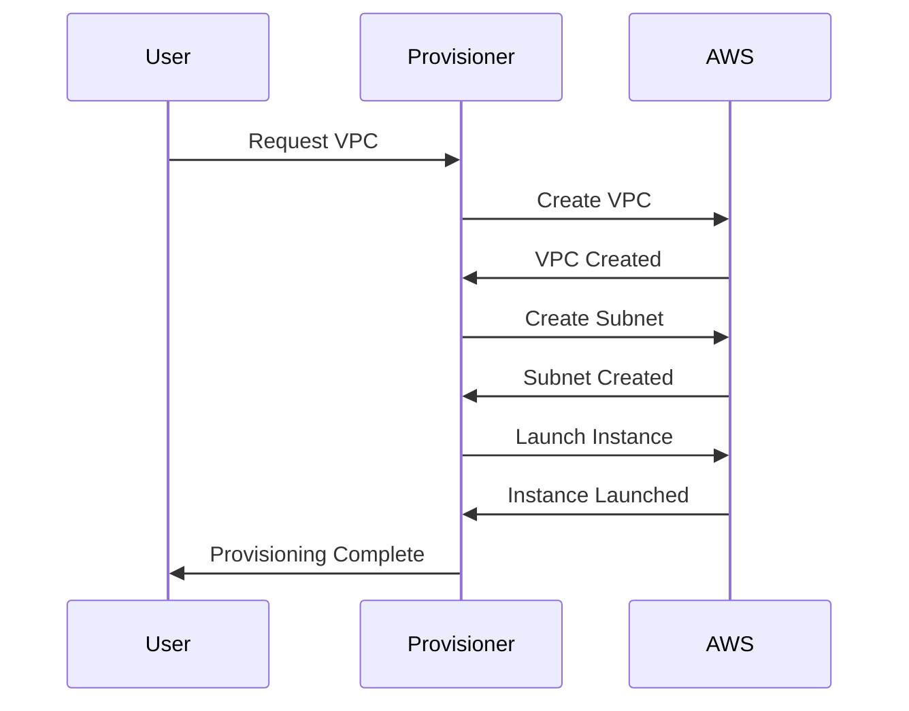

The Resource Dependency Mapping pattern involves defining dependencies between various cloud resources to ensure the correct order of provisioning. In a cloud environment, resources often depend on one another, and provisioning them in the correct order is crucial for preventing failures and inefficiencies during deployment.

## Detailed Explanation

In cloud computing environments, deploying resources such as databases, virtual machines, and network configurations often requires a specific order to maintain application integrity and operational efficiency. For instance, a virtual machine might need to be provisioned before a database can be connected to it. Resource Dependency Mapping helps in identifying and managing these dependencies to enable automated and reliable deployment processes.

This pattern is critical in scenarios where:

- Resources have a hierarchical relationship, and parents must be created before their children.
- Services depend on specific configurations or functionalities of other services.
- The failure of upstream resources must be prevented to ensure downstream reliability.

### Architectural Approaches

1. **Dependency Graphs**: Use directed graphs to map dependencies. Nodes represent resources, and edges represent dependencies.
2. **Declarative Provisioning Tools**: Utilize tools like Terraform or AWS CloudFormation, which inherently support resource dependencies.
3. **Event-Driven Workflows**: Trigger resource provisioning based on events, ensuring that dependent resources are provisioned upon the successful setup of upstream resources.

### Best Practices

- **Explicit Dependencies**: Always make dependencies explicit in your infrastructure as code (IaC).
- **Minimal Resource Set**: Start with a minimal viable set of resources to reduce complexity and manage dependencies efficiently.
- **Fail-safe Mechanisms**: Implement automatic rollback in case a resource fails to provision to maintain system integrity.
- **Continuous Testing**: Regularly test the infrastructure deployment process to catch and resolve dependency issues early.

### Example Code

Here’s an example using Terraform:

```hcl
resource "aws_vpc" "main" {
  cidr_block = "10.0.0.0/16"
}

resource "aws_subnet" "subnet" {
  vpc_id            = aws_vpc.main.id
  cidr_block        = "10.0.1.0/24"
  availability_zone = "us-west-2a"
}

resource "aws_instance" "web" {
  ami           = "ami-0abcdef1234567890"
  instance_type = "t2.micro"
  subnet_id     = aws_subnet.subnet.id
  depends_on    = [aws_subnet.subnet]
}
```

In this example, the AWS `Instance` depends on the `Subnet`, which in turn depends on the `VPC`. This ensures that provisioning occurs in the correct order.

### Diagrams

Here's an example of a UML Sequence Diagram for a simple provisioning process:



### Related Patterns

- **Infrastructure as Code Pattern**: Manages infrastructure through source code, facilitating version control and automation.
- **Service Orchestration Pattern**: Ensures that various independent services work together in a coordinated manner.
- **Event-Driven Architecture Pattern**: Helps in managing complex architectures by asynchronously triggering resource provisioning events.

### Additional Resources

- [Terraform Official Docs](https://www.terraform.io/docs/index.html) for understanding infrastructure management.
- [AWS CloudFormation Documentation](https://docs.aws.amazon.com/AWSCloudFormation/latest/UserGuide/Welcome.html) for managing AWS resources.
- [Azure Resource Manager](https://learn.microsoft.com/en-us/azure/azure-resource-manager/) for managing Azure resources.

## Summary

Resource Dependency Mapping is a foundational pattern in cloud infrastructure provisioning that ensures resources are provisioned in the correct order by defining and managing their dependencies. By using tools and approaches such as dependency graphs, declarative provisioning, and event-driven workflows, organizations can automate their infrastructure setup process, minimize deployment errors, and optimize resource utilization.
