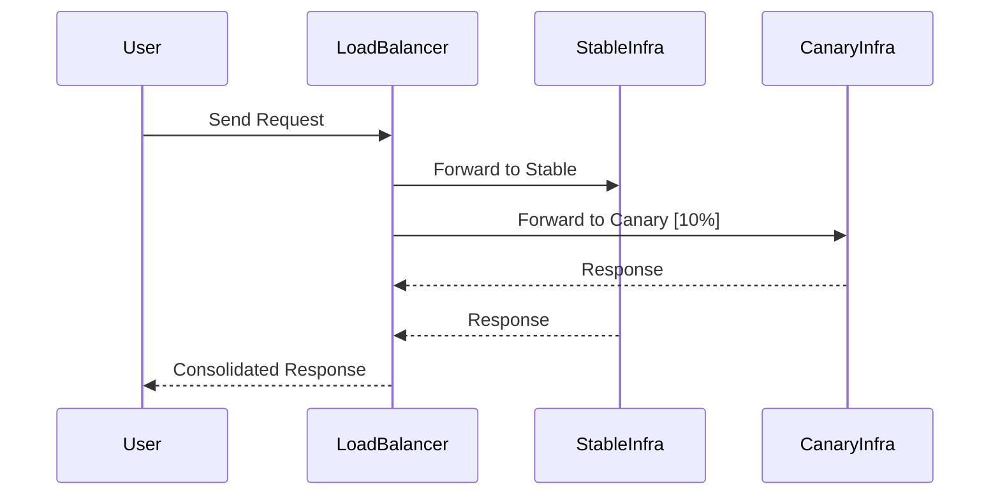

---

linkTitle: "Canary Infrastructure Deployment"
title: "Canary Infrastructure Deployment: Testing Infrastructure Changes Safely"
category: "Cloud Infrastructure and Provisioning"
series: "Cloud Computing: Essential Patterns & Practices"
description: "Canary Infrastructure Deployment is a pattern used to test and validate infrastructure changes by initially routing a small portion of traffic to the updated infrastructure before deploying the changes at scale."
categories:
- Cloud Computing
- Infrastructure
- Deployment Strategies
tags:
- Canary Deployment
- Infrastructure Testing
- Cloud Patterns
- Traffic Splitting
- Gradual Rollout
date: 2024-07-07
type: docs

canonical: "https://softwarepatternslexicon.com/18/1/28"
license: "© 2024 Tokenizer Inc. CC BY-NC-SA 4.0"
---

## Introduction to Canary Infrastructure Deployment

Canary Infrastructure Deployment is a robust pattern that helps with safely rolling out changes to cloud infrastructure. Similar to the way coal miners used canaries as early warning systems to detect toxic gases, this pattern is designed to safely validate changes by initially exposing them to a small percentage of traffic. This approach ensures that any potential issues can be detected early, minimizing the impact on users.

## Detailed Explanation

In a Canary Infrastructure Deployment, updated infrastructure serves only a small portion of the total demand at first—typically starting with as little as 1%-5% of user traffic. The primary goal is to closely monitor the performance, stability, and user interactions with this small segment of the updated infrastructure. If no issues are detected, traffic is gradually increased according to a predefined schedule until all traffic is routed to the updated infrastructure.

### Goals and Benefits

- **Risk Mitigation**: Reduces the potential impact of introducing defects or issues, allowing for early detection and rollback if needed.
- **Performance Evaluation**: Enables real-world performance and behavior validation of the changes before fully scaling.
- **User Impact**: Minimizes the number of users affected in case of failures or issues, protecting overall user experience.
- **Feedback Loop**: Provides an opportunity to gather insights and feedback which can be used to tweak or improve the changes.

### Common Use Cases

- Deployment of new versions of cloud-native applications
- Infrastructure upgrades such as database scaling or migration
- Introducing new features or capabilities to critical services

## Architectural Approaches

### Design Considerations

1. **Traffic Routing and Splitting**: Configurations for routing traffic are crucial. Implement techniques such as sticky sessions, load balancer rules, or service mesh routing for fine-grained control.
2. **Monitoring and Observability**: Establish comprehensive monitoring and alerting systems to observe both synthetic and real-user metrics.
3. **Automated Rollback**: Set up automated rollback mechanisms to swiftly revert changes if critical issues are detected.

### Infrastructure Implementation

Here's an example of how to configure a traffic-splitting sequence using a service mesh, such as Istio:

```yaml
apiVersion: networking.istio.io/v1alpha3
kind: VirtualService
metadata:
  name: canary-deployment
spec:
  hosts:
  - myservice.example.com
  http:
  - route:
    - destination:
        host: myservice
        subset: stable
      weight: 90
    - destination:
        host: myservice
        subset: canary
      weight: 10
```

This YAML configuration serves 10% of the traffic to the canary environment and the remaining 90% to the stable version.

## Diagrams and Visuals

This Mermaid sequence diagram illustrates the Canary Deployment process:



## Best Practices

- **Health Checks**: Implement robust health checks and service-level indicators (SLIs) to ensure system health is constantly assessed.
- **Incremental Traffic Increase**: Use gradual, controlled increments of traffic to the canary to carefully evaluate the effects of changes.
- **Rollback Criteria**: Predefine clear conditions and criteria for rollback scenarios to avoid delayed decision-making during incidents.

## Related Patterns

- **Blue-Green Deployment**: A strategy for releasing updates by swapping between two identical environments.
- **Feature Toggles**: Part of continuous delivery approaches where new features can be turned on or off without redeployment.
- **Chaos Engineering**: A discipline to improve resilience by proactively injecting failures into systems.

## Additional Resources

- [Istio: Traffic Management](https://istio.io/latest/docs/concepts/traffic-management/)
- [Kubernetes: Using Canary Deployments](https://kubernetes.io/docs/concepts/services-networking/ingress-controllers/)
- [AWS Elastic Load Balancing](https://aws.amazon.com/elasticloadbalancing/)

## Conclusion

Canary Infrastructure Deployment stands out as an invaluable tactic in modern cloud strategies, allowing teams to test changes efficiently and safely validate their impacts. By ensuring that only a fraction of traffic encounters the updates initially, this pattern provides a robust feedback loop for fine-tuning deployments and ensuring system integrity, performance, and user satisfaction.

By adopting Canary Infrastructure Deployment, organizations can achieve smoother transitions, better resilience, and a more confident posture towards deploying critical changes in dynamic cloud environments.
