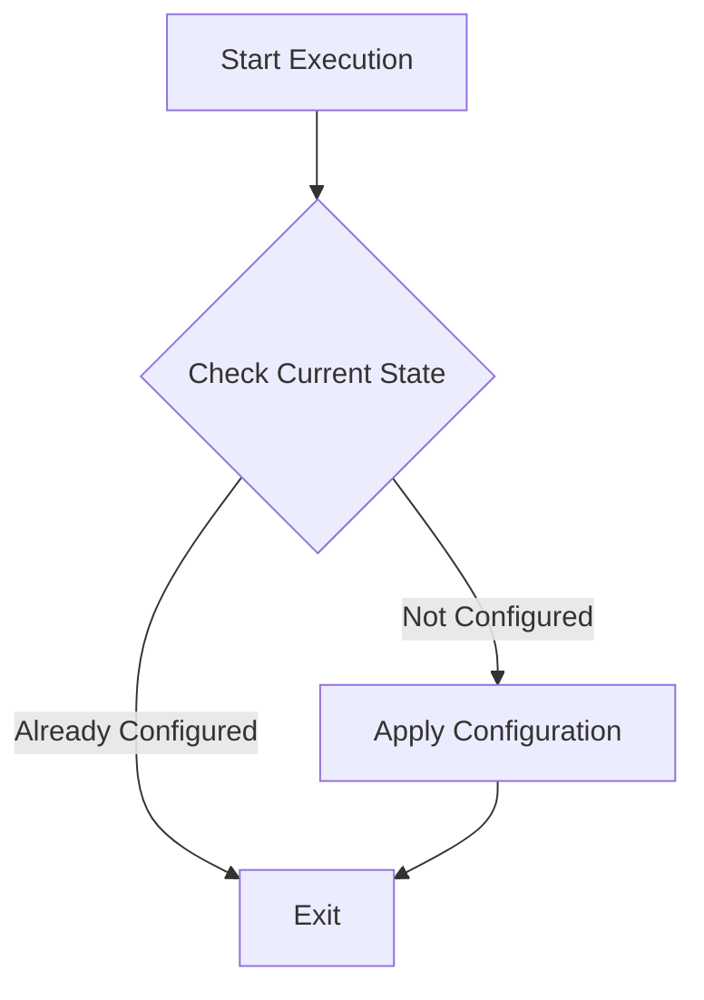

## Idempotent Scripts: Writing Provisioning Scripts that Run Safely Multiple Times

Idempotent scripts are essential tools in the field of cloud infrastructure and provisioning. The principle of idempotency ensures that a script can be executed multiple times in sequence without altering the outcome beyond the initial application. This property is particularly significant in cloud environments where changes in infrastructure and software deployments need to be frequent, automated, and reliable.

### Detailed Explanations

#### Understanding Idempotency

In mathematical terms, an operation is idempotent if applying it multiple times has the same effect as applying it once. In the context of scripting and cloud provisioning, this translates into scripts that are designed to ensure:

- **Consistency**: The infrastructure or system's state remains consistent regardless of how many times the script runs.
- **Reliability**: Removes the risk of introducing state errors or conflicts when re-deployed.
- **Safety**: Protects against unintended side effects that can arise from duplicate operations.

#### Applications in Cloud Infrastructure

Idempotent scripts are used extensively in automating cloud infrastructure setup using tools like Terraform, AWS CloudFormation, Ansible, and Puppet. They play a fundamental role in Continuous Integration/Continuous Deployment (CI/CD) environments where systems are built and rebuilt regularly.

### Architectural Approaches

- **State Checks**: Before making a change, the script checks the current state of the resource and takes action only if necessary.
- **Conditional Execution**: Use of conditional logic to determine if resources need updating, creation, or deletion.
- **Atomic Operations**: Ensuring operations are complete and isolated steps that do not interfere with one another.
- **Idempotent Functions**: Splitting scripts into small, reusable functions that maintain idempotency individually.

### Best Practices

1. **Use Declarative Languages**: Leverage tools and languages that naturally embrace a declarative approach, specifying the desired end state instead of procedural steps (e.g., Terraform).
   
2. **Include State Management**: Ensure proper state management through lock mechanisms or state files to prevent race conditions or concurrent executions.
   
3. **Perform Thorough Testing**: Regularly test scripts in a sandbox environment to validate idempotency.
   
4. **Implement Logging**: Integrate logging to monitor script execution and confirm operations are conducted as expected.

### Example Code

**Terraform Example for Ensuring an Idempotent EC2 Instance**

```hcl
resource "aws_instance" "example" {
  ami           = "ami-0abcdef1234567890"
  instance_type = "t2.micro"

  tags = {
    Name = "ExampleInstance"
  }
}
```

This Terraform script declares the desired state of an AWS EC2 instance. Running this script multiple times will not result in the creation of multiple instances but ensure the declared instance configuration is met.

### Diagrams

#### Idempotent Script Process Flow



#### Related Patterns

- **Immutable Infrastructure**: Building systems where infrastructure components are replaced rather than changed.
- **Infrastructure as Code**: Managing infrastructure through code that defines deployments in a repeatable, reviewable, and automated manner.

#### Additional Resources

- [Terraform Documentation](https://www.terraform.io/docs)
- [AWS CloudFormation Guide](https://docs.aws.amazon.com/cloudformation)
- [Ansible Best Practices](https://docs.ansible.com/ansible/latest/user_guide)

### Summary

Idempotent scripts are a foundational pattern for maintaining stable and reliable cloud infrastructures. By ensuring that these provisioning scripts can operate multiple times without side effects, organizations can achieve consistency and stability in their automated operations. Consequently, they play an indispensable role in modern cloud architectures, where agility and reliability are critical.
